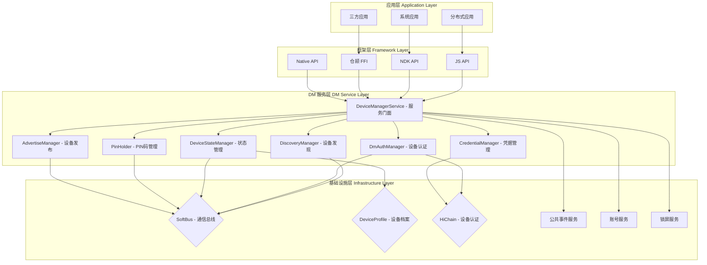
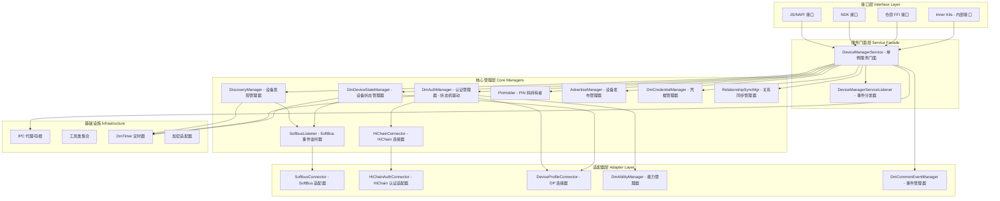

# DeviceManager 架构概述

**版本**: v2.0  
**日期**: 2026-05-19  

---

## 1. 模块定位

### 1.1 在 OpenHarmony 分布式硬件栈中的位置

DeviceManager (DM) 是 OpenHarmony 分布式硬件管理子系统的**业务编排层**，位于应用层和基础设施层之间，负责：

- **设备发现**: 发现周边的分布式设备
- **设备认证**: 建立设备间的信任关系（PIN码、无感认证等）
- **设备状态管理**: 管理设备的在线/离线状态
- **服务编排**: 协调上层应用和底层基础设施的交互

### 1.2 在依赖链中的角色

```
┌─────────────────────────────────────────────────────────────┐
│                     应用层 (Applications)                    │
│  分布式应用（分布式相机、分布式流转、分布式数据同步等）          │
└────────────────────┬────────────────────────────────────────┘
                     │
                     ▼
┌─────────────────────────────────────────────────────────────┐
│              DeviceManager (业务编排层)                       │
│  设备发现、认证、状态管理、ACL 管理、服务信息管理               │
└─────┬───────────────────┬───────────────────────┬───────────┘
      │                   │                       │
      ▼                   ▼                       ▼
┌─────────────┐   ┌─────────────┐       ┌──────────────┐
│  SoftBus    │   │  Device     │       │   HiChain    │
│ (通信层)    │   │  Profile    │       │ (认证层)     │
│             │   │  (数据层)   │       │              │
└─────────────┘   └─────────────┘       └──────────────┘
```

**依赖关系**:
- **DM → SoftBus**: 设备发现、组网、设备上下线通知、会话管理、BLE 心跳控制
- **DM → DP (Device Profile)**: ACL（访问控制列表）生命周期管理、Session Key 管理、服务信息同步、设备属性存储
- **DM → HiChain**: 设备群组管理、群组认证、凭据管理

---

## 2. 四层架构



---

## 3. 内部分层架构

### 3.1 DM 内部层次结构



### 3.2 各层职责描述

#### 3.2.1 接口层

| 组件 | 职责 | 关键类 |
|------|------|--------|
| **JS/NAPI 接口** | 暴露给 JS 应用的异步接口，包括设备发现、认证、状态查询等 | `DeviceManagerImpl` (NAPI 绑定) |
| **NDK 接口** | 暴露给 C/C++ 应用的 Native API | `OH_DeviceManager` 系列 C API |
| **仓颉 FFI 接口** | 暴露给仓颉语言应用的 FFI 接口 | `cj_distributed_device_manager_ffi` |
| **Inner Kits** | 内部 SDK，供系统内部其他子系统使用 | `DeviceManagerSdk`, `DmInitCallBack` |

#### 3.2.2 服务门面层

| 组件 | 职责 | 关键类 |
|------|------|--------|
| **DeviceManagerService** | 单例服务门面，对外提供统一的服务入口，路由请求到相应的 Manager | `DeviceManagerService` |
| **DeviceManagerServiceListener** | 事件分发器，将底层事件（设备上线/下线/发现等）分发给注册的监听器 | `DeviceManagerServiceListener` |

#### 3.2.3 核心管理层

| 模块 | 职责 | 关键类 |
|------|------|--------|
| **DiscoveryManager** | 管理设备发现流程，处理订阅/取消订阅，过滤发现的设备 | `DiscoveryManager` |
| **DmAuthManager** | 管理设备认证流程，实现认证状态机，处理认证消息交互 | `DmAuthManager`, `AuthRequestState`, `AuthResponseState` |
| **DmDeviceStateManager** | 管理设备状态（上线/下线/变更），维护设备列表，处理状态事件 | `DmDeviceStateManager` |
| **SoftbusListener** | 监听 SoftBus 事件（设备发现、上线/下线、变更），分发到对应处理逻辑 | `SoftbusListener` |
| **HiChainConnector** | 与 HiChain 交互，管理设备群组，处理群组认证 | `HiChainConnector` |
| **PinHolder** | 管理 PIN 码的生成、验证、存储和传输 | `PinHolder` |
| **AdvertiseManager** | 管理设备主动发布（Publish），让其他设备可以发现本设备 | `AdvertiseManager` |
| **DmCredentialManager** | 管理设备凭据（Credential），处理凭据导入/导出/删除 | `DmCredentialManager` |
| **RelationshipSyncMgr** | 管理设备关系同步，处理 ACL 同步、用户 ID 同步等 | `RelationshipSyncMgr` |

#### 3.2.4 适配器层

| 组件 | 职责 | 关键类 |
|------|------|--------|
| **SoftbusConnector** | 适配 SoftBus API，封装设备发现、组网、会话管理等功能 | `SoftbusConnector` |
| **HiChainAuthConnector** | 适配 HiChain 认证 API，处理认证流程中的凭据操作 | `HiChainAuthConnector` |
| **DeviceProfileConnector** | 适配 Device Profile API，处理 ACL、Session Key、服务信息的存储和查询 | `DeviceProfileConnector` (动态加载) |
| **DmAbilityManager** | 管理认证 UI 的拉起（ServiceExtensionAbility） | `DmAbilityManager` |
| **DmCommonEventManager** | 管理公共事件订阅和发布（账号切换、应用安装/卸载等） | `DmCommonEventManager` |

#### 3.2.5 基础设施层

| 组件 | 职责 | 关键类 |
|------|------|--------|
| **IPC 代理/存根** | 处理跨进程通信，支持标准系统（HIPC）和小型系统（Lite IPC） | `IpcServerStub`, `IpcServerClientProxy` |
| **工具类集合** | 提供日志、加密、JSON 解析等通用功能 | `DmRadarHelper`, `CryptoAdapter` |
| **DmTimer** | 提供定时器功能，用于超时检测、心跳等 | `DmTimer` |

---

## 4. 核心模块职责矩阵

| 模块 | 关键类 | 职责 | 源码路径 |
|------|--------|------|----------|
| **服务门面** | `DeviceManagerService` | 服务入口，路由请求到各 Manager | `services/service/include/device_manager_service.h` |
| **服务监听器** | `DeviceManagerServiceListener` | 事件分发，通知注册的监听器 | `services/service/include/device_manager_service_listener.h` |
| **设备发现** | `DiscoveryManager` | 管理设备发现流程 | `services/service/include/discovery/discovery_manager.h` |
| **设备认证** | `DmAuthManager` | 管理设备认证流程（状态机驱动） | `services/implementation/include/authentication/dm_auth_manager.h` |
| **设备状态管理** | `DmDeviceStateManager` | 管理设备在线/离线状态 | `services/implementation/include/devicestate/dm_device_state_manager.h` |
| **SoftBus 监听器** | `SoftbusListener` | 监听 SoftBus 事件 | `services/service/include/softbus/softbus_listener.h` |
| **HiChain 连接器** | `HiChainConnector` | 与 HiChain 交互，管理群组 | `services/implementation/include/dependency/hichain/hichain_connector.h` |
| **PIN 码管理** | `PinHolder` | 管理 PIN 码的生成和验证 | `services/service/include/pinholder/pin_holder.h` |
| **设备发布** | `AdvertiseManager` | 管理设备主动发布 | `services/service/include/advertise/advertise_manager.h` |
| **凭据管理** | `DmCredentialManager` | 管理设备凭据 | `services/service/include/hichain/dm_credential_manager.h` |
| **关系同步** | `RelationshipSyncMgr` | 管理设备关系同步 | `services/service/include/relationshipsyncmgr/relationship_sync_mgr.h` |
| **SoftBus 适配器** | `SoftbusConnector` | 适配 SoftBus API | `services/implementation/include/dependency/softbus/softbus_connector.h` |
| **HiChain 认证适配器** | `HiChainAuthConnector` | 适配 HiChain 认证 API | `services/implementation/include/dependency/hichain/hichain_auth_connector.h` |
| **DP 连接器** | `DeviceProfileConnector` | 适配 Device Profile API | 动态加载（通过 SO 加载） |
| **能力管理器** | `DmAbilityManager` | 管理认证 UI 的拉起 | `services/implementation/include/ability/dm_ability_manager.h` |
| **事件管理器** | `DmCommonEventManager` | 管理公共事件订阅和发布 | `services/implementation/include/dependency/commonevent/dm_common_event_manager.h` |
| **IPC 服务端存根** | `IpcServerStub` | 处理 IPC 请求（标准系统） | `services/service/include/ipc/standard/ipc_server_stub.h` |
| **IPC 服务端存根** | `IpcServerStub` | 处理 IPC 请求（小型系统） | `services/service/include/ipc/lite/ipc_server_stub.h` |

---

## 5. 与 SoftBus/DP 的耦合关系总览

### 5.1 DM → SoftBus 依赖

| API 类别 | API 接口 | 用途 | 调用位置 |
|----------|----------|------|----------|
| **组网管理** | `JoinLNN` | 将当前设备加入目标设备所在的 LNN | `SoftbusConnector::JoinLnn` |
| | `LeaveLNN` | 离开 LNN | `SoftbusConnector::LeaveLNN` |
| | `RefreshLNN` | 刷新 LNN，触发设备发现 | `SoftbusListener::RefreshSoftbusLNN` |
| **设备信息查询** | `GetUdidByNetworkId` | 通过 NetworkId 获取 UDID | `SoftbusConnector::GetUdidByNetworkId` |
| | `GetUuidByNetworkId` | 通过 NetworkId 获取 UUID | `SoftbusConnector::GetUuidByNetworkId` |
| | `GetConnectAddr` | 获取设备连接地址 | `SoftbusConnector::GetConnectAddr` |
| | `CheckIsOnline` | 检查设备是否在线 | `SoftbusConnector::CheckIsOnline` |
| **设备发现** | `StartDiscovery` | 开始设备发现 | `DiscoveryManager::StartDiscovering` |
| | `StopDiscovery` | 停止设备发现 | `DiscoveryManager::StopDiscovering` |
| | `PublishLNN` | 发布设备，让其他设备可以发现 | `AdvertiseManager::PublishSoftbusLNN` |
| | `UnPublishLNN` | 停止发布设备 | `AdvertiseManager::StopPublishSoftbusLNN` |
| **会话管理** | `OpenSession` | 打开会话 | `SoftbusSession::OpenSession` |
| | `CloseSession` | 关闭会话 | `SoftbusSession::CloseSession` |
| | `SendBytes` | 发送字节数据 | `SoftbusSession::SendBytes` |
| **BLE 心跳控制** | `BleStartScan` | 开始 BLE 扫描 | 设备发现流程中调用 |
| | `BleStopScan` | 停止 BLE 扫描 | 设备发现停止时调用 |

### 5.2 DM → DP 依赖

| API 类别 | API 接口 | 用途 | 调用位置 |
|----------|----------|------|----------|
| **ACL 管理** | `PutAccessControlProfile` | 添加 ACL 条目 | 认证完成后，`DmAuthManager::PutAccessControlList` |
| | `DeleteAccessControlProfile` | 删除 ACL 条目 | 解除认证时，`DmAuthManager::DeleteAcl` |
| | `GetAccessControlProfile` | 查询 ACL 条目 | 查询设备权限时调用 |
| | `SubscribeDeviceProfile` | 订阅设备档案变更 | 设备状态变化监听 |
| **Session Key 管理** | `PutSessionKey` | 存储 Session Key | 认证完成后，`DmAuthManager::PutSessionKeyAsync` |
| | `GetSessionKey` | 获取 Session Key | 建立会话时，`SoftbusConnector::GetSessionKey` |
| **服务信息管理** | `PutServiceInfo` | 存储服务信息 | `DeviceManagerService::RegisterServiceInfo` |
| | `GetServiceInfo` | 查询服务信息 | `DeviceManagerService::GetPeerServiceInfoByServiceId` |
| | `SyncServiceInfo` | 同步服务信息 | `DeviceManagerService::SyncServiceInfoByServiceId` |
| **设备属性** | `PutDeviceInfo` | 存储设备信息 | 设备上线时 |
| | `GetDeviceInfo` | 查询设备信息 | 设备信息查询 |

### 5.3 SoftBus → DP 依赖

| API 接口 | 用途 |
|----------|------|
| `GetAllAccessControlProfile` | 获取所有 ACL，用于设备发现时的权限过滤 |
| `GetSessionKey` | 获取 Session Key，用于建立加密会话 |
| `AuthDeviceProfileListener` | 设备档案监听器，监听 ACL 变化 |
| `DpAclAdd` | DM 提供给 SoftBus 的接口，用于添加 ACL |

### 5.4 核心耦合场景

| 场景 | 涉及模块 | 流程简述 |
|------|----------|----------|
| **ACL 生命周期** | DM + DP + HiChain | 1. 认证完成 → 2. DM 调用 HiChain 创建群组 → 3. DM 调用 DP 存储 ACL → 4. DM 通过 SoftBus 同步 ACL 到其他设备 |
| **设备上线** | DM + SoftBus + DP | 1. SoftBus 通知设备上线 → 2. DM 处理上线事件 → 3. DM 从 DP 查询设备信息 → 4. DM 更新本地设备列表 → 5. DM 通知应用设备状态变化 |
| **设备下线** | DM + SoftBus + DP | 1. SoftBus 通知设备下线 → 2. DM 处理下线事件 → 3. DM 更新本地设备列表 → 4. DM 启动超时定时器 → 5. 超时后删除 ACL 和群组 |
| **账号切换** | DM + DP + SoftBus | 1. 账号切换事件 → 2. DM 从 DP 查询该账号的 ACL → 3. DM 更新 ACL → 4. DM 通过 SoftBus 广播账号切换事件 → 5. 其他设备更新本地 ACL |
| **ACL 老化** | DM + DP + SoftBus | 1. 定时器触发 → 2. DM 从 DP 查询过期的 ACL → 3. DM 删除过期 ACL → 4. DM 通过 SoftBus 广播 ACL 删除事件 |

---

## 6. 构建体系

### 6.1 GN 构建目标

| 目标名称 | 类型 | 说明 |
|----------|------|------|
| `device_manager` | group | DM 服务主目标，包含服务实现、SA 配置、权限配置等 |
| `device_manager_fwk` | group | DM 框架目标，包含接口层（JS、NDK、仓颉、Inner Kits） |
| `device_manager_test` | group | DM 测试目标，包含单元测试、集成测试 |
| `devicemanagerservice` | shared_library | DM 服务实现（标准系统） |
| `devicemanagerserviceimpl` | shared_library | DM 服务实现扩展（标准系统） |
| `devicemanagersdk` | shared_library | DM Inner Kits SDK |
| `devicemanager_native_js` | shared_library | DM JS NAPI 接口 |
| `cj_distributed_device_manager_ffi_group` | group | DM 仓颉 FFI 接口 |
| `devicemanager_ndk` | shared_library | DM NDK 接口 |
| `devicemanager3rdsdk` | shared_library | DM 三方应用 SDK |
| `dm_sa_profile` | group | DM SA 配置文件 |
| `DeviceManager_UI` | group | DM PIN 码显示 HAP |

### 6.2 特性开关

| 特性名称 | 类型 | 默认值 | 说明 |
|----------|------|--------|------|
| `device_manager_capability` | bool | true | 是否启用设备管理能力 |
| `device_manager_enable_ets_frontend` | bool | true | 是否启用 ETS 前端（用于 PIN 码显示 HAP） |
| `device_manager_no_interaction_auth` | bool | false | 是否启用无感认证 |
| `device_manager_feature_product` | string | "default" | 产品特性配置 |
| `use_nlohmann_json` | bool | true | 是否使用 nlohmann_json 库 |
| `support_bluetooth` | bool | (动态) | 是否支持蓝牙（根据产品配置动态决定） |
| `support_wifi` | bool | (动态) | 是否支持 Wi-Fi（根据产品配置动态决定） |
| `support_power_manager` | bool | (动态) | 是否支持电源管理（根据产品配置动态决定） |
| `support_screenlock` | bool | (动态) | 是否支持锁屏服务（根据产品配置动态决定） |
| `support_memmgr` | bool | (动态) | 是否支持内存管理（根据产品配置动态决定） |
| `support_msdp` | bool | (动态) | 是否支持 MSDP 空间感知（根据产品配置动态决定） |
| `device_manager_common` | bool | (动态) | 是否为公共版本（根据是否存在 distributed_hardware_adapter 决定） |

### 6.3 标准系统 vs 小型系统支持

| 特性 | 标准系统 | 小型系统 |
|------|----------|----------|
| **IPC 机制** | HIPC | Lite IPC |
| **DP 支持** | 支持（动态加载 DeviceProfileConnector.so） | 不支持 |
| **公共事件** | 支持 | 不支持 |
| **多用户** | 支持 | 不支持 |
| **锁屏事件** | 支持 | 不支持 |
| **FFRT** | 支持 | 不支持（使用 std::mutex） |
| **MSDP** | 支持（可选） | 不支持 |
| **蓝牙/Wi-Fi** | 支持（可选） | 不支持 |
| **电源管理** | 支持（可选） | 不支持 |
| **内存管理** | 支持（可选） | 不支持 |
| **PIN 码显示 HAP** | 支持 | 不支持 |

### 6.4 SO 动态加载

| SO 名称 | 用途 | 加载时机 |
|---------|------|----------|
| `libdevicemanagerserviceimpl.z.so` | DM 服务实现扩展 | 服务初始化时 |
| `libdeviceprofile.so` | Device Profile 连接器 | 首次需要时延迟加载 |
| `libdmadapter_resident.z.so` | DM 适配器常驻库 | 服务初始化时（如果启用） |
| `libdm_check_api_white_list.so` | API 白名单检查库 | 首次需要时延迟加载 |
| `libdmmine.z.so` | Mine 设备适配库 | 特定产品加载 |

### 6.5 SA 配置

| 配置项 | 值 | 说明 |
|--------|-----|------|
| **SA 名称** | `DeviceManagerSa` | DM 系统能力名称 |
| **SA ID** | 4801 | DM 系统 ID |
| **进程名称** | `devicemanager` | DM 服务进程名 |
| **系统权限** | `ohos.permission.ACCESS_SERVICE_DM` | 访问 DM 服务的权限 |
| **系统能力** | `SystemCapability.DistributedHardware.DeviceManager` | DM 系统能力 ID |

---

## 7. 总结

DeviceManager 作为 OpenHarmony 分布式硬件管理子系统的业务编排层，承担着设备发现、认证、状态管理等核心功能。它通过清晰的分层架构，将上层应用和底层基础设施解耦，提供了统一的设备管理能力。

### 核心特点：

1. **分层清晰**: 接口层、服务门面层、核心管理层、适配器层、基础设施层各司其职
2. **模块化**: 每个功能模块独立，便于维护和扩展
3. **依赖解耦**: 通过适配器模式，与 SoftBus、DP、HiChain 等底层模块解耦
4. **多系统支持**: 同时支持标准系统和小型系统，根据系统能力动态加载功能
5. **事件驱动**: 通过监听器和回调机制，实现异步事件处理
6. **状态机驱动**: 认证流程采用状态机模式，保证流程清晰可靠

### 关键流程：

- **设备发现流程**: DiscoveryManager → SoftbusListener → SoftBus
- **设备认证流程**: DmAuthManager（状态机） → HiChainConnector/HiChainAuthConnector → HiChain
- **设备状态管理流程**: SoftbusListener → DmDeviceStateManager → DP
- **ACL 生命周期**: DmAuthManager → DP → SoftBus（同步到其他设备）

---

**下一篇文档**: [02-device-discovery.md](./02-device-discovery.md) - 设备发现机制详解
