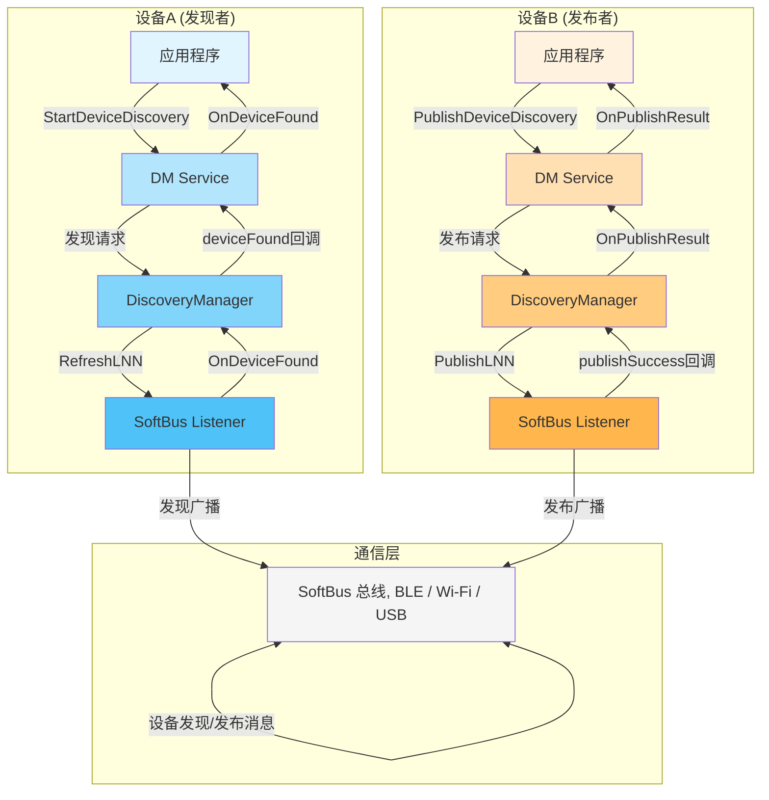
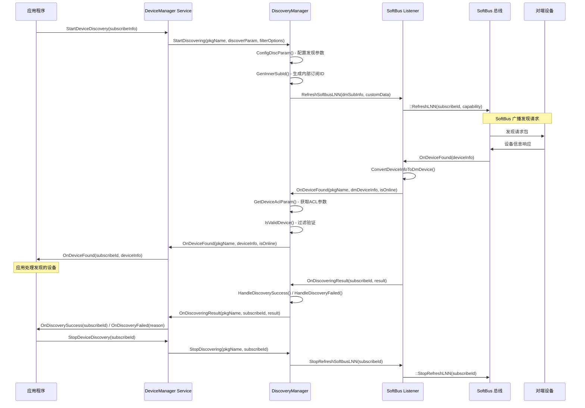

# 设备发布、发现与查询流程

**版本：** v2.0
**日期：** 2026-05-19

---

## 1. 概述

### 1.1 业务目标

设备发布、发现与查询功能是 OpenHarmony 分布式设备管理器的核心能力，允许应用程序：

- **发布设备**：将本地设备的服务和能力信息广播到周边网络，使其他设备能够发现本设备
- **发现设备**：主动扫描和发现周边附近的可用设备，获取设备基本信息
- **查询设备**：获取已信任设备列表、本地设备信息和特定设备详细信息

### 1.2 参与者

设备发布与发现流程涉及以下核心参与者：

- **应用程序**：调用 DeviceManager API 发起设备发布、发现或查询操作
- **DM Service**：设备管理服务，负责协调设备发现和发布逻辑
- **DiscoveryManager**：设备发现管理器，处理发现业务逻辑和过滤
- **SoftBus**：通信总线，提供底层设备发现和发布能力（蓝牙、Wi-Fi 等）
- **对端设备**：网络中的其他设备，响应发现请求或发布自身信息

---

## 2. 发布-发现对称模型

设备发布与发现采用对称模型，每个设备既可以作为发布者（Publisher），也可以作为发现者（Subscriber）。这种设计实现了真正的点对点设备发现能力。



---

## 3. 设备发布流程

设备发布允许本地设备向网络广播自身存在和服务能力，使其他设备能够发现它。

### 3.1 发布API

应用程序通过以下接口发起设备发布：

```cpp
// 在 device_manager.h 中定义
virtual int32_t PublishDeviceDiscovery(const std::string &pkgName, 
                                       const DmPublishInfo &publishInfo,
                                       std::shared_ptr<PublishCallback> callback) = 0;
```

### 3.2 发布信息参数

`DmPublishInfo` 结构体定义了发布参数（在 `dm_publish_info.h` 中）：

```cpp
typedef struct {
    int32_t publishId;              // 发布ID，标识一次发布操作
    DmDiscoverMode mode;            // 发现模式：被动(0x55) 或 主动(0xAA)
    DmExchangeFreq freq;            // 发布频率：LOW/MID/HIGH/SUPER_HIGH/EXTREME_HIGH
    bool ranging;                   // 是否启用测距
    DmExchangeMedium medium;        // 发布介质：AUTO/BLE/COAP/USB
} DmPublishInfo;
```

**参数说明：**
- `publishId`：应用层分配的唯一标识符，用于匹配发布结果回调
- `mode`：
  - `DM_DISCOVER_MODE_PASSIVE (0x55)`：被动模式，设备监听但不主动广播
  - `DM_DISCOVER_MODE_ACTIVE (0xAA)`：主动模式，设备主动广播自身信息
- `freq`：发布频率，控制广播包发送频率（仅蓝牙有效）
- `ranging`：是否计算设备间距离
- `medium`：通信介质选择
  - `DM_AUTO`：自动选择最佳介质
  - `DM_BLE`：蓝牙低功耗
  - `DM_COAP`：Wi-Fi (CoAP协议)
  - `DM_USB`：USB连接

### 3.3 发布调用链

```
Application.PublishDeviceDiscovery()
    ↓
DeviceManagerService.PublishDeviceDiscovery()
    ↓
SoftbusListener.PublishSoftbusLNN()
    ↓
SoftBus API :: PublishLNN()
```

### 3.4 发布结果回调

发布操作是异步的，结果通过 `PublishCallback` 返回：

```cpp
class PublishCallback {
public:
    virtual void OnPublishResult(int32_t publishId, int32_t publishResult) = 0;
};
```

**回调参数：**
- `publishId`：对应的发布ID
- `publishResult`：发布结果
  - `0`：发布成功
  - 非0：发布失败（错误码）

**成功条件：**
- SoftBus 成功注册发布服务
- 开始在指定介质上广播设备信息

**失败场景：**
- 参数错误（无效的 publishId、不支持的 medium）
- SoftBus 服务不可用
- 权限不足
- 介质不支持（如无蓝牙硬件时指定 BLE）

---

## 4. 设备发现流程

设备发现是发布的逆过程，允许应用扫描和发现周边可用设备。

### 4.1 发现流程序列图



### 4.2 发起发现

#### 4.2.1 发现API

应用程序通过以下接口发起设备发现：

```cpp
// 标准接口
virtual int32_t StartDeviceDiscovery(const std::string &pkgName, 
                                     const DmSubscribeInfo &subscribeInfo,
                                     const std::string &extra,
                                     std::shared_ptr<DiscoveryCallback> callback) = 0;

// 扩展接口（带tokenId）
virtual int32_t StartDeviceDiscovery(const std::string &pkgName, 
                                     uint64_t tokenId,
                                     const std::string &filterOptions,
                                     std::shared_ptr<DiscoveryCallback> callback) = 0;

// 最新接口（4.1+版本）
virtual int32_t StartDiscovering(const std::string &pkgName,
                                 std::map<std::string, std::string> &discoverParam,
                                 const std::map<std::string, std::string> &filterOptions,
                                 std::shared_ptr<DiscoveryCallback> callback) = 0;
```

#### 4.2.2 订阅信息参数

`DmSubscribeInfo` 结构体定义了发现订阅参数（在 `dm_subscribe_info.h` 中）：

```cpp
typedef struct DmSubscribeInfo {
    uint16_t subscribeId;           // 订阅ID，应用层分配的唯一标识
    DmDiscoverMode mode;            // 发现模式：被动或主动
    DmExchangeMedium medium;        // 订阅介质
    DmExchangeFreq freq;            // 订阅频率
    bool isSameAccount;             // 是否仅发现同账号设备
    bool isWakeRemote;              // 是否唤醒休眠设备
    char capability[DM_MAX_DEVICE_CAPABILITY_LEN];  // 能力标签（最多64字符）
} DmSubscribeInfo;
```

**参数详解：**

- `subscribeId`：应用层分配的订阅标识符（0-65535），必须唯一
  - 用于匹配发现结果回调
  - 停止发现时需要提供此ID

- `mode`：发现模式
  - `DM_DISCOVER_MODE_PASSIVE`：被动发现，监听其他设备的广播
  - `DM_DISCOVER_MODE_ACTIVE`：主动发现，主动发送探测请求

- `medium`：发现介质
  - `DM_BLE`：蓝牙低功耗发现（适用于近距离、低功耗场景）
  - `DM_COAP`：Wi-Fi发现（适用于高带宽、远距离场景）
  - `DM_USB`：USB发现（适用于有线连接）
  - `DM_AUTO`：自动选择（系统根据场景选择最优介质）

- `freq`：发现频率（仅蓝牙有效）
  - `DM_LOW`：低频率，省电但发现慢
  - `DM_MID`：中等频率，平衡功耗和性能
  - `DM_HIGH`：高频率，快速发现但功耗较高
  - `DM_SUPER_HIGH` / `DM_EXTREME_HIGH`：超高频率，极速发现

- `isSameAccount`：同账号过滤
  - `true`：仅返回登录了相同华为账号的设备
  - `false`：返回所有发现的设备

- `isWakeRemote`：唤醒远程设备
  - `true`：尝试唤醒处于休眠状态的设备
  - `false`：仅发现在线设备

- `capability`：能力过滤标签
  - 例如：`"display"`（显示设备）、`"camera"`（摄像头）、`"audio"`（音频设备）
  - 最多64字符，支持自定义能力标签

#### 4.2.3 发现内部流程

**在 DiscoveryManager 中：**

1. **参数配置** (`ConfigDiscParam`)
   - 解析和验证发现参数
   - 设置默认值（medium、freq）

2. **订阅ID映射** (`GenInnerSubId`)
   - 生成内部订阅ID（与外部subscribeId分离）
   - 维护映射关系：`pkgName -> {externalSubId -> internalSubId}`
   - 防止不同应用间ID冲突

3. **SoftBus发现** (`RefreshSoftbusLNN`)
   - 调用 SoftBus 的 `RefreshLNN` 接口
   - 传递订阅信息和能力标签
   - 注册发现回调

4. **启动超时定时器** (`StartDiscoveryTimer`)
   - 默认120秒超时
   - 超时后自动停止发现并清理资源

### 4.3 发现结果回调

#### 4.3.1 设备发现回调

```cpp
class DiscoveryCallback {
public:
    // 发现成功启动
    virtual void OnDiscoverySuccess(uint16_t subscribeId) = 0;
    
    // 发现失败
    virtual void OnDiscoveryFailed(uint16_t subscribeId, int32_t failedReason) = 0;
    
    // 发现设备（详细信息）
    virtual void OnDeviceFound(uint16_t subscribeId, const DmDeviceInfo &deviceInfo) {};
    
    // 发现设备（基本信息）
    virtual void OnDeviceFound(uint16_t subscribeId, const DmDeviceBasicInfo &deviceBasicInfo) {};
};
```

#### 4.3.2 设备信息结构

```cpp
typedef struct {
    char deviceId[DM_DEVICE_ID_LEN];        // 设备ID
    char deviceName[DM_DEVICE_NAME_LEN];    // 设备名称
    int32_t deviceType;                     // 设备类型（手机、平板、手表等）
    char networkId[DM_NETWORK_ID_LEN];      // 网络ID
} DmDeviceInfo;
```

**设备类型枚举：**
- `0x01`：智能手机
- `0x02`：平板
- `0x03`：智能手表
- `0x04`：智慧屏
- `0x05`：笔记本电脑
- `0x06`：智能音箱
- `0x07`：智能耳机
- 等等...

#### 4.3.3 发现结果处理流程

**SoftBus → DM 转换：**

1. **SoftBus回调** (`OnSoftbusDeviceFound`)
   - SoftBus 发现设备后触发回调
   - 传递 `DeviceInfo *` 结构

2. **信息转换** (`ConvertDeviceInfoToDmDevice`)
   ```cpp
   static void ConvertDeviceInfoToDmDevice(const DeviceInfo &device, DmDeviceInfo &dmDevice)
   ```
   - 转换设备ID、设备名、网络ID
   - 提取连接地址信息（IP、MAC、蓝牙地址）
   - 获取设备类型和能力信息

3. **权限检查** (`GetDeviceAclParam`)
   - 检查设备是否在ACL（访问控制列表）中
   - 获取设备在线状态
   - 获取认证方式（PIN码、无感认证等）

4. **设备过滤** (`IsValidDevice`)
   - 根据 `filterOptions` 过滤设备
   - 支持的过滤条件：
     - 设备状态（在线/离线）
     - 设备类型
     - 距离范围
     - 信任状态
     - 认证方式

5. **应用回调**
   - 通过 `OnDeviceFound` 回调应用层
   - 传递 `subscribeId` 和设备信息

#### 4.3.4 过滤机制

**过滤器类型（在 `discovery_filter.h` 中）：**

```cpp
struct DeviceFilters {
    std::string type;     // 过滤类型
    int32_t value;        // 过滤值
};

struct DeviceFilterPara {
    bool isOnline;        // 在线状态
    int32_t range;        // 距离范围
    bool isTrusted;       // 信任状态
    int32_t authForm;     // 认证方式
    int32_t deviceType;   // 设备类型
};
```

**支持的过滤器：**

- **设备状态过滤** (`FilterByDeviceState`)
  - 仅返回在线设备：`{"type": "online", "value": 1}`
  - 仅返回离线设备：`{"type": "online", "value": 0}`

- **距离过滤** (`FilterByRange`)
  - 例如：`{"type": "range", "value": 5}` （5米内）

- **设备类型过滤** (`FilterByDeviceType`)
  - 例如：`{"type": "deviceType", "value": 0x01}` （仅手机）

- **信任状态过滤**
  - 例如：`{"type": "trusted", "value": 1}` （仅已信任设备）

**过滤操作符：**

- **AND 过滤**：所有条件都满足
  ```json
  {
    "filterOp": "AND",
    "filters": [
      {"type": "online", "value": 1},
      {"type": "deviceType", "value": 0x01}
    ]
  }
  ```

- **OR 过滤**：任一条件满足
  ```json
  {
    "filterOp": "OR",
    "filters": [
      {"type": "deviceType", "value": 0x01},  // 手机
      {"type": "deviceType", "value": 0x02}   // 平板
    ]
  }
  ```

### 4.4 停止发现

#### 4.4.1 停止API

```cpp
// 标准接口
virtual int32_t StopDeviceDiscovery(const std::string &pkgName, uint16_t subscribeId) = 0;

// 扩展接口（带tokenId）
virtual int32_t StopDeviceDiscovery(uint64_t tokenId, const std::string &pkgName) = 0;

// 最新接口（4.1+版本）
virtual int32_t StopDiscovering(const std::string &pkgName,
                                std::map<std::string, std::string> &discoverParam) = 0;
```

#### 4.4.2 停止流程

1. **验证订阅ID**
   - 检查 `subscribeId` 是否存在
   - 验证调用者权限

2. **获取内部订阅ID**
   - 通过 `GetAndRemoveInnerSubId` 获取内部ID
   - 从映射表中移除外部ID

3. **停止SoftBus发现**
   - 调用 `StopRefreshSoftbusLNN(internalSubscribeId)`
   - 注销SoftBus发现回调

4. **清理资源**
   - 清理定时器
   - 清理发现上下文 (`discoveryContextMap_`)
   - 释放订阅ID

**注意事项：**
- `StopDeviceDiscovery` 必须与 `StartDeviceDiscovery` 配对使用
- 传递的 `subscribeId` 必须与启动时一致
- 停止后不会再收到设备发现回调
- 多次停止同一 `subscribeId` 是安全的（幂等操作）

---

## 5. 设备查询

设备查询提供同步API，用于获取已知设备的信息，无需发起发现流程。

### 5.1 查询可信设备列表

#### 5.1.1 API接口

```cpp
// 标准接口
virtual int32_t GetTrustedDeviceList(const std::string &pkgName,
                                     const std::string &extra,
                                     std::vector<DmDeviceInfo> &deviceList) = 0;

// 带刷新的接口
virtual int32_t GetTrustedDeviceList(const std::string &pkgName,
                                     const std::string &extra,
                                     bool isRefresh,
                                     std::vector<DmDeviceInfo> &deviceList) = 0;

// 扩展接口（4.1+版本）
virtual int32_t GetTrustedDeviceList(const std::string &pkgName,
                                     const std::map<std::string, std::string> &filterOptions,
                                     bool isRefresh,
                                     std::vector<DmDeviceInfo> &deviceList) = 0;

// 获取所有可信设备
virtual int32_t GetAllTrustedDeviceList(const std::string &pkgName,
                                       const std::string &extra,
                                       std::vector<DmDeviceInfo> &deviceList) = 0;
```

#### 5.1.2 参数说明

- `pkgName`：调用者包名
- `extra`：扩展信息（通常为空字符串）
- `isRefresh`：是否强制刷新设备列表
  - `true`：从SoftBus重新拉取最新设备列表
  - `false`：返回缓存的设备列表（性能更好）
- `filterOptions`：过滤选项（4.1+版本支持）
  - 可按设备类型、在线状态等过滤
- `deviceList`：输出参数，返回设备信息列表

#### 5.1.3 实现流程

```
GetTrustedDeviceList()
    ↓
SoftbusListener.GetTrustedDeviceList()
    ↓
SoftBus API :: GetAllNodeDeviceInfo()
    ↓
ConvertNodeBasicInfoToDmDevice() - 转换每个设备信息
    ↓
返回 std::vector<DmDeviceInfo>
```

#### 5.1.4 使用场景

- 应用启动时获取已信任设备列表
- 用户查看"我的设备"界面
- 需要与特定设备建立连接前的预检查

### 5.2 查询本地设备信息

#### 5.2.1 API接口

```cpp
virtual int32_t GetLocalDeviceInfo(const std::string &pkgName,
                                   DmDeviceInfo &deviceInfo) = 0;
```

#### 5.2.2 获取本地设备属性

还有多个便捷接口获取本地设备特定属性：

```cpp
// 获取本地设备网络ID
virtual int32_t GetLocalDeviceNetWorkId(const std::string &pkgName,
                                        std::string &networkId) = 0;

// 获取本地设备ID
virtual int32_t GetLocalDeviceId(const std::string &pkgName,
                                 std::string &deviceId) = 0;

// 获取本地设备名称
virtual int32_t GetLocalDeviceName(const std::string &pkgName,
                                   std::string &deviceName) = 0;

// 获取本地设备类型
virtual int32_t GetLocalDeviceType(const std::string &pkgName,
                                   int32_t &deviceType) = 0;

// 获取本地设备显示名称
virtual int32_t GetLocalDisplayDeviceName(const std::string &pkgName,
                                         int32_t maxNameLength,
                                         std::string &displayName) = 0;
```

#### 5.2.3 设备信息内容

返回的 `DmDeviceInfo` 包含：
- `deviceId`：设备唯一标识符
- `deviceName`：设备名称
- `deviceType`：设备类型
- `networkId`：分布式网络ID
- 其他设备元数据

### 5.3 查询指定设备信息

#### 5.3.1 按网络ID查询

```cpp
virtual int32_t GetDeviceInfo(const std::string &pkgName,
                              const std::string networkId,
                              DmDeviceInfo &deviceInfo) = 0;
```

**参数：**
- `networkId`：设备的分布式网络ID

**返回：**
- 成功：填充 `deviceInfo` 结构
- 失败：返回错误码（设备不存在、参数错误等）

#### 5.3.2 其他查询接口

```cpp
// 根据网络ID获取设备名称
virtual int32_t GetDeviceName(const std::string &pkgName,
                              const std::string &networkId,
                              std::string &deviceName) = 0;

// 根据网络ID获取设备类型
virtual int32_t GetDeviceType(const std::string &pkgName,
                              const std::string &networkId,
                              int32_t &deviceType) = 0;

// 根据网络ID获取UDID
virtual int32_t GetUdidByNetworkId(const std::string &pkgName,
                                  const std::string &networkId,
                                  std::string &udid) = 0;

// 根据网络ID获取UUID
virtual int32_t GetUuidByNetworkId(const std::string &pkgName,
                                  const std::string &networkId,
                                  std::string &uuid) = 0;

// 根据网络ID获取网络类型
virtual int32_t GetNetworkTypeByNetworkId(const std::string &pkgName,
                                         const std::string &networkId,
                                         int32_t &networkType) = 0;

// 根据UDID获取网络ID
virtual int32_t GetNetworkIdByUdid(const std::string &pkgName,
                                  const std::string &udid,
                                  std::string &networkId) = 0;

// 根据UDID获取设备名称
static int32_t GetDeviceNameByUdid(const std::string &udid,
                                   std::string &deviceName);
```

### 5.4 获取可用设备列表

```cpp
virtual int32_t GetAvailableDeviceList(const std::string &pkgName,
                                      std::vector<DmDeviceBasicInfo> &deviceList) = 0;
```

**区别于可信设备列表：**
- 可信设备：已完成认证配对的设备
- 可用设备：可被发现且可用于连接的设备（包括未配对的）

---

## 6. 发现过滤与排序

### 6.1 过滤模型

设备发现支持多维度过滤机制，确保应用只收到相关设备。

#### 6.1.1 过滤维度

| 过滤维度 | 类型 | 说明 | 示例 |
|---------|------|------|------|
| 设备状态 | bool | 在线/离线 | 仅在线设备 |
| 设备类型 | int32_t | 手机/平板/手表等 | 仅手机 |
| 距离范围 | int32_t | 距离值（米） | 5米内 |
| 信任状态 | bool | 已信任/未信任 | 仅已信任 |
| 认证方式 | int32_t | PIN码/无感/声纹等 | 仅无感认证设备 |
| 同账号 | bool | 是否同账号 | 仅同账号设备 |
| 能力标签 | string | 能力标识 | 仅投屏设备 |

#### 6.1.2 过滤器实现

**在 `DiscoveryFilter` 类中：**

```cpp
class DiscoveryFilter {
public:
    bool IsValidDevice(const std::string &filterOp,
                       const std::vector<DeviceFilters> &filters,
                       const DeviceFilterPara &filterPara);

private:
    bool FilterByDeviceState(int32_t value, bool isActive);
    bool FilterByRange(int32_t value, int32_t range);
    bool FilterByDeviceType(int32_t value, int32_t deviceType);
    bool FilterByType(const DeviceFilters &filters, const DeviceFilterPara &filterPara);
    bool FilterOr(const std::vector<DeviceFilters> &filters, const DeviceFilterPara &filterPara);
    bool FilterAnd(const std::vector<DeviceFilters> &filters, const DeviceFilterPara &filterPara);
};
```

### 6.2 结果排序规则

设备发现的返回结果按以下优先级排序：

1. **在线状态**：在线设备优先于离线设备
2. **距离**：近距离设备优先（如果启用了 ranging）
3. **设备类型**：按设备类型分组（手机、平板、手表等）
4. **信任状态**：已信任设备优先
5. **发现时间**：先发现的设备优先

**排序示例：**
```
[在线] [已信任] [手机] [距离1米] ← 最优先
[在线] [已信任] [平板] [距离3米]
[在线] [未信任] [手机] [距离5米]
[离线] [已信任] [手表] ← 最后
```

---

## 7. 关键代码路径

| 功能 | 源代码路径 |
|------|-----------|
| **公共API接口** | |
| DeviceManager API定义 | `interfaces/inner_kits/native_cpp/include/device_manager.h` |
| 回调接口定义 | `interfaces/inner_kits/native_cpp/include/device_manager_callback.h` |
| 发布信息结构 | `interfaces/inner_kits/native_cpp/include/dm_publish_info.h` |
| 订阅信息结构 | `interfaces/inner_kits/native_cpp/include/dm_subscribe_info.h` |
| **服务层实现** | |
| DiscoveryManager | `services/service/include/discovery/discovery_manager.h` |
| DiscoveryFilter | `services/service/include/discovery/discovery_filter.h` |
| SoftbusListener | `services/service/include/softbus/softbus_listener.h` |
| **实现文件** | |
| DiscoveryManager实现 | `services/service/src/discovery/discovery_manager.cpp` |
| DiscoveryFilter实现 | `services/service/src/discovery/discovery_filter.cpp` |
| SoftbusListener实现 | `services/service/src/softbus/softbus_listener.cpp` |
| **内部接口** | |
| SoftBus回调接口 | `services/service/include/i_softbus_discovering_callback.h` |
| 设备信息结构 | `interfaces/inner_kits/native_cpp/include/dm_device_info.h` |

---

## 8. 最佳实践与注意事项

### 8.1 发布设备

1. **发布生命周期管理**
   - 应用退出前必须调用 `UnPublishDeviceDiscovery` 停止发布
   - 持续发布会消耗电量，仅在需要时启用
   - 合理设置发布频率，避免过高频率影响其他应用

2. **发布ID管理**
   - `publishId` 在应用范围内必须唯一
   - 记录发布的 `publishId` 以便后续停止
   - 避免使用硬编码的ID值

3. **介质选择**
   - 优先使用 `DM_AUTO` 让系统自动选择
   - BLE适合近距离、低功耗场景
   - COAP适合高带宽、远距离场景

### 8.2 发现设备

1. **订阅ID管理**
   - `subscribeId` 在应用范围内必须唯一
   - 避免重复使用相同的 `subscribeId`
   - 应用退出前停止所有进行中的发现

2. **发现超时**
   - 发现默认120秒超时
   - 超时后需重新发起发现
   - 应用可根据场景调整超时时间

3. **过滤优化**
   - 合理使用过滤器减少不必要的回调
   - 同账号设备发现更快，优先使用
   - 能力标签过滤可大幅减少无关设备

4. **性能考虑**
   - 避免同时发起多个发现请求
   - 高频发现会消耗较多电量
   - 发现结果应缓存使用，避免重复查询

### 8.3 设备查询

1. **缓存策略**
   - 优先使用不带 `isRefresh` 的接口（性能更好）
   - 仅在需要最新数据时设置 `isRefresh=true`
   - 应用层可缓存设备列表减少查询

2. **错误处理**
   - 所有API都应检查返回值
   - 设备可能随时离线，做好异常处理
   - 网络ID可能失效，使用前验证有效性

### 8.4 权限管理

设备发布与发现需要以下权限：

```json
{
  "requestPermissions": [
    {
      "name": "ohos.permission.DISTRIBUTED_DEVICE_CONNECT"
    },
    {
      "name": "ohos.permission.GET_DISTRIBUTED_DEVICE_INFO"
    },
    {
      "name": "ohos.permission.ACCESS_BLUETOOTH"  // 如果使用BLE
    }
  ]
}
```

---

## 9. 错误码

| 错误码 | 说明 | 处理建议 |
|-------|------|---------|
| `0` | 成功 | - |
| `-1` | 通用错误 | 检查参数和权限 |
| `10001` | 参数错误 | 检查subscribeId/publishId有效性 |
| `10002` | 权限不足 | 检查应用权限配置 |
| `10003` | 服务不可用 | 确认DM服务已启动 |
| `10004` | 设备不存在 | 确认设备ID或网络ID正确 |
| `10005` | 超时 | 重试或调整超时时间 |
| `10006` | 介质不支持 | 检查设备硬件支持 |
| `10007` | 订阅ID冲突 | 使用不同的subscribeId |
| `10008` | 过滤器格式错误 | 检查filterOptions JSON格式 |

---

## 10. 示例代码

### 10.1 发布设备

```cpp
#include "device_manager.h"
#include "dm_publish_info.h"

using namespace OHOS::DistributedHardware;

class MyPublishCallback : public PublishCallback {
public:
    void OnPublishResult(int32_t publishId, int32_t publishResult) override {
        if (publishResult == 0) {
            printf("发布成功，publishId: %d\n", publishId);
        } else {
            printf("发布失败，错误码: %d\n", publishResult);
        }
    }
};

// 发布设备
DmPublishInfo publishInfo = {
    .publishId = 1001,
    .mode = DM_DISCOVER_MODE_ACTIVE,
    .freq = DM_MID,
    .ranging = true,
    .medium = DM_AUTO
};

auto callback = std::make_shared<MyPublishCallback>();
int32_t ret = DeviceManager::GetInstance().PublishDeviceDiscovery(
    "com.example.app", publishInfo, callback);
```

### 10.2 发现设备

```cpp
#include "device_manager.h"
#include "dm_subscribe_info.h"

class MyDiscoveryCallback : public DiscoveryCallback {
public:
    void OnDiscoverySuccess(uint16_t subscribeId) override {
        printf("发现成功启动，subscribeId: %d\n", subscribeId);
    }

    void OnDiscoveryFailed(uint16_t subscribeId, int32_t failedReason) override {
        printf("发现失败，subscribeId: %d, 错误码: %d\n", subscribeId, failedReason);
    }

    void OnDeviceFound(uint16_t subscribeId, const DmDeviceInfo &deviceInfo) override {
        printf("发现设备: %s (类型: %d)\n", deviceInfo.deviceName, deviceInfo.deviceType);
    }
};

// 发现设备
DmSubscribeInfo subscribeInfo = {
    .subscribeId = 2001,
    .mode = DM_DISCOVER_MODE_ACTIVE,
    .medium = DM_BLE,
    .freq = DM_HIGH,
    .isSameAccount = false,
    .isWakeRemote = false,
    .capability = "display"  // 发现投屏设备
};

auto callback = std::make_shared<MyDiscoveryCallback>();
int32_t ret = DeviceManager::GetInstance().StartDeviceDiscovery(
    "com.example.app", subscribeInfo, "", callback);

// 停止发现
DeviceManager::GetInstance().StopDeviceDiscovery("com.example.app", 2001);
```

### 10.3 查询可信设备

```cpp
#include "device_manager.h"

using namespace OHOS::DistributedHardware;

// 获取可信设备列表（使用缓存）
std::vector<DmDeviceInfo> deviceList;
int32_t ret = DeviceManager::GetInstance().GetTrustedDeviceList(
    "com.example.app", "", deviceList);

printf("找到 %d 个可信设备:\n", deviceList.size());
for (const auto &device : deviceList) {
    printf("  - %s (类型: %d, 网络: %s)\n",
           device.deviceName, device.deviceType, device.networkId);
}

// 强制刷新设备列表
ret = DeviceManager::GetInstance().GetTrustedDeviceList(
    "com.example.app", "", true, deviceList);
```

### 10.4 查询本地设备

```cpp
#include "device_manager.h"

using namespace OHOS::DistributedHardware;

// 获取本地设备信息
DmDeviceInfo localDevice;
int32_t ret = DeviceManager::GetInstance().GetLocalDeviceInfo(
    "com.example.app", localDevice);

printf("本地设备:\n");
printf("  设备名: %s\n", localDevice.deviceName);
printf("  设备ID: %s\n", localDevice.deviceId);
printf("  设备类型: %d\n", localDevice.deviceType);
printf("  网络ID: %s\n", localDevice.networkId);

// 获取本地设备名称
std::string deviceName;
ret = DeviceManager::GetInstance().GetLocalDeviceName("com.example.app", deviceName);
printf("设备名称: %s\n", deviceName.c_str());
```

---

**文档结束**
