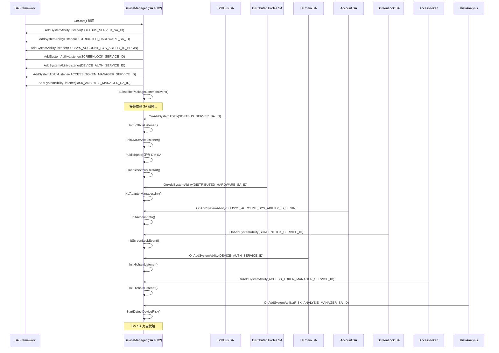
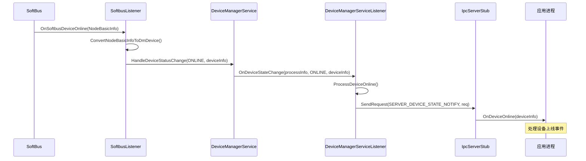

# DeviceManager 设备监听机制

**版本**: v2.0  
**日期**: 2026-05-19

---

## 1. 概述

DeviceManager (DM) 作为 OpenHarmony 分布式硬件系统的核心服务，构建了完整的多维度监听体系，实现设备生命周期感知、服务依赖管理和事件分发。本文档详细阐述 DM 的五大监听维度：

1. **SA 启停管理**：DM 作为 SystemAbility 的启动流程、依赖 SA 就绪监听
2. **死亡通知监听**：客户端与服务端的双向死亡感知机制
3. **设备上下线监听**：SoftBus 设备事件分发到应用层的完整链路
4. **依赖 SA 就绪监听**：SoftBus、DP（分布式配置）、HiChain 的可用性监听
5. **其他业务监听**：设备发现、认证 UI、PIN 码等业务事件监听

---

## 2. DM SA 启停管理

### 2.1 SA 注册与发布

DM 通过 `sa_profile/4802.json` 配置文件注册为 SystemAbility：

```json
{
    "process": "device_manager",
    "systemability": [
        {
            "name": 4802,
            "libpath": "libdevicemanagerservice.z.so",
            "run-on-create": true,
            "distributed": false,
            "dump_level": 1
        }
    ]
}
```

**关键配置说明**：
- `name: 4802`：DM 的系统能力 ID（`DISTRIBUTED_HARDWARE_DEVICEMANAGER_SA_ID`）
- `run-on-create: true`：系统启动时立即创建
- `distributed: false`：非分布式 SA（单设备运行）

**SA 实现类**：
```cpp
// services/service/src/ipc/standard/ipc_server_stub.cpp
class IpcServerStub : public SystemAbility, public IRemoteStub<IpcRemoteBroker> {
    void OnStart() override;      // SA 启动入口
    void OnStop() override;       // SA 停止入口
    void OnAddSystemAbility(int32_t systemAbilityId, const std::string& deviceId) override;
    void OnRemoveSystemAbility(int32_t systemAbilityId, const std::string& deviceId) override;
};
```

### 2.2 DM 启动时序



**关键代码路径**：
```cpp
// services/service/src/ipc/standard/ipc_server_stub.cpp
void IpcServerStub::OnStart() {
    // 注册依赖 SA 监听
    AddSystemAbilityListener(SOFTBUS_SERVER_SA_ID);           // SoftBus
    AddSystemAbilityListener(DISTRIBUTED_HARDWARE_SA_ID);     // DP
    AddSystemAbilityListener(SUBSYS_ACCOUNT_SYS_ABILITY_ID_BEGIN); // Account
    AddSystemAbilityListener(SCREENLOCK_SERVICE_ID);          // 屏幕锁定
    AddSystemAbilityListener(DEVICE_AUTH_SERVICE_ID);         // HiChain
    AddSystemAbilityListener(ACCESS_TOKEN_MANAGER_SERVICE_ID);// 权限
    AddSystemAbilityListener(RISK_ANALYSIS_MANAGER_SA_ID);    // 风险检测
    
    DeviceManagerService::GetInstance().SubscribePackageCommonEvent();
}

void IpcServerStub::OnAddSystemAbility(int32_t systemAbilityId, const std::string& deviceId) {
    if (systemAbilityId == SOFTBUS_SERVER_SA_ID) {
        DeviceManagerService::GetInstance().InitSoftbusListener();
        if (!Init()) {  // 发布 DM SA
            LOGE("failed to init IpcServerStub");
            state_ = ServiceRunningState::STATE_NOT_START;
            return;
        }
        state_ = ServiceRunningState::STATE_RUNNING;
        DeviceNameManager::GetInstance().InitDeviceNameWhenSoftBusReady();
        DeviceManagerService::GetInstance().HandleSoftbusRestart();
    }
    // ... 处理其他 SA
}

bool IpcServerStub::Init() {
    KVAdapterManager::GetInstance().Init();  // 初始化 KV 存储
    DeviceManagerService::GetInstance().InitDMServiceListener();
    bool ret = Publish(this);  // 向 SA Framework 发布 DM
    return ret;
}
```

**发布时机策略**：
- DM 在 `OnStart()` 中**只注册监听器**，**不发布自身**
- 等待 **SoftBus SA 就绪**后，才调用 `Publish(this)` 发布 DM
- 确保 DM 发布时已具备设备发现能力

---

## 3. DM 死亡通知监听

### 3.1 客户端侧死亡监听

应用通过 `DmInitCallback` 监听 DM 服务死亡：

```cpp
// interfaces/inner_kits/native_cpp/include/device_manager_callback.h
class DmInitCallback {
public:
    virtual ~DmInitCallback() {}
    virtual void OnRemoteDied() = 0;  // DM 服务死亡回调
};
```

**客户端使用方式**：
```cpp
// 应用初始化 DM 时注册死亡监听
auto callback = std::make_shared<MyDmInitCallback>();
DeviceManager::GetInstance().InitDeviceManager(pkgName, callback);

void MyDmInitCallback::OnRemoteDied() {
    // DM 服务异常死亡，执行清理和重连逻辑
    LOGE("DeviceManager service died, cleaning up...");
    // 1. 清理本地状态
    // 2. 重新初始化 DM
}
```

**实现机制**：
- 使用 IPC `DeathRecipient` 监听远程对象死亡
- DM 服务进程崩溃或被杀死时，客户端收到 `OnRemoteDied` 回调
- 应用需实现重连逻辑

### 3.2 服务端侧客户端死亡处理

DM 服务端监听客户端进程死亡，清理对应资源：

```cpp
// services/service/include/ipc/standard/ipc_server_stub.h
class AppDeathRecipient : public IRemoteObject::DeathRecipient {
public:
    void OnRemoteDied(const wptr<IRemoteObject> &remote) override;
};

class IpcServerStub : public SystemAbility {
    std::map<ProcessInfo, sptr<AppDeathRecipient>> appRecipient_;  // 死亡监听器
    std::map<ProcessInfo, sptr<IpcRemoteBroker>> dmListener_;      // 客户端监听器
};
```

**死亡处理流程**：
```cpp
void AppDeathRecipient::OnRemoteDied(const wptr<IRemoteObject> &remote) {
    // 1. 识别死亡进程
    ProcessInfo processInfo = IpcServerStub::GetInstance().GetDmListenerPkgName(remote);
    
    // 2. 清理监听器
    IpcServerStub::GetInstance().UnRegisterDeviceManagerListener(processInfo);
    
    // 3. 通知业务模块
    DeviceManagerService::GetInstance().RemoveNotifyRecord(processInfo);
    
    // 4. 清理发现缓存
    DeviceManagerService::GetInstance().ClearDiscoveryCache(processInfo);
    
    // 5. 清理发布缓存
    DeviceManagerService::GetInstance().ClearPublishIdCache(processInfo);
}
```

**资源清理项**：
| 清理项 | 说明 |
|--------|------|
| 监听器注销 | 移除 `dmListener_` 和 `appRecipient_` 映射 |
| 设备状态回调 | 清理该应用的设备状态监听 |
| 发现缓存 | 清理该应用的设备发现订阅 |
| 发布缓存 | 清理该应用的设备发布会话 |
| 认证会话 | 终止该应用进行的设备认证流程 |

---

## 4. 设备上下线监听

### 4.1 注册监听

应用通过 `DeviceStateCallback` 或 `DeviceStatusCallback` 注册设备状态监听：

```cpp
// interfaces/inner_kits/native_cpp/include/device_manager_callback.h
class DeviceStateCallback {
public:
    virtual void OnDeviceOnline(const DmDeviceInfo &deviceInfo) = 0;    // 设备上线
    virtual void OnDeviceOffline(const DmDeviceInfo &deviceInfo) = 0;   // 设备下线
    virtual void OnDeviceChanged(const DmDeviceInfo &deviceInfo) = 0;   // 设备信息变更
    virtual void OnDeviceReady(const DmDeviceInfo &deviceInfo) = 0;     // 设备就绪
};
```

**注册接口**：
```cpp
// interfaces/inner_kits/native_cpp/include/device_manager.h
virtual int32_t RegisterDevStateCallback(
    const std::string &pkgName,
    const std::string &extra,
    std::shared_ptr<DeviceStateCallback> callback) = 0;
```

### 4.2 事件分发机制



**关键代码路径**：

1. **SoftBus 事件接收**：
```cpp
// services/service/include/softbus/softbus_listener.h
class SoftbusListener {
public:
    static void OnSoftbusDeviceOnline(NodeBasicInfo *info);
    static void OnSoftbusDeviceOffline(NodeBasicInfo *info);
    static void OnSoftbusDeviceInfoChanged(NodeBasicInfoType type, NodeBasicInfo *info);
};
```

2. **DM 服务处理**：
```cpp
// services/service/include/device_manager_service.h
class DeviceManagerService {
public:
    void HandleDeviceStatusChange(DmDeviceState devState, DmDeviceInfo &devInfo, const bool isOnline);
};
```

3. **事件分发到应用**：
```cpp
// services/service/include/device_manager_service_listener.h
class DeviceManagerServiceListener {
public:
    void OnDeviceStateChange(const ProcessInfo &processInfo, const DmDeviceState &state,
        const DmDeviceInfo &info, const bool isOnline) override;
};
```

**设备状态定义**：
```cpp
enum DmDeviceState {
    DEVICE_STATE_UNKNOWN = 0,
    DEVICE_STATE_ONLINE,      // 设备上线
    DEVICE_STATE_OFFLINE,     // 设备下线
    DEVICE_STATE_CHANGED,     // 设备信息变更
    DEVICE_STATE_READY,       // 设备就绪
};
```

---

## 5. 依赖 SA 就绪监听

### 5.1 SoftBus 就绪监听

**监听机制**：
```cpp
// services/service/src/ipc/standard/ipc_server_stub.cpp
void IpcServerStub::OnStart() {
    AddSystemAbilityListener(SOFTBUS_SERVER_SA_ID);
}

void IpcServerStub::OnAddSystemAbility(int32_t systemAbilityId, const std::string& deviceId) {
    if (systemAbilityId == SOFTBUS_SERVER_SA_ID) {
        HandleSoftBusServerAdd();  // SoftBus 就绪回调
    }
}

void IpcServerStub::HandleSoftBusServerAdd() {
    DeviceManagerService::GetInstance().InitSoftbusListener();
    if (!Init()) {
        LOGE("failed to init IpcServerStub");
        state_ = ServiceRunningState::STATE_NOT_START;
        return;
    }
    state_ = ServiceRunningState::STATE_RUNNING;
    DeviceNameManager::GetInstance().InitDeviceNameWhenSoftBusReady();
    DeviceManagerService::GetInstance().HandleSoftbusRestart();
}
```

**SoftBus 初始化**：
```cpp
// services/service/include/softbus/softbus_listener.h
class SoftbusListener {
public:
    int32_t InitSoftbusListener();
    int32_t GetTrustedDeviceList(std::vector<DmDeviceInfo> &deviceInfoList);
    int32_t GetLocalDeviceInfo(DmDeviceInfo &deviceInfo);
};
```

### 5.2 DP（Distributed Profile）就绪监听

**监听配置**：
```cpp
// services/service/src/ipc/standard/ipc_server_stub.cpp
void IpcServerStub::OnStart() {
    AddSystemAbilityListener(DISTRIBUTED_HARDWARE_SA_ID);  // DP SA ID
}
```

**DP 初始化**：
```cpp
bool IpcServerStub::Init() {
    KVAdapterManager::GetInstance().Init();  // 初始化 KV 存储适配器
    // ...
}
```

### 5.3 HiChain 就绪监听

**监听配置**：
```cpp
// services/service/src/ipc/standard/ipc_server_stub.cpp
void IpcServerStub::OnAddSystemAbility(int32_t systemAbilityId, const std::string& deviceId) {
    if (systemAbilityId == DEVICE_AUTH_SERVICE_ID) {
        DeviceManagerService::GetInstance().InitHichainListener();
    }
    if (systemAbilityId == ACCESS_TOKEN_MANAGER_SERVICE_ID) {
        DeviceManagerService::GetInstance().InitHichainListener();
    }
}
```

**HiChain 初始化**：
```cpp
// services/service/include/hichain/hichain_listener.h
class HichainListener {
public:
    HichainListener();
    ~HichainListener();
    void RegisterDataChangeCb();      // 注册数据变更回调
    void RegisterCredentialCb();      // 注册凭证回调
    
    static void OnHichainDeviceUnBound(const char *peerUdid, const char *groupInfo);
    static void OnCredentialDeleted(const char *credId, const char *credInfo);
};
```

**依赖 SA 监听汇总**：

| SA 名称 | SA ID | 监听作用 | 初始化操作 |
|---------|-------|----------|------------|
| SoftBus | `SOFTBUS_SERVER_SA_ID` | 设备组网能力 | `InitSoftbusListener()` + 发布 DM SA |
| Distributed Profile | `DISTRIBUTED_HARDWARE_SA_ID` | 分布式配置存储 | `KVAdapterManager::Init()` |
| HiChain | `DEVICE_AUTH_SERVICE_ID` | 设备认证能力 | `InitHichainListener()` |
| Access Token | `ACCESS_TOKEN_MANAGER_SERVICE_ID` | 权限管理 | `InitHichainListener()` |
| Account | `SUBSYS_ACCOUNT_SYS_ABILITY_ID_BEGIN` | 多用户管理 | `InitAccountInfo()` |
| ScreenLock | `SCREENLOCK_SERVICE_ID` | 屏幕状态 | `InitScreenLockEvent()` |
| Risk Analysis | `RISK_ANALYSIS_MANAGER_SA_ID` | 安全风险检测 | `StartDetectDeviceRisk()` |

---

## 6. 其他业务监听

### 6.1 发现结果监听

**回调接口**：
```cpp
// interfaces/inner_kits/native_cpp/include/device_manager_callback.h
class DiscoveryCallback {
public:
    virtual void OnDiscoverySuccess(uint16_t subscribeId) = 0;              // 发现成功
    virtual void OnDiscoveryFailed(uint16_t subscribeId, int32_t failedReason) = 0; // 发现失败
    virtual void OnDeviceFound(uint16_t subscribeId, const DmDeviceInfo &deviceInfo) = 0; // 找到设备
};
```

**使用方式**：
```cpp
auto discoveryCallback = std::make_shared<MyDiscoveryCallback>();
DeviceManager::GetInstance().StartDeviceDiscovery(pkgName, subscribeInfo, extra, discoveryCallback);
```

### 6.2 认证 UI 状态监听

**回调接口**：
```cpp
class DeviceManagerUiCallback {
public:
    virtual void OnCall(const std::string &paramJson) = 0;  // UI 状态回调
};
```

**注册接口**：
```cpp
virtual int32_t RegisterDeviceManagerFaCallback(
    const std::string &pkgName,
    std::shared_ptr<DeviceManagerUiCallback> callback) = 0;
```

### 6.3 PIN 码状态监听

**回调接口**：
```cpp
class PinHolderCallback {
public:
    virtual void OnPinHolderCreate(const std::string &deviceId, DmPinType pinType, const std::string &payload) = 0;
    virtual void OnPinHolderDestroy(DmPinType pinType, const std::string &payload) = 0;
    virtual void OnCreateResult(int32_t result) = 0;
    virtual void OnDestroyResult(int32_t result) = 0;
    virtual void OnPinHolderEvent(DmPinHolderEvent event, int32_t result, const std::string &content) = 0;
};
```

**注册接口**：
```cpp
virtual int32_t RegisterPinHolderCallback(
    const std::string &pkgName,
    std::shared_ptr<PinHolderCallback> callback) = 0;
```

---

## 7. 监听体系架构总图

```mermaid
graph TB
    subgraph SystemAbility Framework
        SA[SA Manager]
    end
    subgraph DeviceManager Service (SA 4802)
        Stub[IpcServerStub]
        DMS[DeviceManagerService]
        SL[SoftbusListener]
        HL[HichainListener]
        LS[DeviceManagerServiceListener]
    end
    subgraph 依赖 SystemAbility
        SB[SoftBus SA]
        DP[Distributed Profile SA]
        HC[HiChain SA]
        ACC[Account SA]
        SCR[ScreenLock SA]
    end
    subgraph 应用层
        App1[应用 A]
        App2[应用 B]
    end
    SA -->|OnStart| Stub
    SA -->|OnAddSystemAbility| Stub
    Stub -->|AddSystemAbilityListener| SB
    Stub -->|AddSystemAbilityListener| DP
    Stub -->|AddSystemAbilityListener| HC
    Stub -->|AddSystemAbilityListener| ACC
    Stub -->|AddSystemAbilityListener| SCR
    SB -->|OnAddSystemAbility| Stub
    DP -->|OnAddSystemAbility| Stub
    HC -->|OnAddSystemAbility| Stub
    ACC -->|OnAddSystemAbility| Stub
    SCR -->|OnAddSystemAbility| Stub
    Stub -->|HandleSoftBusServerAdd| DMS
    DMS -->|InitSoftbusListener| SL
    DMS -->|InitHichainListener| HL
    SL -->|OnSoftbusDeviceOnline| DMS
    DMS -->|OnDeviceStateChange| LS
    LS -->|IPC| App1
    LS -->|IPC| App2
    App1 -->|RegisterDevStateCallback| LS
    App2 -->|RegisterDevStateCallback| LS
    App1 -->|DeathRecipient| Stub
    App2 -->|DeathRecipient| Stub
```

---

## 8. 关键代码路径

| 监听类型 | 头文件路径 | 实现文件路径 |
|---------|-----------|-------------|
| **SA 启停管理** | | |
| IpcServerStub 定义 | `services/service/include/ipc/standard/ipc_server_stub.h` | `services/service/src/ipc/standard/ipc_server_stub.cpp` |
| DeviceManagerService | `services/service/include/device_manager_service.h` | `services/implementation/src/device_manager_service_impl.cpp` |
| **死亡通知监听** | | |
| DmInitCallback | `interfaces/inner_kits/native_cpp/include/device_manager_callback.h` | - |
| AppDeathRecipient | `services/service/include/ipc/standard/ipc_server_stub.h` | `services/service/src/ipc/standard/ipc_server_stub.cpp` |
| **设备上下线监听** | | |
| SoftbusListener | `services/service/include/softbus/softbus_listener.h` | `services/service/src/softbus/softbus_listener.cpp` |
| DeviceManagerServiceListener | `services/service/include/device_manager_service_listener.h` | `services/service/src/device_manager_service_listener.cpp` |
| DeviceStateCallback | `interfaces/inner_kits/native_cpp/include/device_manager_callback.h` | - |
| **依赖 SA 就绪监听** | | |
| SoftbusListener | `services/service/include/softbus/softbus_listener.h` | `services/service/src/softbus/softbus_listener.cpp` |
| HichainListener | `services/service/include/hichain/hichain_listener.h` | `services/service/src/hichain/hichain_listener.cpp` |
| KVAdapterManager | `services/service/include/utils/kv_adapter_manager.h` | `services/service/src/utils/kv_adapter_manager.cpp` |
| **其他业务监听** | | |
| DiscoveryCallback | `interfaces/inner_kits/native_cpp/include/device_manager_callback.h` | - |
| DeviceManagerUiCallback | `interfaces/inner_kits/native_cpp/include/device_manager_callback.h` | - |
| PinHolderCallback | `interfaces/inner_kits/native_cpp/include/device_manager_callback.h` | `services/service/src/pinholder/pin_holder.cpp` |
| PinHolder | `services/service/include/pinholder/pin_holder.h` | `services/service/src/pinholder/pin_holder.cpp` |

---

## 附录：相关枚举定义

### 设备状态枚举
```cpp
enum DmDeviceState {
    DEVICE_STATE_UNKNOWN = 0,
    DEVICE_STATE_ONLINE,      // 设备上线
    DEVICE_STATE_OFFLINE,     // 设备下线
    DEVICE_STATE_CHANGED,     // 设备信息变更
    DEVICE_STATE_READY,       // 设备就绪
};
```

### SoftBus 事件类型
```cpp
typedef enum DmSoftbusEventType {
    EVENT_TYPE_UNKNOWN = 0,
    EVENT_TYPE_ONLINE = 1,
    EVENT_TYPE_OFFLINE = 2,
    EVENT_TYPE_CHANGED = 3,
    EVENT_TYPE_SCREEN = 4,
} DmSoftbusEventType;
```

### SA ID 定义
```cpp
constexpr int32_t DISTRIBUTED_HARDWARE_DEVICEMANAGER_SA_ID = 4802;
constexpr int32_t SOFTBUS_SERVER_SA_ID = 3001;
constexpr int32_t DISTRIBUTED_HARDWARE_SA_ID = 4801;
constexpr int32_t DEVICE_AUTH_SERVICE_ID = 3037;
constexpr int32_t ACCESS_TOKEN_MANAGER_SERVICE_ID = 5007;
constexpr int32_t SUBSYS_ACCOUNT_SYS_ABILITY_ID_BEGIN = 1201;
constexpr int32_t SCREENLOCK_SERVICE_ID = 4101;
constexpr int32_t RISK_ANALYSIS_MANAGER_SA_ID = 5500;
```

---

**文档结束**
