# 可信关系管理

**版本**：v2.0  
**日期**：2026-05-19

## 1. 概述

可信关系管理是 DeviceManager 的核心领域抽象，负责建立、维护和清理设备间的信任关系。DM 通过三大支柱实现可信关系管理：

1. **HiChain 凭证组管理**：基于设备认证生成和管理凭证组
2. **ACL（访问控制列表）**：定义设备间的访问权限和信任级别
3. **SessionKey 生命周期管理**：管理设备间安全通信密钥的完整生命周期

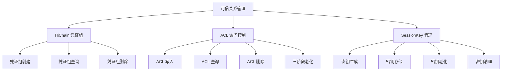

## 2. 信任关系类型体系

### 2.1 四种信任关系

DM 支持四种基础信任关系，每种关系对应不同的业务场景和权限级别：

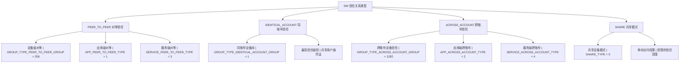


### 2.2 信任类型判定逻辑

DM 根据绑定参数和业务场景自动判定信任类型：

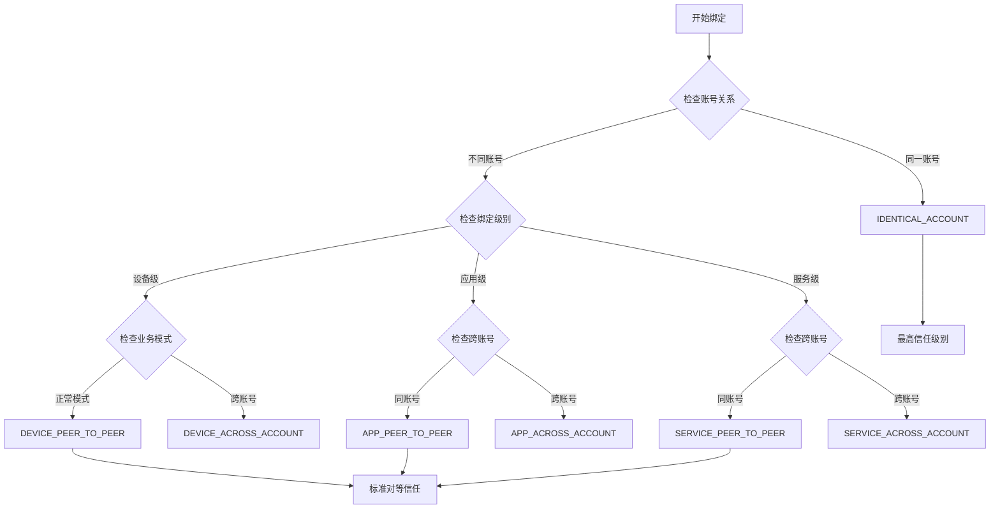

**信任类型优先级**（从高到低）：

1. **IDENTICAL_ACCOUNT**（同账号）：最高信任级别，设备间共享用户级凭证和完整权限
2. **PEER_TO_PEER**（对等信任）：设备、应用或服务级别的对等访问权限
3. **ACROSS_ACCOUNT**（跨账号）：跨账号的受限信任关系
4. **SHARE**（共享模式）：单向访问权限，用于共享设备场景

## 3. HiChain 凭证组管理

### 3.1 凭证组创建

凭证组在认证过程中创建，用于建立设备间的加密信任基础。DM 通过 HiChain 接口管理凭证组的完整生命周期。

**创建时机**：
- 设备首次认证绑定（authenticateDevice）
- 导入认证码（importAuthCode）
- 需要建立新的信任关系时

**凭证组类型与作用域**：

```cpp
// 凭证作用域定义（来自 HiChain 认证框架）
enum DmAuthScope {
    DM_AUTH_SCOPE_INVALID = -1,    // 无效作用域
    DM_AUTH_SCOPE_LNN = 0,         // LNN 级别凭证
    DM_AUTH_SCOPE_USER = 1,        // 用户级别凭证
    DM_AUTH_SCOPE_APP = 2,         // 应用级别凭证
    DM_AUTH_SCOPE_MAX = 3          // 最大值
};
```

**凭证组创建流程**（来自 `auth_credential.cpp`）：

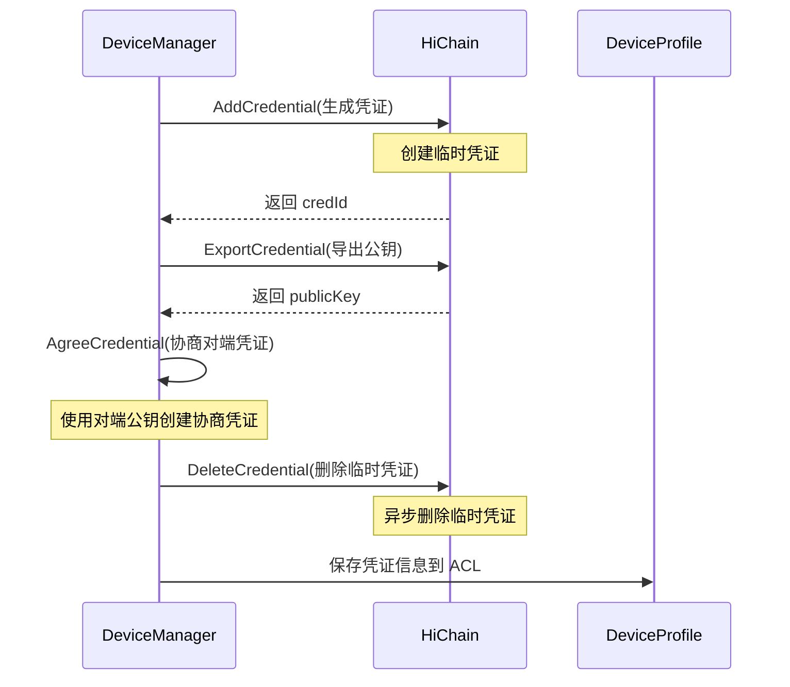

**凭证参数构建**（`CreateAuthParamsString`）：

```cpp
// 生成凭证认证参数
std::string authParams = {
    "method": "GENERATE",           // 凭证添加方式
    "deviceId": "设备ID",            // 设备标识
    "userId": "用户ID",              // 用户空间ID
    "subject": "PRIMARY",           // 凭证主体
    "credType": "ACCOUNT_UNRELATED", // 凭证类型
    "keyFormat": "ASYMM_GENERATE",   // 密钥格式
    "algorithm": "ED25519",          // 算法类型
    "proofType": "PSK",             // 证明类型
    "authorizedScope": "LNN/USER/APP", // 授权作用域
    "authorizedAppList": [tokenId1, tokenId2], // 授权应用列表
    "credOwner": "DM"               // 凭证所有者
};
```

### 3.2 凭证组查询与删除

**凭证组查询**：

DM 在以下场景查询凭证组：
- 绑定前检查是否已存在信任关系
- 解绑时获取需要清理的凭证信息
- 用户切换时查询凭证归属

**凭证组删除**：

删除时机：
- 设备解绑（UnAuthenticateDevice）
- 用户注销或切换
- 账号登出事件
- 凭证过期或失效

```cpp
// 删除凭证的典型流程（来自 auth_credential.cpp）
int32_t AuthCredentialAgreeState::AgreeCredential(...) {
    // 1. 生成协商凭证
    ret = hiChainAuthConnector->AgreeCredential(osAccountId, selfCredId, authParamsString, credId);
    
    // 2. 异步删除临时凭证
    ffrt::submit([=]() {
        hiChainAuthConnector->DeleteCredential(osAccountId, tmpCredId);
    }, ffrt::task_attr().name("DeleteCredentialTask"));
    
    return ret;
}
```

## 4. ACL 全生命周期管理

### 4.1 ACL 数据模型

ACL（Access Control List）是 DM 信任关系的核心数据结构，定义了设备间的访问权限和信任级别。

**Accesser/Accessee 模型**：

```cpp
// 访问方（Accesser）- 主动发起访问的设备端
struct DmAccesser {
    uint64_t requestTokenId;        // 请求方 TokenID
    std::string requestBundleName;  // 请求方包名
    int32_t requestUserId;          // 请求方用户ID
    std::string requestAccountId;   // 请求方账号ID
    std::string requestDeviceId;    // 请求方设备ID
    int32_t requestTargetClass;     // 请求方目标类别
    std::string requestDeviceName;  // 请求方设备名称
};

// 被访问方（Accessee）- 被动接受访问的设备端
struct DmAccessee {
    uint64_t trustTokenId;          // 信任方 TokenID
    std::string trustBundleName;    // 信任方包名
    int32_t trustUserId;            // 信任方用户ID
    std::string trustAccountId;     // 信任方账号ID
    std::string trustDeviceId;      // 信任方设备ID
    int32_t trustTargetClass;       // 信任方目标类别
    std::string trustDeviceName;    // 信任方设备名称
};
```

**DP 存储结构**（4 个核心表）：

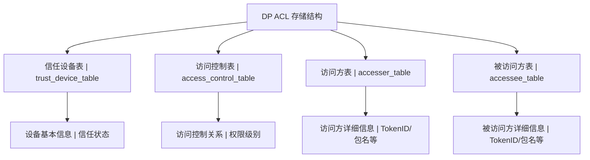

**ACL 访问控制表结构**：

```cpp
struct DmAccessControlTable {
    int32_t accessControlId;        // 访问控制ID
    int64_t accesserId;             // 访问方ID（accesser_table 外键）
    int64_t accesseeId;             // 被访问方ID（accessee_table 外键）
    std::string deviceId;           // 设备ID
    std::string sessionKey;         // 会话密钥
    int32_t bindType;               // 绑定类型（信任类型）
    uint32_t authType;              // 认证类型
    uint32_t deviceType;            // 设备类型
    std::string deviceIdHash;       // 设备ID哈希
    int32_t status;                 // 状态（ACTIVE/INACTIVE）
    int32_t validPeriod;            // 有效期
    int32_t lastAuthTime;           // 最后认证时间
    uint32_t bindLevel;             // 绑定级别（APP/SERVICE/DEVICE）
};
```

### 4.2 ACL 写入流程

ACL 写入发生在设备认证成功后的数据同步阶段，是建立信任关系的关键步骤。

**DM → DP ACL 写入序列图**：

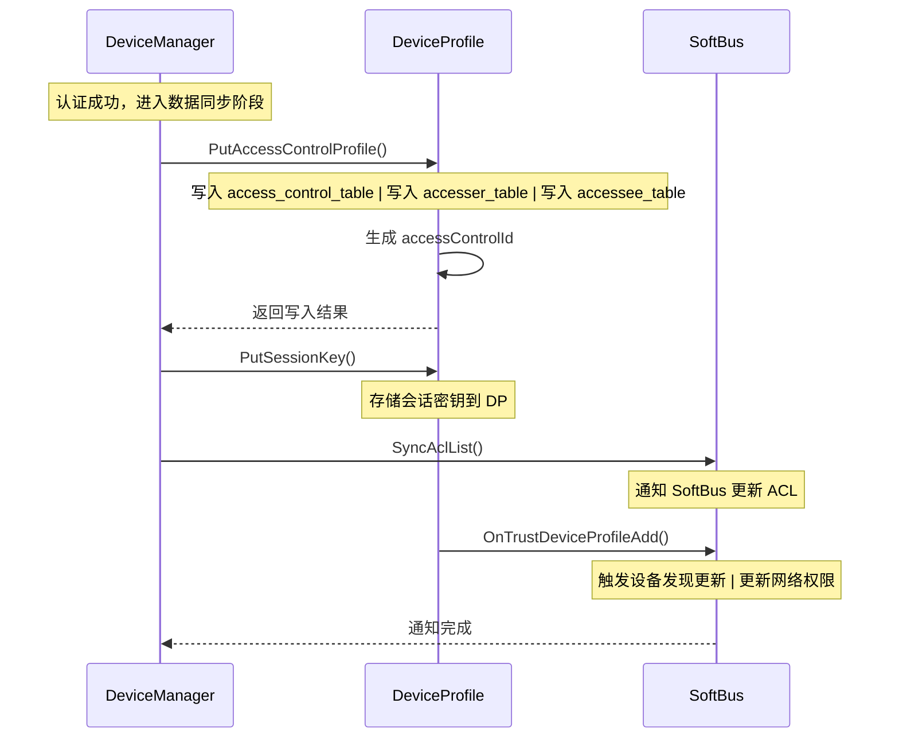

**ACL 写入关键代码**（来自 `auth_acl.cpp`）：

```cpp
// Sink 端数据同步状态 - 写入 ACL
int32_t AuthSinkDataSyncState::Action(std::shared_ptr<DmAuthContext> context) {
    // 1. 验证证书
    int32_t ret = VerifyCertificate(context);
    if (ret != DM_OK) {
        return ret;
    }
    
    // 2. 查询对端 ACL 并比较
    context->softbusConnector->SyncLocalAclListProcess(
        {context->accessee.deviceId, context->accessee.userId},
        {context->accesser.deviceId, context->accesser.userId}, 
        context->accesser.aclStrList, false);
    
    // 3. 获取会话密钥
    if (GetSessionKey(context)) {
        DerivativeSessionKey(context);
    }
    
    // 4. 判断是否需要写入 ACL
    if (NeedAgreeAcl(context)) {
        UpdateCredInfo(context);
        
        // 5. 写入 ACL 到 DP
        context->authMessageProcessor->PutAccessControlList(
            context, context->accessee, context->accesser.deviceId);
    }
    
    // 6. 同步 ACL 列表
    context->softbusConnector->SyncAclList();
    
    return DM_OK;
}
```

### 4.3 ACL 查询流程

**SoftBus → DP 查询流程**：

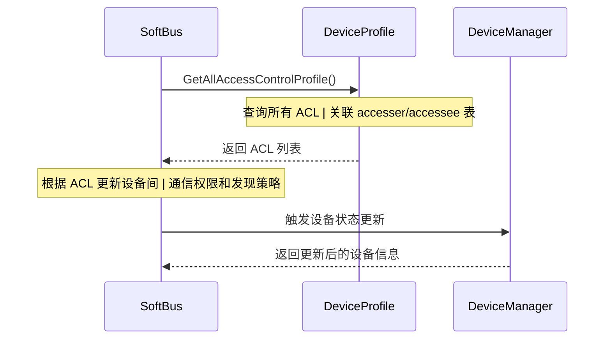

**DM → DP 查询流程**：

```cpp
// DM 查询 ACL 的典型场景
std::vector<DistributedDeviceProfile::AccessControlProfile> 
DeviceProfileConnector::GetAccessControlProfile() {
    // 查询所有访问控制配置
    return distributedDeviceProfileClient->GetAccessControlProfile();
}

// 根据设备 ID 和用户 ID 查询 ACL
std::vector<DistributedDeviceProfile::AccessControlProfile>
DeviceProfileConnector::GetAclProfileByDeviceIdAndUserId(
    const std::string &deviceId, int32_t userId) {
    // 精确查询特定设备和用户的 ACL
}
```

### 4.4 ACL 删除流程

ACL 删除是解绑过程的核心环节，需要清理所有相关的信任关系数据。

**解绑触发 ACL 清理流程**：

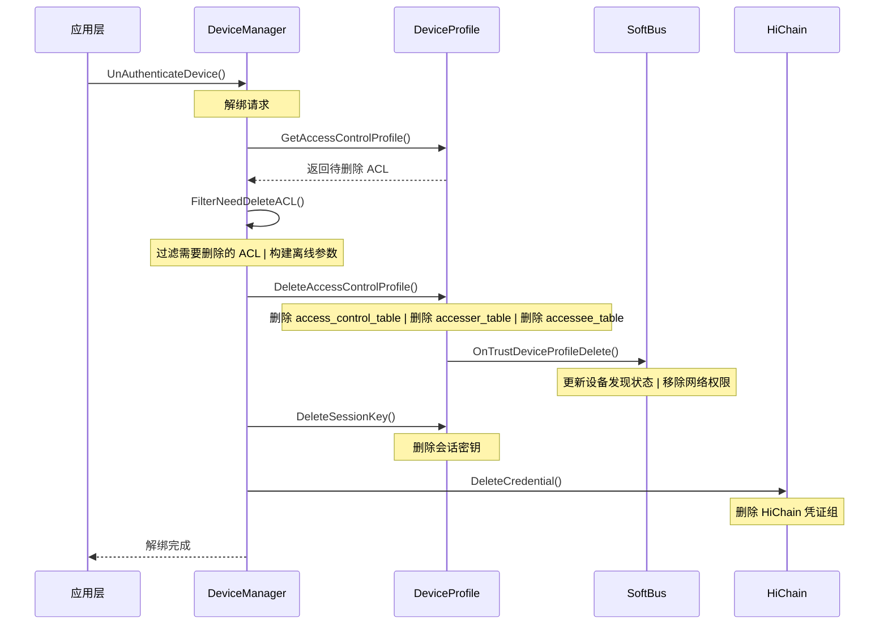

**ACL 删除关键代码**（来自 `deviceprofile_connector.cpp`）：

```cpp
// 过滤需要删除的 ACL
DmOfflineParam DeviceProfileConnector::FilterNeedDeleteACL(
    const std::string &localDeviceId, 
    uint32_t localTokenId,
    const std::string &remoteDeviceId, 
    const std::string &extra) {
    
    DmOfflineParam offlineParam;
    
    // 1. 查询所有 ACL
    std::vector<DistributedDeviceProfile::AccessControlProfile> profiles =
        GetAccessControlProfile();
    
    // 2. 过滤需要删除的 ACL
    FilterNeedDeleteACLInfos(profiles, localUdid, localTokenId, 
                             remoteUdid, extra, offlineParam);
    
    // 3. 缓存 ACL ID 用于后续删除
    for (const auto &profile : profiles) {
        CacheAcerAclId(profile, offlineParam.needDelAclInfos);
        CacheAceeAclId(profile, offlineParam.needDelAclInfos);
    }
    
    return offlineParam;
}
```

### 4.5 ACL 变更通知机制

DP 采用订阅-发布模式通知 ACL 变更，DM 和 SoftBus 通过订阅机制接收实时通知。

**DP 通知事件类型**：

```cpp
// DP 通知回调接口
class DpDeviceProfileCallback {
public:
    // ACL 添加通知
    void OnTrustDeviceProfileAdd(const TrustDeviceProfile &profile);
    
    // ACL 更新通知
    void OnTrustDeviceProfileUpdate(const TrustDeviceProfile &profile);
    
    // ACL 删除通知
    void OnTrustDeviceProfileDelete(const std::string &udid);
    
    // ACL 激活通知（用户切换到前台）
    void OnTrustDeviceProfileActive(const std::string &udid, int32_t userId);
    
    // ACL 去激活通知（用户切换到后台）
    void OnTrustDeviceProfileInactive(const std::string &udid, int32_t userId);
};
```

**通知订阅流程**：

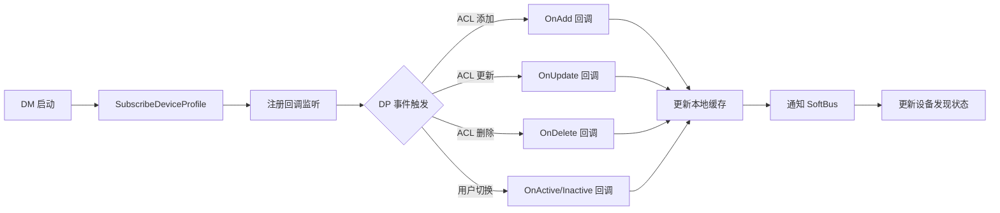

## 5. ACL 三阶段老化

### 5.1 老化模型概览

SessionKey 三阶段老化是 DM 信任关系管理的核心机制，用于平衡安全性和用户体验。随着时间推移，SessionKey 经历三个阶段：活跃期、过渡期和缓存期，最终被清理。

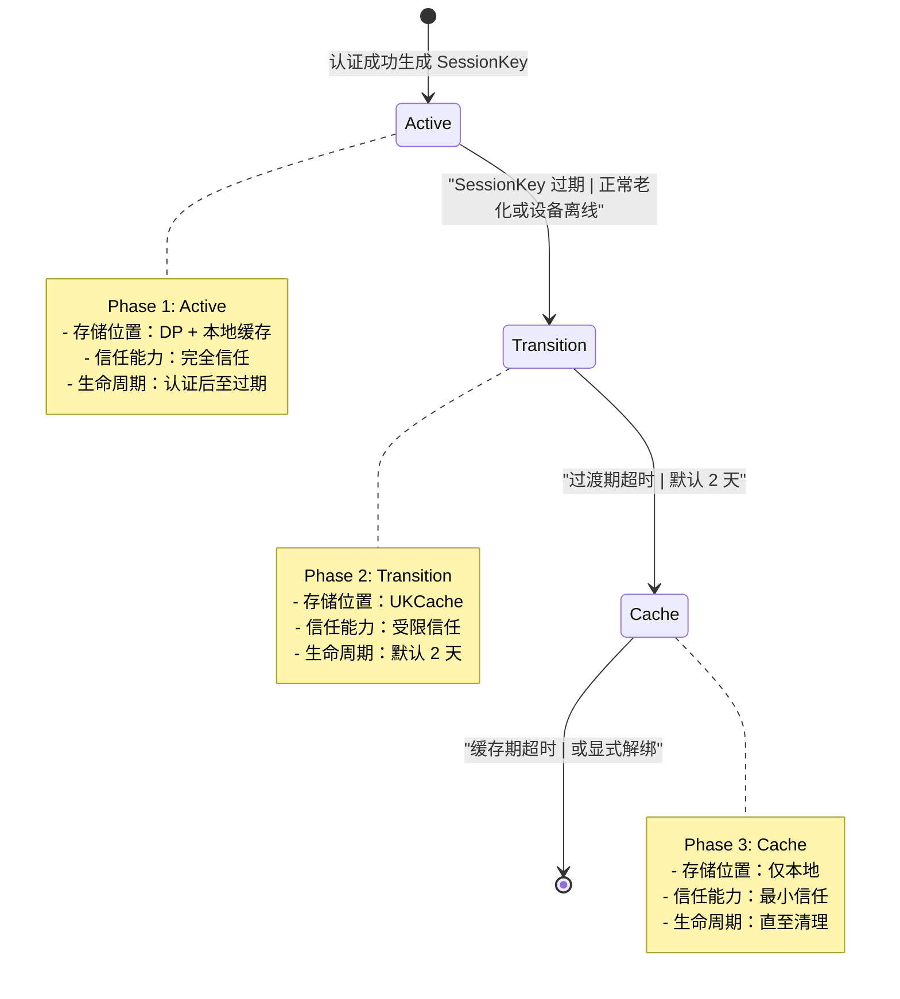

### 5.2 Phase 1: Active 活跃期

**存储方式**：
- DP 数据库：通过 `PutSessionKey()` 存储完整的 SessionKey
- 本地缓存：DM 内存中保留 SessionKey 副本用于快速访问

**信任能力**：
- 完整的设备间通信权限
- 可以发起认证会话
- SoftBus 查询可直接获取 SessionKey

**关键代码**：

```cpp
// SessionKey 存储到 DP（来自 dm_auth_message_processor.cpp）
int32_t DmAuthMessageProcessor::SaveSessionKeyToDP(int32_t userId, int32_t &skId) {
    std::vector<unsigned char> sessionKeyArray = cryptoMgr_->GetSessionKey();
    if (sessionKeyArray.empty()) {
        LOGE("sessionKey is empty");
        return ERR_DM_FAILED;
    }
    
    // 调用 DP 接口存储 SessionKey
    int32_t ret = DeviceProfileConnector::GetInstance().PutSessionKey(
        userId, sessionKeyArray, skId);
    
    if (ret != DM_OK) {
        LOGE("DP put session key failed, ret: %{public}d", ret);
        return ret;
    }
    
    LOGI("Save session key to DP success, skId: %{public}d", skId);
    return DM_OK;
}
```

**老化触发条件**：
- 正常老化：SessionKey 到达有效期（通常由业务配置决定）
- 设备离线：对方设备长时间未在线
- 用户切换：相关用户切换到后台

### 5.3 Phase 2: Transition 过渡期

**存储方式**：
- 从 DP 中移除 SessionKey
- 转存到 UKCache（User Key Cache）通过 `InsertUserKeyToUKCache()`
- 本地保留缓存引用

**信任能力**：
- 受限的设备间通信权限
- 可能需要重新认证才能恢复完整权限
- 保留基本的设备发现能力

**关键转换流程**：

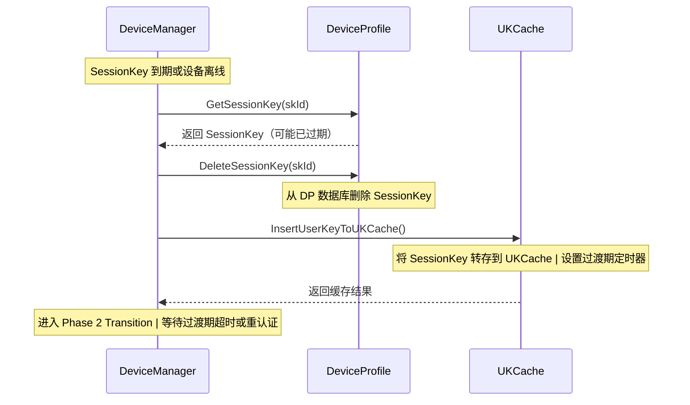

**过渡期特性**：
- 时长：默认 2 天（可配置）
- 恢复机制：如果设备在过渡期内重新认证，可快速恢复到 Phase 1
- 安全性：SessionKey 已从 DP 移除，降低泄露风险

### 5.4 Phase 3: Cache 缓存期

**存储方式**：
- 仅本地缓存存储
- 不再依赖 DP 或 UKCache
- 可能已部分失效

**信任能力**：
- 最小的信任关系
- 主要用于保留设备基本信息
- 需要完整重新认证才能恢复信任

**清理机制**：

```cpp
// SessionKey 清理（来自 deviceprofile_connector.h）
int32_t DeleteSessionKey(int32_t userId, int32_t sessionKeyId);
int32_t GetSessionKey(int32_t userId, int32_t sessionKeyId, 
                      std::vector<unsigned char> &sessionKeyArray);

// 网络ID清理
void DelUserKeyByNetworkId(const std::string &networkId);
```

**进入 Phase 3 的条件**：
- 过渡期超时（默认 2 天后）
- 设备长时间未重新认证
- 系统资源回收触发

**从 Phase 3 清理的条件**：
- 显式解绑操作
- 缓存空间不足
- 系统关机或重启（取决于缓存持久化策略）

### 5.5 老化触发条件与定时器

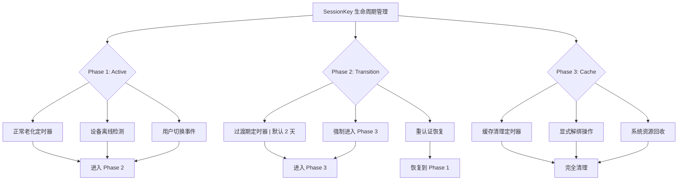

**定时器配置**（参考值）：
- Active → Transition：由 SessionKey 有效期决定，通常数小时到数天
- Transition → Cache：默认 2 天
- Cache → Cleanup：根据缓存策略，可能数天到数周

**老化监控代码**：

```cpp
// 定时老化检查（来自 dm_device_state_manager.cpp）
void DmDeviceStateManager::CheckAclAging() {
    // 1. 查询所有 ACL
    std::vector<AccessControlProfile> profiles = 
        DeviceProfileConnector::GetInstance().GetAllAccessControlProfile();
    
    for (const auto &profile : profiles) {
        // 2. 检查 SessionKey 时间戳
        int64_t currentTime = GetSysTimeMs();
        int64_t keyAge = currentTime - profile.getSessionKeyTimeStamp();
        
        // 3. 判断是否需要老化
        if (keyAge > ACTIVE_TIMEOUT && profile.getSessionKeyId() > 0) {
            // Active -> Transition
            TransitionAclToPhase2(profile);
        } else if (keyAge > TRANSITION_TIMEOUT) {
            // Transition -> Cache
            TransitionAclToPhase3(profile);
        }
    }
}
```

## 6. SessionKey 生命周期

SessionKey 是设备间安全通信的核心，其生命周期管理直接关系到分布式系统的安全性。

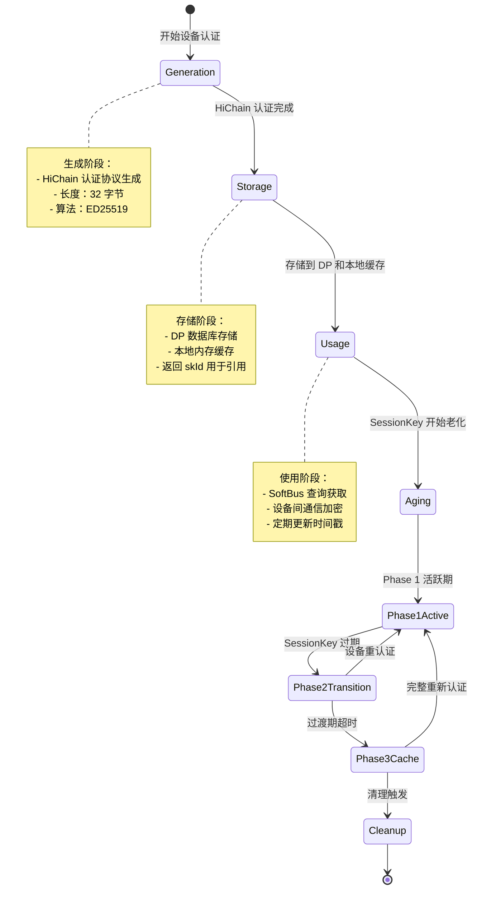

**SessionKey 关键属性**：

```cpp
struct DMSessionKey {
    uint8_t *key = nullptr;      // 密钥内容
    uint32_t keyLen = 0;         // 密钥长度（通常 32 字节）
};

// SessionKey 元数据
struct SessionKeyMeta {
    int32_t skId;                // SessionKey ID（DP 引用）
    int64_t skTimeStamp;         // 时间戳（用于老化）
    std::string deviceId;        // 关联设备 ID
    int32_t userId;              // 关联用户 ID
    int32_t phase;               // 当前老化阶段
};
```

**SessionKey 生成与导出**（来自 `auth_credential.cpp`）：

```cpp
// 在凭证认证完成时获取 SessionKey
int32_t AuthSrcCredentialAuthDoneState::Action(std::shared_ptr<DmAuthContext> context) {
    // 1. 等待 HiChain 返回 SessionKey
    if (context->authStateMachine->WaitExpectEvent(ON_SESSION_KEY_RETURNED) 
        != ON_SESSION_KEY_RETURNED) {
        return ERR_DM_FAILED;
    }
    
    // 2. 获取 SessionKey
    if (GetSessionKey(context)) {
        // 3. 导出会话密钥
        DerivativeSessionKey(context);
        
        // 4. 发送数据同步消息
        context->authMessageProcessor->CreateAndSendMsg(
            MSG_TYPE_REQ_DATA_SYNC, context);
    }
    
    return DM_OK;
}
```

**SessionKey 查询与使用**（来自 `deviceprofile_connector.h`）：

```cpp
// SoftBus 或 DM 查询 SessionKey
int32_t GetSessionKey(int32_t userId, int32_t sessionKeyId, 
                      std::vector<unsigned char> &sessionKeyArray) {
    // 从 DP 数据库查询 SessionKey
    return DeviceProfileConnector::GetInstance().GetSessionKey(
        userId, sessionKeyId, sessionKeyArray);
}
```

## 7. 三方联动全景

DM、DP 和 SoftBus 三者紧密协作，共同完成可信关系的建立、维护和清理。

### 7.1 信任建立（绑定）三方联动

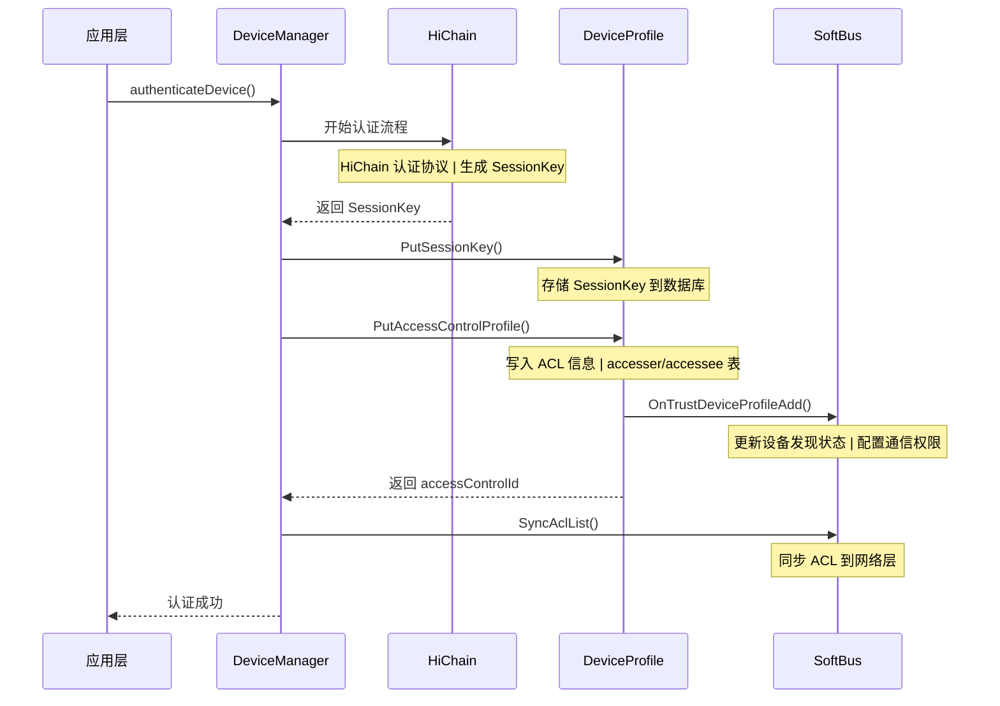

### 7.2 信任老化三方联动

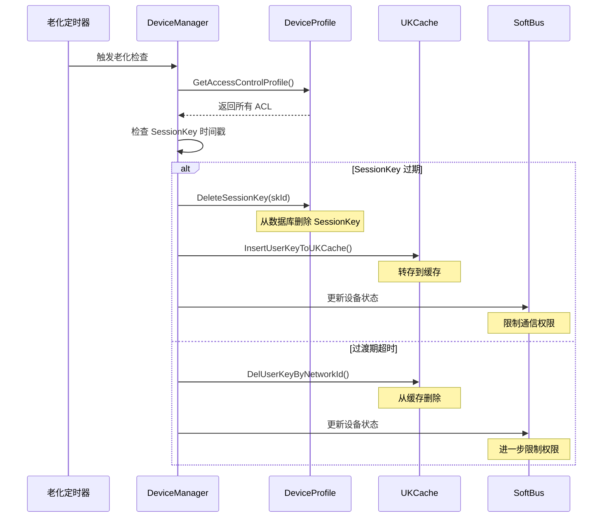

### 7.3 信任撤销（解绑）三方联动

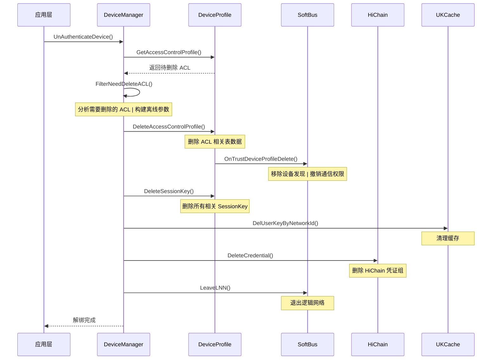


## 9. 常见问题与调试

### 9.1 ACL 写入失败

**现象**：认证成功但设备间无法通信

**排查步骤**：

1. 检查 DP 连接状态
```cpp
// 查看 DP 是否初始化
int32_t ret = DeviceProfileConnector::GetInstance().
    SubscribeDeviceProfileInited(dpInitedCallback);
```

2. 检查 ACL 参数完整性
```cpp
// 确保所有必需字段都已填充
if (accesser.deviceId.empty() || accessee.deviceId.empty()) {
    LOGE("Invalid ACL parameters");
    return ERR_DM_FAILED;
}
```

3. 查看日志中的错误码
```bash
# 搜索 ACL 相关错误
grep "PutAccessControlList failed" /data/log/dm.log
grep "DP put session key failed" /data/log/dm.log
```

### 9.2 SessionKey 老化异常

**现象**：SessionKey 过早进入过渡期或无法正常老化

**排查步骤**：

1. 检查时间戳是否正确
```cpp
// 查看 SessionKey 时间戳
LOGI("SessionKey timestamp: %{public}" PRId64, 
     profile.getSessionKeyTimeStamp());
```

2. 检查老化定时器是否正常工作
```bash
# 搜索老化相关日志
grep "Aging check" /data/log/dm.log
grep "Transition to Phase" /data/log/dm.log
```

3. 手动触发老化检查
```cpp
// 强制触发老化检查
DmDeviceStateManager::GetInstance()->CheckAclAging();
```

### 9.3 信任关系不同步

**现象**：DM 和 SoftBus 的设备状态不一致

**排查步骤**：

1. 检查 DP 通知是否正常触发
```bash
# 搜索 DP 通知日志
grep "OnTrustDeviceProfile" /data/log/dm.log
```

2. 检查 SoftBus 监听回调
```cpp
// 验证 SoftBus 回调是否注册
softbusConnector->RegisterListener(listener);
```

3. 手动同步 ACL 列表
```cpp
// 强制同步 ACL
softbusConnector->SyncAclList();
```

---

**文档变更历史**：

| 版本 | 日期 | 作者 | 变更说明 |
|------|------|------|---------|
| v2.0 | 2026-05-19 | [待定] | 基于 DM-DP-SoftBus 依赖分析的完整重写 |
| v1.0 | 2025-XX-XX | [待定] | 初始版本 |
