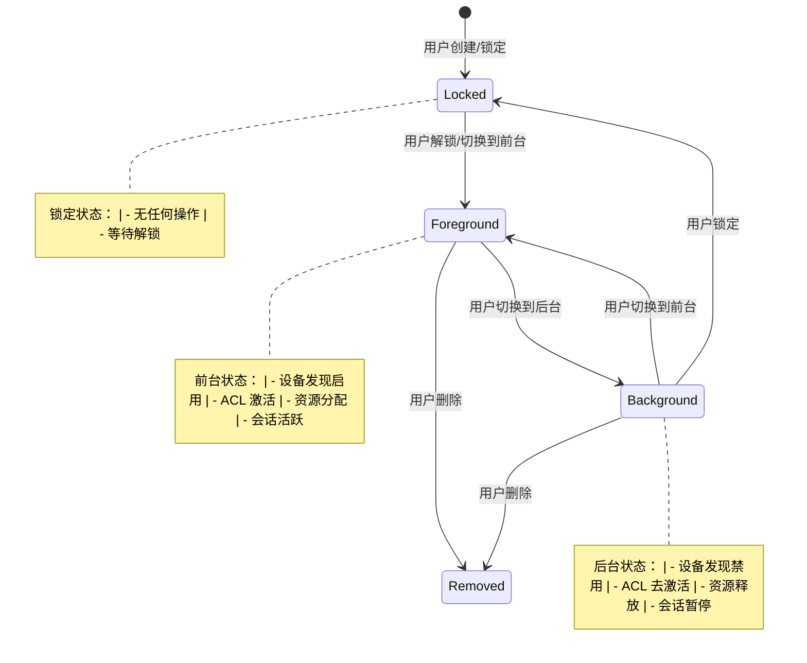
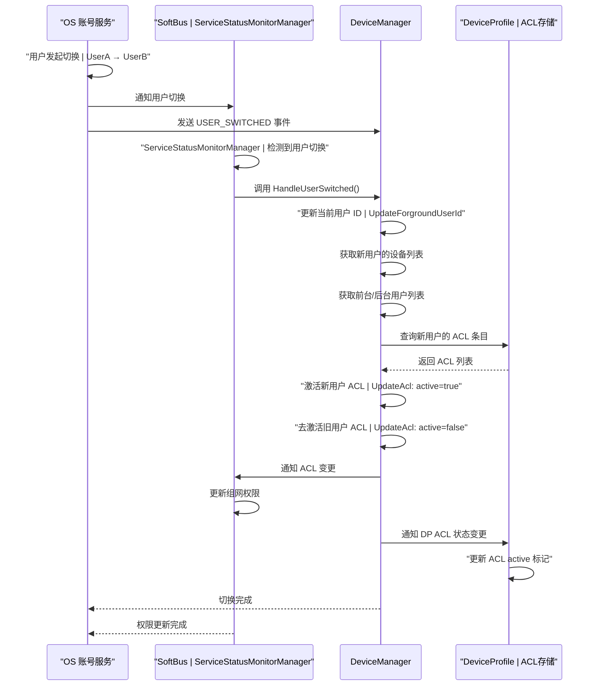

# 用户事件处理流程

> **版本**: v2.0  
> **日期**: 2026-05-19  

---

## 1. 概述

OpenHarmony 分布式设备管理器（DM）的多用户系统是一个跨所有子系统的核心关注点，涉及设备发现、认证、绑定、访问控制（ACL）和配置文件同步等模块。DM 必须为每个用户维护独立的设备可见性、信任关系和状态管理。

### 1.1 多用户隔离原则

- **用户级设备可见性**：每个用户只能看到自己信任的设备
- **用户级认证隔离**：认证状态在不同用户间完全隔离
- **用户级 ACL 管理**：访问控制列表（ACL）按用户激活/去激活
- **用户级配置文件**：设备配置文件服务（DP）数据按用户隔离

### 1.2 账号与用户的关系

DM 中的"用户"概念与 OpenHarmony OS 的 Account Manager 服务中的"用户"概念一一对应：

- **userId**：系统分配的用户 ID（如 100、101）
- **accountId**：分布式账号 ID（OHOS 账号系统的分布式标识）
- **accountName**：分布式账号名称

---

## 2. 多用户模型

### 2.1 用户标识

#### 2.1.1 ProcessInfo 中的 userId

```cpp
// 位置：services/service/src/device_manager_service.cpp
struct ProcessInfo {
    int32_t userId;      // 发起请求的用户 ID
    uint32_t tokenId;    // 调用者的令牌 ID
    std::string pkgName; // 调用者包名
};
```


### 2.2 用户级设备可见性

#### 2.2.1 设备信任关系的用户隔离

每个用户维护独立的信任设备列表：

```cpp
// 设备与用户的绑定关系
struct DMAclQuadInfo {
    std::string localUdid;   // 本地设备 UDID
    int32_t localUserId;     // 本地用户 ID
    std::string peerUdid;    // 对端设备 UDID
    int32_t peerUserId;      // 对端用户 ID
};
```

#### 2.2.2 设备发现时的用户过滤

设备发现（Discovery）只返回对当前用户可见的设备：

- 发现请求携带调用者的 `userId`
- 发现结果过滤掉非当前用户信任的设备
- 不同用户的发现过程相互独立

### 2.3 用户级认证隔离

#### 2.3.1 认证状态隔离

每个用户的认证状态独立管理：

```cpp
// 位置：services/service/src/device_manager_service.cpp
// 认证管理器按用户隔离
AuthManager *authManager;  // 每个 userId 有独立的实例
```

#### 2.3.2 凭证组隔离

HiChain 凭证按用户分组：

- 每个用户的凭证存储在不同的凭证组中
- 用户切换时，凭证组不共享
- 账号登出时清除该用户的所有凭证

---

## 3. 用户事件监听体系

### 3.1 监听的系统事件

DM 通过 `DmAccountCommonEventManager` 订阅系统的公共事件（CommonEvent）：

```cpp
// 位置：services/service/include/publishcommonevent/dm_account_common_event.h
class DmAccountCommonEventManager {
public:
    bool SubscribeAccountCommonEvent(
        const std::vector<std::string> &eventNameVec,
        const AccountEventCallback &callback);
};
```

### 3.2 事件类型清单

DM 监听的七种用户事件及其处理逻辑：

| 事件类型 | 触发模块 | DM 处理动作 | ACL 影响 | 同步通知 |
|---------|---------|------------|---------|---------|
| **COMMON_EVENT_USER_SWITCHED** | OS 账号服务 | 调用 HandleUserSwitched()，切换设备可见性 | 激活新用户 ACL，去激活旧用户 ACL | 通知对端设备 |
| **COMMON_EVENT_USER_REMOVED** | OS 账号服务 | 删除用户相关设备信任关系和 ACL | 删除该用户的所有 ACL 条目 | 通知对端清理 |
| **COMMON_EVENT_DISTRIBUTED_ACCOUNT_LOGIN** | 分布式账号服务 | 初始化设备名称，保存账号信息 | 无直接 ACL 影响 | 无 |
| **COMMON_EVENT_DISTRIBUTED_ACCOUNT_LOGOUT** | 分布式账号服务 | 清理登出用户的凭证、服务信息 | 去激活该用户的 ACL 条目 | 通知对端设备 |
| **COMMON_EVENT_USER_INFO_UPDATED** | OS 账号服务 | 更新设备昵称 | 无 ACL 影响 | 无 |
| **COMMON_EVENT_USER_UNLOCKED** (PC) | OS 账号服务 | 删除无效的 SK ID ACL，恢复设备状态 | 恢复 ACL 可用性 | 通知对端设备 |
| **COMMON_EVENT_USER_FOREGROUND** | OS 账号服务 | 处理前台切换，更新设备可见性 | 激活该用户 ACL | 通知对端设备 |
| **COMMON_EVENT_USER_BACKGROUND** | OS 账号服务 | 处理后台切换，释放资源 | 去激活该用户 ACL | 通知对端设备 |
| **COMMON_EVENT_USER_STOPPED** (PC) | OS 账号服务 | 清理已停止用户的资源 | 去激活该用户 ACL | 通知对端设备 |

### 3.3 事件回调参数

```cpp
// 账号事件回调定义
// 参数：(事件类型, 当前用户ID, 之前用户ID)
using AccountEventCallback = std::function<void(std::string, int32_t, int32_t)>;

// 参数示例：
// COMMON_EVENT_USER_SWITCHED:   ("usual.event.USER_SWITCHED", 101, 100)
// COMMON_EVENT_USER_REMOVED:    ("usual.event.USER_REMOVED", -1, 101)
// COMMON_EVENT_USER_UNLOCKED:   ("usual.event.USER_UNLOCKED", 101, 101)
```

---

## 4. 前后台切换

### 4.1 前台切换（USER_FOREGROUND）

#### 4.1.1 触发条件

- 用户从后台切换到前台（如分屏应用切换）
- 用户解锁后进入前台
- PC 场景下的用户切换

#### 4.1.2 HandleForeground 流程

```cpp
// 位置：services/service/src/device_manager_service.cpp:2677
void DeviceManagerService::HandleAccountCommonEvent(const std::string commonEventType)
{
    // 1. 获取当前前台和后台用户列表
    std::vector<int32_t> foregroundUserVec;
    std::vector<int32_t> backgroundUserVec;
    MultipleUserConnector::GetForegroundUserIds(foregroundUserVec);
    MultipleUserConnector::GetBackgroundUserIds(backgroundUserVec);
    
    // 2. 清除已锁定的用户
    MultipleUserConnector::ClearLockedUser(foregroundUserVec, backgroundUserVec);
    
    // 3. 检查用户状态是否变化
    if (!IsUserStatusChanged(foregroundUserVec, backgroundUserVec)) {
        return;
    }
    
    // 4. 获取当前用户和之前用户的设备绑定级别
    std::map<std::string, int32_t> curUserDeviceMap = 
        GetDeviceIdAndBindLevel(foregroundUserVec, localUdid);
    std::map<std::string, int32_t> preUserDeviceMap = 
        GetDeviceIdAndBindLevel(backgroundUserVec, localUdid);
    
    // 5. 通知对端设备
    NotifyRemoteAccountCommonEvent(commonEventType, localUdid, peerUdids, 
                                   foregroundUserIds, backgroundUserIds);
}
```

#### 4.1.3 前台切换的影响

- **设备发现**：只对前台用户启用设备发现
- **ACL 激活**：激活前台用户的 ACL 条目
- **设备状态**：更新前台用户的设备在线状态
- **资源分配**：为前台用户分配更多资源

### 4.2 后台切换（USER_BACKGROUND）

#### 4.2.1 触发条件

- 用户从前台切换到后台
- 用户锁定（未解锁）
- PC 场景下的用户切换

#### 4.2.2 HandleBackground 流程

```cpp
// 后台切换处理与前台切换类似，但资源释放方向相反
void DeviceManagerService::HandleAccountCommonEvent(const std::string commonEventType)
{
    // 1. 获取更新后的前台和后台用户列表
    // 2. 清除已锁定的用户
    // 3. 检查用户状态是否变化
    // 4. 获取设备绑定级别
    // 5. 更新 ACL 状态（去激活后台用户的 ACL）
    // 6. 通知对端设备
}
```

#### 4.2.3 后台切换的影响

- **设备发现**：停止该用户的设备发现
- **ACL 去激活**：去激活后台用户的 ACL 条目
- **资源释放**：释放该用户占用的资源
- **会话管理**：暂停该用户的活跃会话

### 4.3 前后台状态机



---

## 5. 账号切换全链路

### 5.1 切换流程

账号切换涉及 OS 账号服务、SoftBus、DM 和 DP 四个模块的协同：



### 5.2 DM 处理逻辑

#### 5.2.1 HandleUserSwitched() 主流程

```cpp
// 位置：services/service/src/device_manager_service.cpp:2880
void DeviceManagerService::HandleUserSwitchEventCallback(
    const std::string &commonEventType, int32_t currentUserId, int32_t beforeUserId)
{
    // 1. 更新前台用户 ID
    MultipleUserConnector::UpdateForgroundUserId();
    
    // 2. 保存旧用户信息
    MultipleUserConnector::SetSwitchOldUserId(beforeUserId);
    
    // 3. 获取账号信息
    std::string accountId = MultipleUserConnector::GetOhosAccountIdByUserId(currentUserId);
    std::string accountName = MultipleUserConnector::GetOhosAccountNameByUserId(currentUserId);
    
    // 4. 保存新账号信息
    DMAccountInfo dmAccountInfo = {accountId, accountName};
    MultipleUserConnector::SetAccountInfo(currentUserId, dmAccountInfo);
    
    // 5. 获取前台和后台用户列表
    std::vector<int32_t> foregroundUserVec;
    std::vector<int32_t> backgroundUserVec;
    MultipleUserConnector::GetForegroundUserIds(foregroundUserVec);
    MultipleUserConnector::GetBackgroundUserIds(backgroundUserVec);
    
    // 6. 处理用户切换
    ffrt::submit([=]() {
        HandleUserSwitched(localUdid, deviceVec, foregroundUserVec, backgroundUserVec);
    }, ffrt::task_attr().name("HandleUserSwitchedTask"));
}
```

#### 5.2.2 用户级状态转换

```cpp
// 位置：services/service/src/device_manager_service.cpp:2890
void DeviceManagerService::HandleUserSwitched(
    const std::string &localUdid, 
    const std::vector<std::string> &deviceVec,
    const std::vector<int32_t> &foregroundUserIds,
    const std::vector<int32_t> &backgroundUserIds)
{
    // 1. 检查依赖是否就绪
    if (!discoveryMgr_->IsCommonDependencyReady()) {
        LOGE("Common dependency not ready");
        return;
    }
    
    // 2. 调用依赖层处理用户切换
    discoveryMgr_->GetCommonDependencyObj()->HandleUserSwitched(
        localUdid, deviceVec, foregroundUserIds, backgroundUserIds);
    
    // 3. 依赖层内部会：
    //    a. 查询新用户的设备列表
    //    b. 更新本地设备的可见性
    //    c. 通知对端设备用户切换
    //    d. 更新 ACL 状态
}
```

### 5.3 ACL Active/Inactive 机制

#### 5.3.1 ACL 数据结构

```cpp
// ACL 条目示例（存储在 DP 中）
{
    "localUdid": "deviceA_udid",
    "localUserId": 100,
    "peerUdid": "deviceB_udid",
    "peerUserId": 101,
    "bindLevel": 1,           // 绑定级别（0:仅连接, 1:可访问）
    "active": true,           // ACL 激活状态
    "extraInfo": "{}"
}
```

#### 5.3.2 ACL 激活/去激活流程

```cpp
// 位置：commondependency/src/deviceprofile_connector.cpp
void DeviceProfileConnector::UpdateAcl(
    const std::string &localUdid,
    const std::vector<std::string> &peerUdids,
    const std::vector<int32_t> &foregroundUserIds,
    const std::vector<int32_t> &backgroundUserIds)
{
    // 1. 激活前台用户的 ACL
    for (const auto &userId : foregroundUserIds) {
        for (const auto &peerUdid : peerUdids) {
            DMAclQuadInfo info = {localUdid, userId, peerUdid, peerUserId};
            UpdateAclActiveStatus(info, true);  // 激活
        }
    }
    
    // 2. 去激活后台用户的 ACL
    for (const auto &userId : backgroundUserIds) {
        for (const auto &peerUdid : peerUdids) {
            DMAclQuadInfo info = {localUdid, userId, peerUdid, peerUserId};
            UpdateAclActiveStatus(info, false); // 去激活
        }
    }
}
```

#### 5.3.3 DP 通知处理

当 ACL 状态变更时，DM 通知 DP：

```cpp
// 位置：commondependency/src/deviceprofile_connector.cpp
int32_t DeviceProfileConnector::UpdateAclActiveStatus(
    const DMAclQuadInfo &aclQuadInfo, bool isActive)
{
    // 1. 构建 ACL 配置文件
    AccessControlProfileProfile aclProfile;
    aclProfile.SetLocalUdid(aclQuadInfo.localUdid);
    aclProfile.SetLocalUserId(aclQuadInfo.localUserId);
    aclProfile.SetPeerUdid(aclQuadInfo.peerUdid);
    aclProfile.SetPeerUserId(aclQuadInfo.peerUserId);
    aclProfile.SetActive(isActive);  // 设置激活状态
    
    // 2. 同步到 DP
    return DistributedDeviceProfileClient::GetInstance().
        PutAccessControlProfileProfile(aclProfile);
}
```

---

## 6. 单双账号模式

### 6.1 单账号模式

#### 6.1.1 特征

- 只有一个用户同时处于活跃状态
- 前台用户列表只有一个元素
- 后台用户列表为空或仅包含已锁定用户

#### 6.1.2 行为约束

```cpp
// 单账号模式下的用户状态
std::vector<int32_t> foregroundUserIds = {100};  // 只有一个前台用户
std::vector<int32_t> backgroundUserIds = {};     // 后台无用户
```

- 用户切换时，旧用户完全退出
- ACL 切换是全量替换（全部去激活旧用户，全部激活新用户）
- 无并发用户访问冲突

### 6.2 双账号模式

#### 6.2.1 特征

- 支持两个用户同时处于活跃状态（如分屏场景）
- 前台用户列表可包含两个用户
- 后台用户列表可能包含其他用户

#### 6.2.2 额外复杂度

```cpp
// 双账号模式下的用户状态
std::vector<int32_t> foregroundUserIds = {100, 101};  // 两个前台用户
std::vector<int32_t> backgroundUserIds = {102};       // 一个后台用户
```

- **ACL 并发**：需要同时支持两个用户的 ACL 激活
- **资源竞争**：两个用户可能同时访问同一设备
- **优先级处理**：前台用户优先级高于后台用户
- **隔离要求**：确保用户间的数据隔离

#### 6.2.3 隔离实现

```cpp
// 位置：services/service/src/device_manager_service.cpp:2700
void DeviceManagerService::NotifyRemoteAccountCommonEvent(
    const std::string &commonEventType,
    const std::string &localUdid,
    const std::vector<std::string> &peerUdids,
    const std::vector<int32_t> &foregroundUserIds,
    const std::vector<int32_t> &backgroundUserIds)
{
    // 1. 检查 ACL 状态是否与前台用户匹配
    if (!CheckAclStatusAndForegroundNotMatch(localUdid, foregroundUserIds, backgroundUserIds)) {
        LOGI("ACL status matches foreground users, no update needed");
        return;
    }
    
    // 2. 获取当前用户和之前用户的设备绑定级别
    std::map<std::string, int32_t> curUserDeviceMap = 
        GetDeviceIdAndBindLevel(foregroundUserIds, localUdid);
    std::map<std::string, int32_t> preUserDeviceMap = 
        GetDeviceIdAndBindLevel(backgroundUserIds, localUdid);
    
    // 3. 通知对端设备（携带前台/后台用户信息）
    for (const auto &peerUdid : peerUdids) {
        SendCommonEventBroadCast(peerUdid, foregroundUserIds, backgroundUserIds, true);
    }
}
```

---

## 7. 账号事件管理

### 7.1 账号绑定

#### 7.1.1 设备与账号绑定逻辑

设备绑定（BindDevice）时建立设备与账号的关联：

```cpp
// 位置：services/implementation/src/device_manager_service_impl.cpp
int32_t DeviceManagerServiceImpl::BindDevice(
    const std::string &pkgName, int32_t authType, 
    const std::string &deviceId, const std::string &bindParam)
{
    // 1. 获取调用者的用户 ID
    int32_t callerUserId = -1;
    MultipleUserConnector::GetCallerUserId(callerUserId);
    
    // 2. 建立设备与用户的绑定关系
    DMAclQuadInfo aclQuadInfo;
    aclQuadInfo.localUdid = localUdid;
    aclQuadInfo.localUserId = callerUserId;
    aclQuadInfo.peerUdid = peerUdid;
    aclQuadInfo.peerUserId = peerUserId;
    
    // 3. 创建 ACL 条目
    CreateAclEntry(aclQuadInfo);
    
    // 4. 同步到 DP
    SyncAclToDP(aclQuadInfo);
}
```

#### 7.1.2 绑定关系存储

绑定关系存储在多个位置：

- **DP（DeviceProfile）**：存储 ACL 配置文件
- **KVStore**：存储本地用户与设备的映射
- **HiChain**：存储认证凭证（按用户分组）

### 7.2 账号解绑

#### 7.2.1 用户删除处理

当用户被删除时，DM 清理该用户的所有相关数据：

```cpp
// 位置：services/service/src/device_manager_service.cpp:2988
void DeviceManagerService::HandleUserRemoved(int32_t removedUserId)
{
    LOGI("Handle user removed, userId: %{public}d", removedUserId);
    
    // 1. 删除该用户的账号信息
    MultipleUserConnector::DeleteAccountInfoByUserId(removedUserId);
    
    // 2. 获取该用户绑定的所有设备
    std::multimap<std::string, int32_t> deviceMap = 
        dmServiceImpl_->GetDeviceIdAndUserId(removedUserId);
    
    // 3. 处理每个设备的解绑
    for (const auto &item : deviceMap) {
        std::string peerUdid = item.first;
        int32_t peerUserId = item.second;
        
        // 4. 通知对端设备删除该用户的 ACL
        NotifyRemoteUserRemoved(peerUdid, removedUserId);
        
        // 5. 删除本地 ACL 条目
        DeleteAclEntry(localUdid, removedUserId, peerUdid, peerUserId);
    }
    
    // 6. 清理该用户的凭证
    ClearUserCredentials(removedUserId);
}
```

#### 7.2.2 远程设备通知

```cpp
// 位置：services/service/src/device_manager_service.cpp
void DeviceManagerService::NotifyRemoteUserRemoved(
    const std::string &peerUdid, int32_t removedUserId)
{
    // 1. 构建用户删除通知
    std::string msg = BuildUserRemovedMsg(removedUserId);
    
    // 2. 通过 SoftBus 发送给对端设备
    softbusListener_->SendMsgToPeer(peerUdid, msg);
    
    // 3. 对端设备收到后删除该用户的所有 ACL 条目
}
```

### 7.3 设备迁移

#### 7.3.1 跨账号设备迁移

在某些场景下，设备信任关系需要从一个账号迁移到另一个账号：

- **家庭共享**：设备从个人账号迁移到家庭账号
- **账号合并**：两个账号合并时的设备迁移
- **设备转让**：设备所有权转移

#### 7.3.2 迁移流程

```cpp
// 伪代码：设备迁移流程
int32_t MigrateDeviceBetweenAccounts(
    const std::string &udid,
    int32_t fromUserId,
    int32_t toUserId)
{
    // 1. 验证迁移权限
    if (!CheckMigrationPermission(fromUserId, toUserId)) {
        return ERR_NO_PERMISSION;
    }
    
    // 2. 导出旧账号的设备信息
    DeviceMigrationInfo info = ExportDeviceInfo(udid, fromUserId);
    
    // 3. 导入到新账号
    ImportDeviceInfo(udid, toUserId, info);
    
    // 4. 更新 ACL 条目
    UpdateAclEntry(udid, fromUserId, toUserId);
    
    // 5. 清理旧账号数据
    CleanupOldAccountData(udid, fromUserId);
    
    return DM_OK;
}
```

---

---

## 9. 最佳实践与注意事项

### 9.1 开发建议

1. **始终使用 MultipleUserConnector 获取用户信息**
   ```cpp
   // 推荐
   int32_t userId = MultipleUserConnector::GetCurrentAccountUserID();
   
   // 不推荐（直接使用系统 API）
   int32_t userId = AccountSA::GetUserId();
   ```

2. **处理用户事件时检查用户状态**
   ```cpp
   if (!MultipleUserConnector::IsUserUnlocked(userId)) {
       LOGE("User is locked, skip operation");
       return ERR_USER_LOCKED;
   }
   ```

3. **ACL 操作前验证用户权限**
   ```cpp
   if (!CheckUserPermission(userId, deviceId)) {
       LOGE("User has no permission to access device");
       return ERR_NO_PERMISSION;
   }
   ```

### 9.2 常见问题

| 问题 | 原因 | 解决方案 |
|-----|------|---------|
| 用户切换后设备不可见 | ACL 未激活 | 检查 `UpdateAclActiveStatus` 调用 |
| 后台用户仍能访问设备 | ACL 未去激活 | 检查 USER_BACKGROUND 事件处理 |
| 用户删除后仍有数据残留 | 清理不完整 | 检查 `HandleUserRemoved` 逻辑 |
| 双账号模式下权限冲突 | 隔离不足 | 使用 `CheckAclStatusAndForegroundNotMatch` 验证 |

### 9.3 调试技巧

1. **查看当前用户状态**
   ```bash
   # 查看前台用户列表
   hidumper -s DeviceManagerService -a -u
   ```

2. **检查 ACL 状态**
   ```bash
   # 查看 ACL 条目
   hidumper -s DeviceProfileService -a -a
   ```

3. **日志过滤**
   ```bash
   # 过滤用户事件相关日志
   grep "USER_SWITCHED\|USER_FOREGROUND\|USER_BACKGROUND" /data/log/hilog/*.log
   ```

---

## 10. 参考文档

- [OpenHarmony 账号管理子系统](https://docs.openharmony.cn/)
- [DM-DP-SoftBus 分析文档](../03-integration/01-dm-dp-softbus.md)
- [设备绑定流程](../04-workflows/02-device-binding.md)
- [访问控制（ACL）机制](../05-access-control/01-acl-overview.md)
