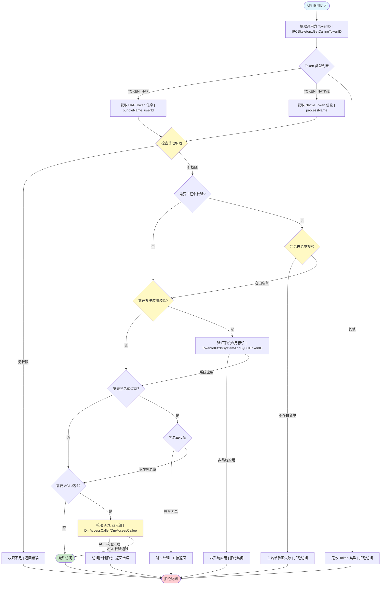
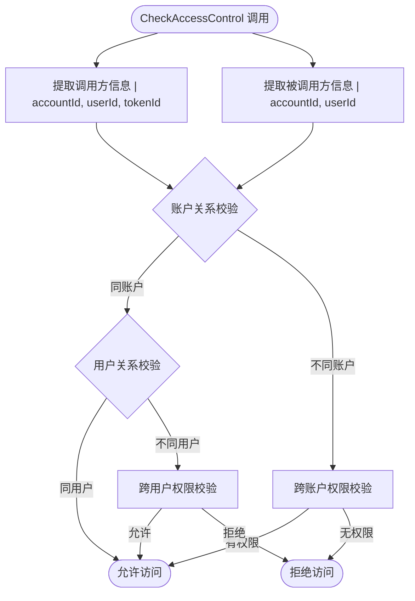

# DeviceManager 权限校验机制

**版本：** v2.0  
**更新日期：** 2026-05-19

---

## 1. 概述

DeviceManager（DM）实现了完整的权限校验体系，确保只有授权的应用和用户能够操作设备管理功能。该体系包括：

- **基础权限检查**：验证应用是否具有必需的系统权限
- **调用方身份验证**：识别并验证调用方的包名、TokenID、用户ID等信息
- **白名单机制**：对敏感接口进行包名白名单控制
- **黑名单机制**：对特定场景的通知进行黑名单过滤
- **系统应用校验**：区分系统应用和普通应用，限制敏感接口仅供系统应用调用
- **访问控制列表（ACL）**：基于调用方和被调用方的四元组信息进行细粒度访问控制

---

## 2. 权限声明

DM 服务声明和使用以下系统权限：

### 2.1 DM 服务自身权限

| 权限名称 | 级别 | 用途 | 定义位置 |
|---------|------|------|---------|
| `ohos.permission.ACCESS_SERVICE_DM` | system_core | 访问 DM 服务的核心权限 | `sa_profile/device_manager.cfg` |
| `ohos.permission.DISTRIBUTED_DATASYNC` | normal | 分布式数据同步权限 | `sa_profile/device_manager.cfg` |
| `ohos.permission.GET_BUNDLE_INFO_PRIVILEGED` | system_basic | 获取应用信息权限 | `sa_profile/device_manager.cfg` |
| `ohos.permission.MONITOR_DEVICE_NETWORK_STATE` | system_basic | 监控设备网络状态 | `permission_manager.cpp` |
| `ohos.permission.sec.ACCESS_UDID` | system_core | 访问设备 UDID | `permission_manager.cpp` |
| `ohos.permission.READ_LOCAL_DEVICE_NAME` | normal | 读取本地设备名称 | `permission_manager.cpp` |

### 2.2 应用调用 DM 接口所需权限

| 接口类别 | 所需权限 | 说明 |
|---------|---------|------|
| 设备发现、认证、绑定 | `ohos.permission.DISTRIBUTED_DATASYNC` | 大部分设备管理接口 |
| 服务注册/发布/发现 | `ohos.permission.DISTRIBUTED_DATASYNC` | 服务相关接口 |
| 设备信息查询 | `ohos.permission.DISTRIBUTED_DATASYNC` | 获取设备列表、设备信息 |
| 导入/导出认证码 | `ohos.permission.ACCESS_SERVICE_DM` + 白名单 | 仅限特定包名 |
| PinHolder 功能 | `ohos.permission.ACCESS_SERVICE_DM` + 白名单 | 仅限 CollaborationFwk |
| 设置设备名称策略 | `ohos.permission.ACCESS_SERVICE_DM` + 白名单 | 仅限特定包名 |
| 读取本地设备名称 | `ohos.permission.READ_LOCAL_DEVICE_NAME` | 特定接口 |

---

## 3. 权限校验流程



### 3.1 权限校验关键步骤说明

1. **TokenID 提取**：从 IPC 调用中获取调用方的 TokenID
2. **Token 类型识别**：判断是 HAP 应用（TOKEN_HAP）还是系统服务（TOKEN_NATIVE）
3. **基础权限检查**：验证应用是否具有所需权限
4. **进程名/包名获取**：从 Token 信息中提取调用方的身份标识
5. **白名单校验**：对敏感接口，检查调用方是否在白名单中
6. **系统应用校验**：部分接口要求必须是系统应用
7. **黑名单过滤**：特定场景（如 OnReady 通知）对黑名单中的调用方跳过处理
8. **ACL 校验**：基于调用方和被调用方的四元组信息进行访问控制

---

## 4. 调用方身份验证

### 4.1 DmAccessCaller 结构

```cpp
typedef struct DmAccessCaller {
    std::string accountId;    // 账户 ID
    std::string pkgName;      // 包名/进程名
    std::string networkId;    // 网络 ID
    int32_t userId;           // 用户 ID
    uint64_t tokenId;         // Token ID
    std::string extra;        // 扩展信息
} DmAccessCaller;
```

**字段说明：**
- `accountId`：标识调用方所属的账户
- `pkgName`：HAP 应用的 bundleName 或 Native 服务的进程名
- `networkId`：调用方所在设备的网络 ID
- `userId`：调用方所属的用户 ID（多用户场景）
- `tokenId`：调用方的访问令牌 ID，用于权限验证
- `extra`：预留的扩展字段

### 4.2 DmAccessCallee 结构

```cpp
typedef struct DmAccessCallee {
    std::string accountId;    // 被调用方账户 ID
    std::string networkId;    // 被调用方网络 ID
    std::string peerId;       // 对端 ID
    std::string pkgName;      // 被调用方包名
    int32_t userId;           // 被调用方用户 ID
    uint64_t tokenId;         // 被调用方 Token ID
    std::string extra;        // 扩展信息
} DmAccessCallee;
```

### 4.3 TokenID 校验流程

```cpp
// 1. 获取调用方 TokenID
AccessTokenID tokenCaller = IPCSkeleton::GetCallingTokenID();

// 2. 获取 Token 类型
ATokenTypeEnum tokenTypeFlag = AccessTokenKit::GetTokenTypeFlag(tokenCaller);

// 3. 根据类型获取详细信息
if (tokenTypeFlag == ATokenTypeEnum::TOKEN_HAP) {
    // HAP 应用
    HapTokenInfo tokenInfo;
    AccessTokenKit::GetHapTokenInfo(tokenCaller, tokenInfo);
    processName = tokenInfo.bundleName;
    
    // 检查是否为系统应用
    uint64_t fullTokenId = IPCSkeleton::GetCallingFullTokenID();
    if (!TokenIdKit::IsSystemAppByFullTokenID(fullTokenId)) {
        // 非系统应用，拒绝访问
        return ERR_DM_FAILED;
    }
} else if (tokenTypeFlag == ATokenTypeEnum::TOKEN_NATIVE) {
    // Native 系统服务
    NativeTokenInfo tokenInfo;
    AccessTokenKit::GetNativeTokenInfo(tokenCaller, tokenInfo);
    processName = tokenInfo.processName;
}
```

### 4.4 系统应用与普通应用区分

| 特性 | 系统应用 | 普通应用 |
|------|---------|---------|
| Token 类型 | TOKEN_HAP 或 TOKEN_NATIVE | TOKEN_HAP |
| 系统应用标识 | `TokenIdKit::IsSystemAppByFullTokenID()` 返回 true | 返回 false |
| 可调用接口 | 所有 DM 接口 | 仅限 `DISTRIBUTED_DATASYNC` 权限接口 |
| 白名单要求 | 部分敏感接口需要白名单 | 不能访问敏感接口 |

---

## 5. 白名单机制

DM 对敏感接口实现了严格的白名单控制，只有特定包名的调用方才能访问。

### 5.1 各接口白名单配置

| 接口/功能 | 白名单包名 | 代码常量 |
|----------|-----------|---------|
| **导入/导出认证码** | CollaborationFwk, wear_link_service, watch_system_service, cast_engine_service, glasses_collaboration_service, xr_glass_app_service, gameservice_server, caas_service | `AUTH_CODE_WHITE_LIST` |
| **PinHolder 功能** | CollaborationFwk | `PIN_HOLDER_WHITE_LIST` |
| **系统 SA 白名单** | Samgr_Networking, ohos.distributeddata.service, ohos.dslm, ohos.deviceprofile, distributed_bundle_framework, ohos.dhardware, ohos.security.distributed_access_token, ohos.storage.distributedfile.daemon, audio_manager_service, hmos.collaborationfwk.deviceDetect | `SYSTEM_SA_WHITE_LIST` |
| **设置设备名称策略** | collaboration_service, watch_system_service, com.huawei.hmos.walletservice, com.ohos.distributedjstest, glasses_collaboration_service | `SETDNPOLICY_WHITE_LIST` |
| **获取设备信息** | gameservice_server, com.huawei.hmos.slassistant, token_sync_service | `GETDEVICEINFO_WHITE_LIST` |
| **修改本地设备名** | com.huawei.hmos.settings, com.huawei.hmos.tvcooperation, com.ohos.settings | `MODIFY_LOCAL_DEVICE_NAME_WHITE_LIST` |
| **修改远程设备名** | com.ohos.settings | `MODIFY_REMOTE_DEVICE_NAME_WHITE_LIST` |
| **PutDeviceProfileInfoList** | com.huawei.hmos.ailifesvc, com.huawei.hmos.tvcooperation | `PUT_DEVICE_PROFILE_INFO_LIST_WHITE_LIST` |
| **获取信任设备列表** | distributedsched | `GET_TRUSTED_DEVICE_LIST_WHITE_LIST` |

### 5.2 白名单校验实现

```cpp
bool PermissionManager::CheckProcessNameValidOnAuthCode(const std::string &processName)
{
    if (processName.empty()) {
        LOGE("ProcessName is empty");
        return false;
    }
    for (uint16_t index = 0; index < AUTH_CODE_WHITE_LIST_NUM; ++index) {
        if (processName == AUTH_CODE_WHITE_LIST[index]) {
            return true;
        }
    }
    return false;
}
```

### 5.3 白名单配置文件

权限相关的白名单配置主要在以下位置：

- **源码硬编码**：`services/service/src/permission/standard/permission_manager.cpp`
- **JSON 配置**：`permission/dm_permission.json`

```json
{
    "ImportAuthCode": [
        "com.huawei.msdp.hmringgenerator",
        "com.huawei.msdp.hmringdiscriminator",
        "CollaborationFwk",
        "wear_link_service",
        "watch_system_service",
        "com.huawei.hmos.huaweicast"
    ],
    "ExportAuthCode": [
        "com.huawei.msdp.hmringgenerator",
        "com.huawei.msdp.hmringdiscriminator",
        "CollaborationFwk",
        "wear_link_service",
        "watch_system_service"
    ],
    "RegisterPinHolderCallback": ["CollaborationFwk"],
    "CreatePinHolder": ["CollaborationFwk"],
    "DestroyPinHolder": ["CollaborationFwk"],
    "SetDnPolicy": [
        "collaboration_service",
        "watch_system_service",
        "com.huawei.hmos.walletservice",
        "com.ohos.distributedjstest"
    ],
    "BindForDeviceLevel": [""]
}
```

---

## 6. 黑名单机制

黑名单主要用于特定场景的过滤，避免对某些调用方进行不必要的通知。

### 6.1 OnReady 通知黑名单

```cpp
constexpr const char* ONREADY_RETROSPECTIVE_NOTIFICATION_BLACK_LIST[] = {
    "distributeddata",
};
```

**使用场景：** 当设备就绪（OnReady）时，DM 会发送追溯通知，但对于 `distributeddata` 等系统服务，不需要此通知，因此将其加入黑名单。

### 6.2 黑名单校验

```cpp
bool PermissionManager::CheckOnReadyRetrospectiveNotificationBlackList()
{
    std::string processName = "";
    if (PermissionManager::GetInstance().GetCallerProcessName(processName) != DM_OK) {
        LOGE("Get caller process name failed");
        return false;
    }
    for (uint16_t index = 0; index < ONREADY_RETROSPECTIVE_NOTIFICATION_BLACK_LIST_NUM; ++index) {
        if (processName == ONREADY_RETROSPECTIVE_NOTIFICATION_BLACK_LIST[index]) {
            LOGI("no need for retrospective notification %{public}s.", processName.c_str());
            return true;
        }
    }
    return false;
}
```

---

## 7. 系统应用校验

### 7.1 系统应用验证逻辑

```cpp
int32_t PermissionManager::GetCallerProcessName(std::string &processName)
{
    AccessTokenID tokenCaller = IPCSkeleton::GetCallingTokenID();
    if (tokenCaller == 0) {
        LOGE("GetCallingTokenID error.");
        return ERR_DM_FAILED;
    }
    ATokenTypeEnum tokenTypeFlag = AccessTokenKit::GetTokenTypeFlag(tokenCaller);
    if (tokenTypeFlag == ATokenTypeEnum::TOKEN_HAP) {
        HapTokenInfo tokenInfo;
        if (AccessTokenKit::GetHapTokenInfo(tokenCaller, tokenInfo) != EOK) {
            LOGE("GetHapTokenInfo failed.");
            return ERR_DM_FAILED;
        }
        processName = std::move(tokenInfo.bundleName);
        
        // 关键：验证是否为系统应用
        uint64_t fullTokenId = IPCSkeleton::GetCallingFullTokenID();
        if (!OHOS::Security::AccessToken::TokenIdKit::IsSystemAppByFullTokenID(fullTokenId)) {
            LOGE("%{public}s not system hap.", processName.c_str());
            return ERR_DM_FAILED;
        }
    } else if (tokenTypeFlag == ATokenTypeEnum::TOKEN_NATIVE) {
        NativeTokenInfo tokenInfo;
        if (AccessTokenKit::GetNativeTokenInfo(tokenCaller, tokenInfo) != EOK) {
            LOGE("GetNativeTokenInfo failed.");
            return ERR_DM_FAILED;
        }
        processName = std::move(tokenInfo.processName);
    } else {
        LOGE("unsupported process.");
        return ERR_DM_FAILED;
    }
    return DM_OK;
}
```

### 7.2 要求系统应用的接口

以下接口要求调用方必须是系统应用：

- `GetCallerProcessName()` 相关的所有敏感接口
- 设备名称修改（本地/远程）
- 设备策略设置
- 设备配置信息写入
- 认证码导入导出

---

## 8. 访问控制列表（ACL）

### 8.1 ACL 四元组

DM 实现了基于调用方和被调用方四元组信息的访问控制：

| 维度 | 说明 | 示例 |
|------|------|------|
| 调用方账户 | `DmAccessCaller.accountId` | 用户所属账户 |
| 调用方用户 | `DmAccessCaller.userId` | 多用户场景下的用户 ID |
| 被调用方账户 | `DmAccessCallee.accountId` | 对端账户 |
| 被调用方用户 | `DmAccessCallee.userId` | 对端用户 ID |

### 8.2 ACL 校验接口

```cpp
// 设备管理器提供的 ACL 检查接口
bool CheckAccessControl(const DmAccessCaller &caller, const DmAccessCallee &callee);
bool CheckIsSameAccount(const DmAccessCaller &caller, const DmAccessCallee &callee);
bool CheckSrcAccessControl(const DmAccessCaller &caller, const DmAccessCallee &callee);
bool CheckSinkAccessControl(const DmAccessCaller &caller, const DmAccessCallee &callee);
bool CheckSrcIsSameAccount(const DmAccessCaller &caller, const DmAccessCallee &callee);
bool CheckSinkIsSameAccount(const DmAccessCaller &caller, const DmAccessCallee &callee);
```

### 8.3 DeviceProfileConnector ACL 实现

```cpp
DM_EXPORT bool DeviceProfileConnector::CheckAccessControl(
    const DmAccessCaller &caller,
    const DmAccessCallee &callee)
{
    // 实现 ACL 四元组校验逻辑
    // 校验调用方和被调用方的账户关系、用户关系等
    // 返回是否允许访问
}
```

### 8.4 ACL 校验流程



---

## 9. 各接口权限要求清单

### 9.1 设备发现与认证

| API | 所需权限 | 调用方级别 | 备注 |
|-----|---------|-----------|------|
| `StartDiscovering` | `DISTRIBUTED_DATASYNC` | 普通应用/系统应用 | - |
| `StopDiscovering` | `DISTRIBUTED_DATASYNC` | 普通应用/系统应用 | - |
| `StartDeviceAuth` | `DISTRIBUTED_DATASYNC` | 普通应用/系统应用 | - |
| `AuthenticateDevice` | `DISTRIBUTED_DATASYNC` | 普通应用/系统应用 | - |
| `VerifyAuthInfo` | `DISTRIBUTED_DATASYNC` | 普通应用/系统应用 | - |

### 9.2 设备绑定与解绑

| API | 所需权限 | 调用方级别 | 备注 |
|-----|---------|-----------|------|
| `BindDevice` | `DISTRIBUTED_DATASYNC` | 普通应用/系统应用 | - |
| `UnBindDevice` | `DISTRIBUTED_DATASYNC` | 普通应用/系统应用 | - |
| `BindTarget` | `DISTRIBUTED_DATASYNC` | 普通应用/系统应用 | - |

### 9.3 设备信息查询

| API | 所需权限 | 调用方级别 | 备注 |
|-----|---------|-----------|------|
| `GetDeviceInfo` | `DISTRIBUTED_DATASYNC` | 普通应用/系统应用 | - |
| `GetDeviceName` | `DISTRIBUTED_DATASYNC` | 普通应用/系统应用 | - |
| `GetLocalDeviceName` | `READ_LOCAL_DEVICE_NAME` | 普通应用/系统应用 | 特定权限 |
| `SetLocalDeviceName` | `DISTRIBUTED_DATASYNC` + 白名单 | 系统应用 | 仅限设置相关包名 |
| `SetRemoteDeviceName` | `DISTRIBUTED_DATASYNC` + 白名单 | 系统应用 | 仅限设置相关包名 |
| `GetTrustedDeviceList` | `DISTRIBUTED_DATASYNC` + 白名单 | 系统应用 | 仅限 distributedsched |
| `GetDeviceInfo` | `DISTRIBUTED_DATASYNC` + 白名单 | 系统应用 | 仅限特定包名 |

### 9.4 认证码管理

| API | 所需权限 | 调用方级别 | 备注 |
|-----|---------|-----------|------|
| `ImportAuthCode` | `ACCESS_SERVICE_DM` + 白名单 | 系统应用 | 仅限认证码白名单 |
| `ExportAuthCode` | `ACCESS_SERVICE_DM` + 白名单 | 系统应用 | 仅限认证码白名单 |

### 9.5 PinHolder 功能

| API | 所需权限 | 调用方级别 | 备注 |
|-----|---------|-----------|------|
| `RegisterPinHolderCallback` | `ACCESS_SERVICE_DM` + 白名单 | 系统应用 | 仅限 CollaborationFwk |
| `CreatePinHolder` | `ACCESS_SERVICE_DM` + 白名单 | 系统应用 | 仅限 CollaborationFwk |
| `DestroyPinHolder` | `ACCESS_SERVICE_DM` + 白名单 | 系统应用 | 仅限 CollaborationFwk |

### 9.6 服务管理

| API | 所需权限 | 调用方级别 | 备注 |
|-----|---------|-----------|------|
| `RegisterServicePublisher` | `DISTRIBUTED_DATASYNC` | 普通应用/系统应用 | - |
| `StartServicePublish` | `DISTRIBUTED_DATASYNC` | 普通应用/系统应用 | - |
| `StopServicePublish` | `DISTRIBUTED_DATASYNC` | 普通应用/系统应用 | - |
| `StartServiceDiscovery` | `DISTRIBUTED_DATASYNC` | 普通应用/系统应用 | - |
| `StopServiceDiscovery` | `DISTRIBUTED_DATASYNC` | 普通应用/系统应用 | - |

### 9.7 设备策略管理

| API | 所需权限 | 调用方级别 | 备注 |
|-----|---------|-----------|------|
| `SetDnPolicy` | `ACCESS_SERVICE_DM` + 白名单 | 系统应用 | 仅限策略白名单 |

### 9.8 访问控制

| API | 所需权限 | 调用方级别 | 备注 |
|-----|---------|-----------|------|
| `CheckAccessControl` | `ACCESS_SERVICE_DM` | 系统应用 | ACL 四元组校验 |
| `CheckIsSameAccount` | `ACCESS_SERVICE_DM` | 系统应用 | 同账户校验 |
| `CheckSrcAccessControl` | `ACCESS_SERVICE_DM` | 系统应用 | 源端 ACL 校验 |
| `CheckSinkAccessControl` | `ACCESS_SERVICE_DM` | 系统应用 | 端 ACL 校验 |

### 9.9 设备配置信息

| API | 所需权限 | 调用方级别 | 备注 |
|-----|---------|-----------|------|
| `PutDeviceProfileInfoList` | `DISTRIBUTED_DATASYNC` + 白名单 | 系统应用 | 仅限特定包名 |

---

## 10. 关键代码路径

| 功能模块 | 头文件 | 源文件 |
|---------|--------|--------|
| **权限管理器接口** | `services/service/include/permission/standard/permission_manager.h` | - |
| **标准系统权限实现** | - | `services/service/src/permission/standard/permission_manager.cpp` |
| **轻量级系统权限实现** | `services/service/include/permission/lite/permission_manager.h` | 对应源文件 |
| **3rd 权限管理** | `3rd/utils/include/permission_manager_3rd.h` | `3rd/utils/src/permission_manager_3rd.cpp` |
| **ACL 数据结构** | `common/include/ipc/model/ipc_check_access_control.h` | - |
| **访问者信息结构** | `interfaces/inner_kits/native_cpp/include/dm_device_info.h` | - |
| **ACL 校验实现** | `interfaces/inner_kits/native_cpp/include/device_manager_impl.h` | `interfaces/inner_kits/native_cpp/src/device_manager_impl.cpp` |
| **DeviceProfile ACL** | `commondependency/include/deviceprofile_connector.h` | `commondependency/src/deviceprofile_connector.cpp` |
| **IPC 权限检查** | `services/service/include/device_manager_service.h` | `services/service/src/device_manager_service.cpp` |
| **白名单配置** | - | `permission/dm_permission.json` |
| **SA 权限声明** | - | `sa_profile/device_manager.cfg` |

### 10.1 关键代码片段位置

#### 10.1.1 Token 权限验证

```cpp
// 位置: services/service/src/permission/standard/permission_manager.cpp:354-368
bool PermissionManager::VerifyAccessTokenByPermissionName(const std::string& permissionName)
{
    AccessTokenID tokenCaller = IPCSkeleton::GetCallingTokenID();
    if (tokenCaller == 0) {
        LOGE("GetCallingTokenID error.");
        return false;
    }
    ATokenTypeEnum tokenTypeFlag = AccessTokenKit::GetTokenTypeFlag(tokenCaller);
    if (tokenTypeFlag == ATokenTypeEnum::TOKEN_HAP || tokenTypeFlag == ATokenTypeEnum::TOKEN_NATIVE) {
        if (AccessTokenKit::VerifyAccessToken(tokenCaller, permissionName) == PermissionState::PERMISSION_GRANTED) {
            return true;
        }
    }
    return false;
}
```

#### 10.1.2 调用方进程名获取

```cpp
// 位置: services/service/src/permission/standard/permission_manager.cpp:155-190
int32_t PermissionManager::GetCallerProcessName(std::string &processName)
{
    // 获取 TokenID 并提取进程名，同时验证系统应用身份
    // ...
}
```

#### 10.1.3 白名单校验

```cpp
// 位置: services/service/src/permission/standard/permission_manager.cpp:192-206
bool PermissionManager::CheckProcessNameValidOnAuthCode(const std::string &processName)
{
    // 认证码接口的白名单校验
    // ...
}
```

#### 10.1.4 ACL 校验入口

```cpp
// 位置: interfaces/inner_kits/native_cpp/src/device_manager_impl.cpp:3077-3081
bool DeviceManagerImpl::CheckAccessControl(const DmAccessCaller &caller, const DmAccessCallee &callee)
{
    LOGI("Start");
    return CheckAclByIpcCode(caller, callee, CHECK_ACCESS_CONTROL);
}
```

---

## 11. 权限校验最佳实践

### 11.1 应用开发者

1. **声明所需权限**：在 `module.json5` 中正确声明权限
   ```json
   {
     "requestPermissions": [
       {
         "name": "ohos.permission.DISTRIBUTED_DATASYNC",
         "reason": "$string:distributed_datasync_reason",
         "usedScene": {
           "abilities": ["DeviceAbility"],
           "when": "always"
         }
       }
     ]
   }
   ```

2. **运行时权限检查**：在调用敏感接口前检查权限状态
   ```cpp
   if (!PermissionManager::GetInstance().CheckDataSyncPermission()) {
       // 处理权限不足
       return ERR_DM_PERMISSION_DENIED;
   }
   ```

3. **系统应用要求**：如需调用敏感接口，确保应用被正确签名和配置为系统应用

### 11.2 系统集成者

1. **白名单配置**：根据设备特性调整 `dm_permission.json` 中的白名单
2. **权限声明**：在 `sa_profile/device_manager.cfg` 中为 DM 服务配置正确的权限
3. **SELinux 策略**：确保 DM 服务的 SELinux 域具有足够的权限

### 11.3 安全注意事项

1. **最小权限原则**：仅申请必需的权限
2. **白名单严格控制**：避免向不必要的包名开放敏感接口
3. **Token 验证**：始终验证调用方的 TokenID 和系统应用标识
4. **日志审计**：记录权限校验失败的情况以便安全审计

---

## 12. 总结

DeviceManager 的权限校验体系通过多层防护确保分布式设备管理的安全性：

- **基础权限层**：通过 OpenHarmony 的权限子系统验证应用权限
- **身份验证层**：通过 TokenID 和进程名识别调用方身份
- **访问控制层**：通过白名单和系统应用校验限制敏感接口访问
- **ACL 层**：通过四元组校验实现细粒度的跨设备访问控制

这种分层设计既保证了安全性，又提供了足够的灵活性以支持各种分布式场景。
