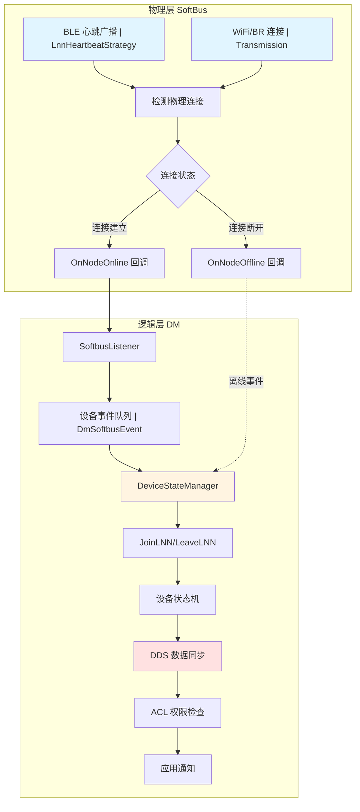
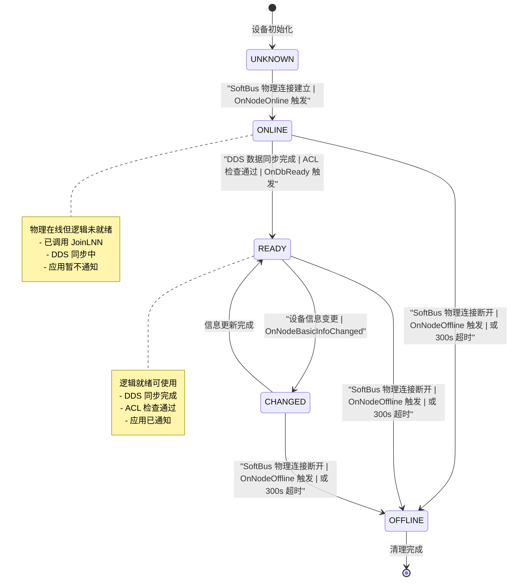
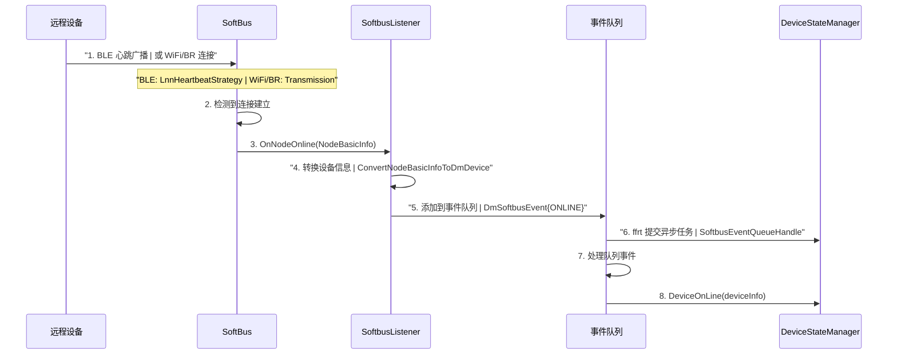
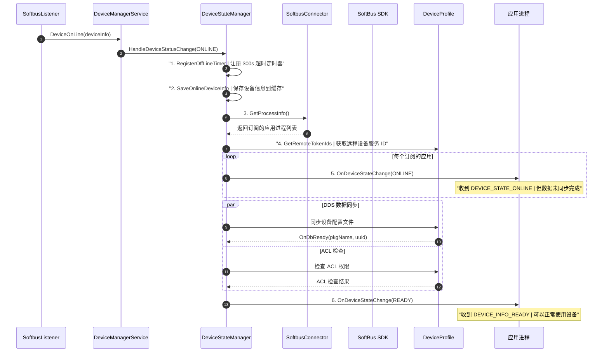
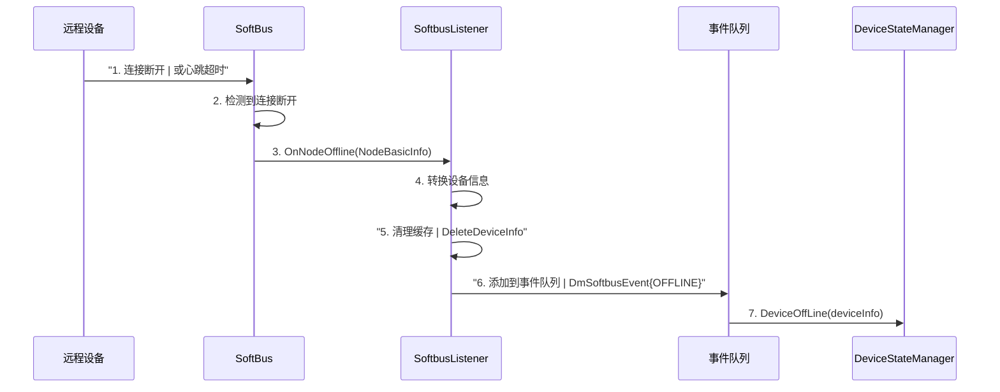
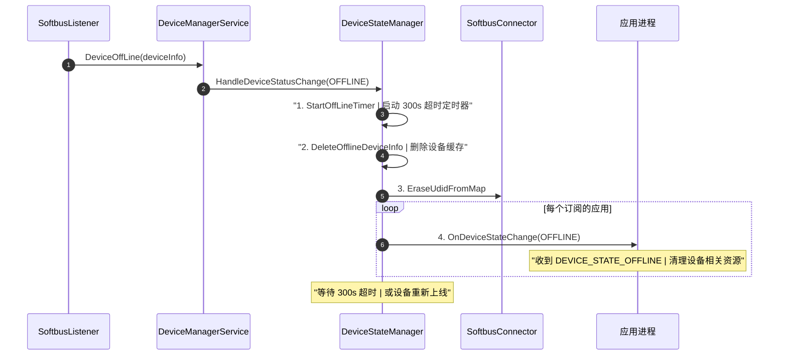
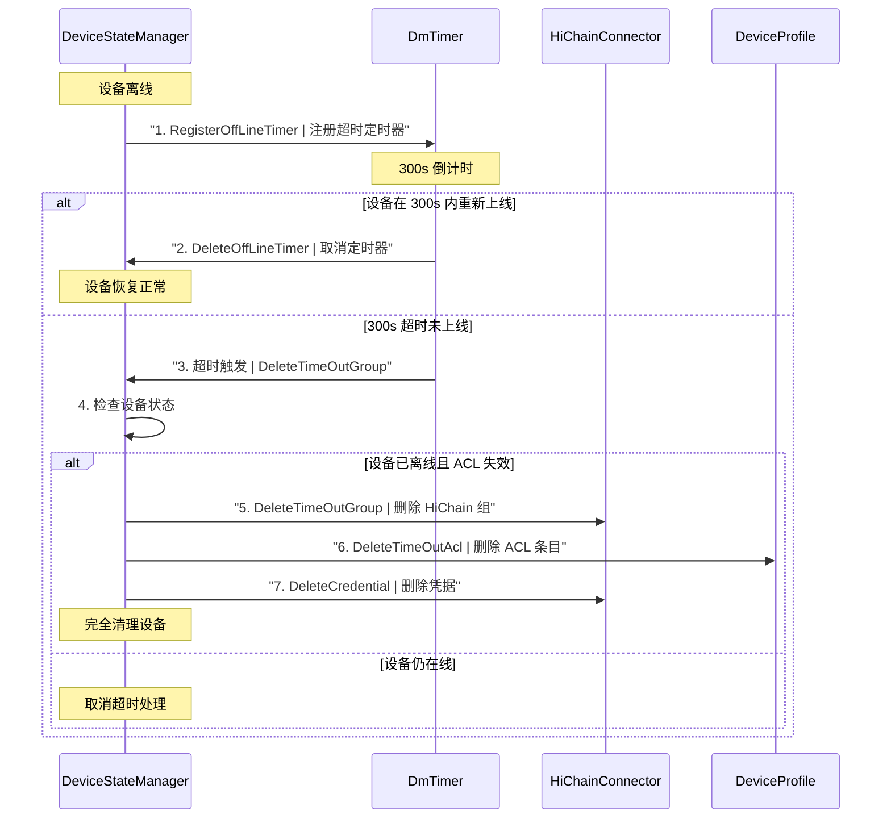
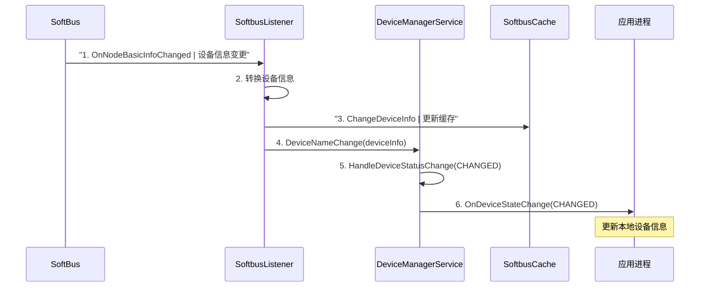
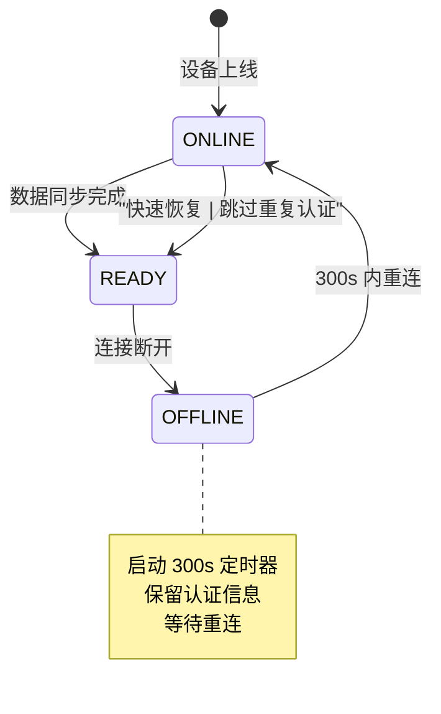
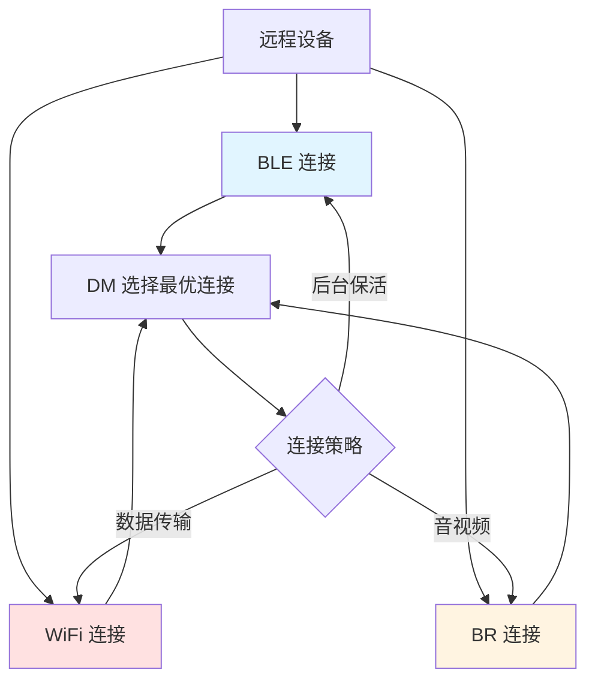

# 设备上下线管理

版本 v2.0  
更新日期 2026-05-19

## 1. 概述

设备管理（Device Manager，DM）的上下线管理采用**物理层/逻辑层双层模型**。物理层由 SoftBus 负责，通过 BLE 心跳、WiFi/BR 连接等方式检测设备的物理在线状态；逻辑层由 DM 负责，通过 JoinLNN/LeaveLNN 操作管理设备的逻辑状态，并触发 DDS 数据同步和 ACL 检查。

### 双层模型的优势

- **物理层快速响应**：SoftBus 通过心跳机制快速检测设备物理连接变化
- **逻辑层可靠管理**：DM 管理设备的逻辑状态，确保数据同步完成后再通知应用
- **状态隔离**：物理在线不一定逻辑在线（如 DDS 同步未完成）

## 2. 双层模型

### 2.1 模型架构



### 2.2 层次职责

| 层次 | 组件 | 主要职责 |
|------|------|----------|
| **物理层** | SoftBus | - BLE 心跳检测（LnnHeartbeatStrategy）<br/>- WiFi/BR 连接管理（Transmission）<br/>- 触发 OnNodeOnline/Offline 回调 |
| **逻辑层** | DM | - 设备事件队列管理（DmSoftbusEvent）<br/>- JoinLNN/LeaveLNN 操作<br/>- 设备状态机管理（ONLINE/READY/OFFLINE）<br/>- DDS 数据同步<br/>- ACL 权限检查<br/>- 应用状态通知 |

## 3. 设备状态机

### 3.1 状态定义



### 3.2 状态枚举

```cpp
// 定义在 interfaces/inner_kits/native_cpp/include/dm_device_info.h
typedef enum {
    DEVICE_STATE_ONLINE = 0,     // 设备物理在线，数据同步中
    DEVICE_INFO_READY = 1,       // 设备就绪，数据同步完成
    DEVICE_STATE_OFFLINE = 2,    // 设备物理离线
    DEVICE_INFO_CHANGED = 3,     // 设备信息变更
} DmDeviceState;
```

### 3.3 状态转换条件

| 当前状态 | 目标状态 | 触发条件 |
|----------|----------|----------|
| UNKNOWN | ONLINE | SoftBus OnNodeOnline → JoinLNN 成功 |
| ONLINE | READY | DDS 数据同步完成 + ACL 检查通过 |
| ONLINE | OFFLINE | SoftBus OnNodeOffline |
| READY | CHANGED | 设备信息变更（设备名等） |
| CHANGED | READY | 信息更新完成 |
| READY | OFFLINE | SoftBus OnNodeOffline 或 300s 超时 |
| CHANGED | OFFLINE | SoftBus OnNodeOffline 或 300s 超时 |

## 4. 上线流程

### 4.1 物理层上线

物理层上线由 SoftBus 负责，通过 BLE 心跳或 WiFi/BR 连接检测：



**关键代码路径：**

1. **SoftBus 回调注册**（`services/service/src/softbus/softbus_listener.cpp:217-226`）：
```cpp
static INodeStateCb softbusNodeStateCb_ = {
    .events = EVENT_NODE_STATE_ONLINE | EVENT_NODE_STATE_OFFLINE | 
              EVENT_NODE_STATE_INFO_CHANGED | EVENT_NODE_STATUS_CHANGED,
    .onNodeOnline = SoftbusListener::OnSoftbusDeviceOnline,
    .onNodeOffline = SoftbusListener::OnSoftbusDeviceOffline,
    // ...
};
```

2. **事件转换**（`services/service/src/softbus/softbus_listener.cpp:477-525`）：
```cpp
void SoftbusListener::OnSoftbusDeviceOnline(NodeBasicInfo *info) {
    DmSoftbusEvent dmSoftbusEventInfo;
    dmSoftbusEventInfo.eventType = EVENT_TYPE_ONLINE;
    ConvertNodeBasicInfoToDmDevice(*info, dmSoftbusEventInfo.dmDeviceInfo);
    SoftbusEventQueueAdd(dmSoftbusEventInfo);
}
```

3. **事件队列处理**（`services/service/src/softbus/softbus_listener.cpp:379-427`）：
```cpp
void SoftbusListener::SoftbusEventQueueHandle(std::string deviceId) {
    // 从队列中取出事件
    // 根据 eventType 分发到不同的处理函数
    if (dmSoftbusEventInfo.eventType == EVENT_TYPE_ONLINE) {
        DeviceOnLine(dmSoftbusEventInfo.dmDeviceInfo);
    }
}
```

### 4.2 逻辑层上线

逻辑层上线由 DM 负责管理，包括设备状态管理和数据同步：



**关键代码路径：**

1. **状态变更处理**（`services/implementation/src/devicestate/dm_device_state_manager.cpp:122-148`）：
```cpp
void DmDeviceStateManager::OnDeviceOnline(std::string deviceId, int32_t authForm) {
    DmDeviceInfo devInfo = softbusConnector_->GetDeviceInfoByDeviceId(deviceId, uuid);
    devInfo.authForm = static_cast<DmAuthForm>(authForm);
    
    // 保存设备信息
    stateDeviceInfos_[deviceId] = devInfo;
    remoteDeviceInfos_[uuid] = devInfo;
    
    // 获取订阅的应用进程
    std::vector<ProcessInfo> processInfoVec = softbusConnector_->GetProcessInfo();
    
    // 处理状态变更
    ProcessDeviceStateChange(DEVICE_STATE_ONLINE, devInfo, processInfoVec, true);
}
```

2. **状态变更分发**（`services/implementation/src/devicestate/dm_device_state_manager.cpp:208-236`）：
```cpp
void DmDeviceStateManager::ProcessDeviceStateChange(
    const DmDeviceState devState, 
    const DmDeviceInfo &devInfo,
    std::vector<ProcessInfo> &processInfoVec, 
    const bool isOnline) {
    
    // 获取远程设备服务 ID
    std::unordered_set<int64_t> remoteServiceIds;
    DeviceProfileConnector::GetInstance().GetRemoteTokenIds(localUdid, udid, remoteServiceIds);
    
    // 通知所有订阅的应用
    for (const auto &item : processInfoVec) {
        if (!remoteServiceIds.empty() && devState == DEVICE_STATE_ONLINE) {
            listener_->OnDeviceStateChange(item, devState, devInfo, remoteServiceIdVec);
        } else {
            listener_->OnDeviceStateChange(item, devState, devInfo, isOnline);
        }
    }
}
```

3. **JoinLNN 调用**（`services/implementation/src/dependency/softbus/softbus_connector.cpp:373-378`）：
```cpp
int32_t ret = ::JoinLNN(DM_PKG_NAME, addrInfo.get(), OnSoftbusJoinLNNResult, isForceJoin);
```

### 4.3 READY 状态

READY 状态表示设备已经完全就绪，可以正常使用。触发条件：

1. **DDS 数据同步完成**
   - 设备配置文件同步到本地数据库
   - 服务信息同步完成
   - 触发 `OnDbReady(pkgName, uuid)` 回调

2. **ACL 权限检查通过**
   - 访问控制列表检查通过
   - 设备信任关系确认

3. **应用通知**
   - 从 ONLINE 转换到 READY 时，再次通知应用
   - 应用此时可以正常使用设备功能

**代码实现**（`services/implementation/src/devicestate/dm_device_state_manager.cpp:252-281`）：

```cpp
void DmDeviceStateManager::OnDbReady(const std::string &pkgName, const std::string &uuid) {
    // 从缓存中获取设备信息
    auto iter = remoteDeviceInfos_.find(uuid);
    if (iter == remoteDeviceInfos_.end()) {
        return;
    }
    DmDeviceInfo saveInfo = iter->second;
    
    if (listener_ != nullptr) {
        DmDeviceState state = DEVICE_INFO_READY;
        ProcessInfo processInfo;
        processInfo.pkgName = pkgName;
        processInfo.userId = MultipleUserConnector::GetFirstForegroundUserId();
        listener_->OnDeviceStateChange(processInfo, state, saveInfo, true);
    }
}
```

### 4.4 上线时的 ACL 检查

设备上线时会进行 ACL（Access Control List）权限检查：

```cpp
// 在上线流程中检查 ACL
bool accessControl = CheckAccessControl(caller, callee);
if (!accessControl) {
    // 拒绝设备上线或限制功能
    return;
}
```

**ACL 检查内容：**
- 设备信任关系验证
- 用户账号一致性检查
- 权限级别匹配
- 应用授权验证

## 5. 下线流程

### 5.1 物理层下线

物理层下线由 SoftBus 检测连接断开：



**关键代码：**

```cpp
void SoftbusListener::OnSoftbusDeviceOffline(NodeBasicInfo *info) {
    DmSoftbusEvent dmSoftbusEventInfo;
    dmSoftbusEventInfo.eventType = EVENT_TYPE_OFFLINE;
    ConvertNodeBasicInfoToDmDevice(*info, dmSoftbusEventInfo.dmDeviceInfo);
    
    // 清理设备缓存
    SoftbusCache::GetInstance().DeleteDeviceInfo(dmSoftbusEventInfo.dmDeviceInfo);
    SoftbusCache::GetInstance().DeleteDeviceSecurityLevel(dmSoftbusEventInfo.dmDeviceInfo.networkId);
    
    SoftbusEventQueueAdd(dmSoftbusEventInfo);
}
```

### 5.2 逻辑层下线

逻辑层下线包括状态清理和应用通知：



**关键代码：**

```cpp
void DmDeviceStateManager::HandleDeviceStatusChange(
    DmDeviceState devState, 
    DmDeviceInfo &devInfo,
    std::vector<ProcessInfo> &processInfoVec, 
    const std::string &peerUdid, 
    const bool isOnline) {
    
    switch (devState) {
        case DEVICE_STATE_OFFLINE:
            StartOffLineTimer(peerUdid);  // 启动离线超时定时器
            DeleteOfflineDeviceInfo(devInfo);
            if (softbusConnector_ != nullptr) {
                std::string udid;
                softbusConnector_->GetUdidByNetworkId(devInfo.networkId, udid);
                softbusConnector_->EraseUdidFromMap(udid);
            }
            ProcessDeviceStateChange(devState, devInfo, processInfoVec, isOnline);
            break;
    }
}
```

### 5.3 离线超时机制

为了处理设备短暂离线的情况，DM 实现了 **300 秒离线超时机制**：

**超时定义：**

```cpp
#define OFFLINE_TIMEOUT 300  // 300 秒
```

**超时处理流程：**



**关键代码：**

1. **注册离线定时器**（`services/implementation/src/devicestate/dm_device_state_manager.cpp:284-331`）：

```cpp
void DmDeviceStateManager::RegisterOffLineTimer(const DmDeviceInfo &deviceInfo) {
    std::string peerUdid;
    softbusConnector_->GetUdidByNetworkId(deviceInfo.networkId, peerUdid);
    
    int32_t localUserId = MultipleUserConnector::GetCurrentAccountUserID();
    std::unordered_set<int32_t> peerUserIds = 
        DeviceProfileConnector::GetInstance().GetActiveAuthOncePeerUserId(peerUdid, localUserId);
    
    for (const auto &peerUserId : peerUserIds) {
        std::string key = peerUdid + "_" + std::to_string(peerUserId) + "_" + std::to_string(localUserId);
        std::string timerName = STATE_TIMER_PREFIX + sha256UdidHash + "_" + 
                               std::to_string(peerUserId) + "_" + std::to_string(localUserId);
        
        StateTimerInfo stateTimer = {
            .timerName = timerName,
            .peerUdid = peerUdid,
            .peerUserId = peerUserId,
            .localUserId = localUserId,
            .isStart = false,
        };
        stateTimerInfoMap_[key] = stateTimer;
    }
}
```

2. **启动离线定时器**（`services/implementation/src/devicestate/dm_device_state_manager.cpp:333-358`）：

```cpp
void DmDeviceStateManager::StartOffLineTimer(const std::string &peerUdid) {
    std::unordered_set<AuthOnceAclInfo, AuthOnceAclInfoHash> authOnceAclInfos =
        DeviceProfileConnector::GetInstance().GetAuthOnceAclInfos(peerUdid);
    
    for (const auto &item : authOnceAclInfos) {
        std::string key = peerUdid + "_" + std::to_string(item.peerUserId) + "_" + std::to_string(item.localUserId);
        auto iter = stateTimerInfoMap_.find(key);
        if (iter == stateTimerInfoMap_.end() || iter->second.isStart) {
            continue;
        }
        
        timer_->StartTimer(iter->second.timerName, OFFLINE_TIMEOUT, [this] (std::string name) {
            DmDeviceStateManager::DeleteTimeOutGroup(name);
        });
        iter->second.isStart = true;
    }
}
```

3. **超时处理**（`services/implementation/src/devicestate/dm_device_state_manager.cpp:360-399`）：

```cpp
void DmDeviceStateManager::DeleteTimeOutGroup(const std::string &timerName) {
    auto iter = stateTimerInfoMap_.begin();
    for (; iter != stateTimerInfoMap_.end(); iter++) {
        if (iter->second.timerName == timerName) {
            break;
        }
    }
    
    auto timerInfo = iter->second;
    bool isOnline = softbusConnector_->CheckIsOnline(iter->second.peerUdid);
    bool isActive = DeviceProfileConnector::GetInstance().AuthOnceAclIsActive(
        timerInfo.peerUdid, timerInfo.peerUserId, timerInfo.localUserId);
    
    if (isOnline && isActive) {
        // 设备仍在线，取消超时处理
        iter->second.isStart = false;
        return;
    }
    
    // 设备离线，清理资源
    hiChainConnector_->DeleteTimeOutGroup(timerInfo.peerUdid, timerInfo.localUserId);
    DeleteGroupByDP(timerInfo.peerUdid, timerInfo.peerUserId, timerInfo.localUserId);
    
    DmOfflineParam offlineParam;
    uint32_t allAclCnt = DeviceProfileConnector::GetInstance().DeleteTimeOutAcl(
        timerInfo.peerUdid, timerInfo.peerUserId, timerInfo.localUserId, offlineParam);
    
    if (allAclCnt > 0 && allAclCnt == static_cast<uint32_t>(offlineParam.needDelAclInfos.size())) {
        DeleteCredential(offlineParam, timerInfo.peerUdid, timerInfo.localUserId);
    }
    DeleteSkCredAndAcl(offlineParam.needDelAclInfos);
    stateTimerInfoMap_.erase(iter);
}
```

**超时机制的作用：**

1. **容忍短暂离线**：设备因网络波动短暂离线时，不会立即清理认证信息
2. **防止资源泄漏**：长时间离线后自动清理，避免无效设备占用资源
3. **安全保护**：超时后删除凭据和 ACL，防止未授权访问

## 6. 设备信息变更

设备信息变更（如设备名称修改）通过 CHANGED 状态处理：



**关键代码：**

```cpp
void SoftbusListener::OnSoftbusDeviceInfoChanged(NodeBasicInfoType type, NodeBasicInfo *info) {
    DmSoftbusEvent dmSoftbusEventInfo;
    dmSoftbusEventInfo.eventType = EVENT_TYPE_CHANGED;
    ConvertScreenStatusToDmDevice(status->basicInfo, devScreenStatus, dmSoftbusEventInfo.dmDeviceInfo);
    
    // 更新缓存
    SoftbusCache::GetInstance().ChangeDeviceInfo(dmSoftbusEventInfo.dmDeviceInfo);
    
    // 添加到事件队列
    SoftbusEventQueueAdd(dmSoftbusEventInfo);
}
```

**CHANGED 状态触发条件：**
- 设备名称修改
- 设备屏幕状态变更
- 设备类型信息变更
- 网络类型变更

## 7. 重连机制

### 7.1 重连流程

设备短暂离线后重新上线时，DM 会快速恢复设备状态：



### 7.2 状态恢复

重连后的状态恢复流程：

1. **取消离线定时器**
   ```cpp
   void DmDeviceStateManager::DeleteOffLineTimer(const std::string &peerUdid) {
       // 查找并删除对应的定时器
       auto iter = stateTimerInfoMap_.find(key);
       if (iter != stateTimerInfoMap_.end()) {
           timer_->DeleteTimer(iter->second.timerName);
           stateTimerInfoMap_.erase(iter);
       }
   }
   ```

2. **保留认证状态**
   - HiChain 组信息保留
   - ACL 权限保留
   - 凭据信息保留

3. **快速恢复 READY 状态**
   - 跳过重复认证
   - 快速同步增量数据
   - 立即通知应用

### 7.3 LeaveLNN 调用

在某些情况下，DM 会主动调用 LeaveLNN：

```cpp
int32_t DeviceManagerService::LeaveLNN(const std::string &pkgName, const std::string &networkId) {
    LOGI("NetworkId: %{public}s", GetAnonyString(networkId).c_str());
    return softbusConnector_->LeaveLNN(pkgName, networkId);
}
```

**LeaveLNN 调用时机：**
- 应用主动解绑设备
- 设备认证失败
- 安全策略要求离线
- 用户主动删除设备

**LeaveLNN 结果处理：**

```cpp
void SoftbusConnector::OnLeaveLNNResult(const char *networkId, int32_t retCode) {
    if (retCode == SOFTBUS_OK) {
        LOGI("leave LNN called success.");
        return;
    }
    LOGE("leave LNN called failed, retCode: %{public}d.", retCode);
    
    CHECK_NULL_VOID(leaveLNNCallback_);
    auto iter = leaveLnnPkgMap_.find(networkId);
    if (iter != leaveLnnPkgMap_.end()) {
        leaveLNNCallback_->OnLeaveLNNResult(iter->second, networkId, retCode);
        leaveLnnPkgMap_.erase(networkId);
    }
}
```

## 8. BLE vs WiFi/BR 差异

### 8.1 连接方式对比

| 特性 | BLE | WiFi | BR（蓝牙 BR/EDR） |
|------|-----|------|------------------|
| **连接建立** | BLE 广播 + 心跳 | WiFi IP + Port | BR MAC 连接 |
| **在线检测** | LnnHeartbeatStrategy | Transmission 心跳 | Transmission 心跳 |
| **连接优先级** | BLE_PRIORITY_HIGH | 正常优先级 | 正常优先级 |
| **功耗特性** | 低功耗 | 高功耗 | 中等功耗 |
| **传输速度** | 低速 | 高速 | 中速 |
| **适用场景** | 后台保活 | 大数据传输 | 音视频传输 |

### 8.2 上线流程差异

**BLE 上线特点：**

```cpp
// BLE 连接地址信息
if (addrInfo->type == CONNECTION_ADDR_BLE) {
    // 使用 BLE MAC 地址
    jsonPara[BLE_MAC] = addr->info.ble.bleMac;
    addr->info.ble.priority = BLE_PRIORITY_HIGH;
    
    // 转换 UDID Hash
    Crypto::ConvertHexStringToBytes(addrInfo->info.ble.udidHash, UDID_HASH_LEN, 
                                     udidHash.c_str(), udidHash.length());
}
```

- **心跳策略**：使用 `LnnHeartbeatStrategy` 进行心跳检测
- **优先级高**：设置为 `BLE_PRIORITY_HIGH`
- **低功耗**：适合后台设备发现和保活

**WiFi/BR 上线特点：**

```cpp
// WiFi 连接地址信息
addr = GetConnectAddrByType(deviceInfo.get(), ConnectionAddrType::CONNECTION_ADDR_WLAN);
if (addr != nullptr) {
    jsonPara[WIFI_IP] = addr->info.wlan.ip;
    jsonPara[WIFI_PORT] = addr->info.wlan.port;
}

// BR 连接地址信息
addr = GetConnectAddrByType(deviceInfo.get(), ConnectionAddrType::CONNECTION_ADDR_BR);
if (addr != nullptr) {
    jsonPara[BR_MAC] = addr->info.br.brMac;
}
```

- **传输层**：使用 `Transmission` 进行数据传输
- **高带宽**：适合大数据量传输
- **稳定性**：连接更稳定，适合长连接

### 8.3 下线检测差异

| 连接类型 | 检测机制 | 超时时间 | 恢复策略 |
|----------|----------|----------|----------|
| BLE | 心跳超时 | 较短（可配置） | 重新广播发现 |
| WiFi | TCP 断开/心跳超时 | 中等 | 重新连接 IP |
| BR | 连接断开/心跳超时 | 中等 | 重新连接 MAC |

### 8.4 混合连接场景

设备可能同时支持多种连接方式：



**连接选择策略：**
1. **默认优先级**：BLE > WiFi > BR
2. **场景适配**：根据应用需求选择连接类型
3. **自动切换**：某种连接断开时自动切换到其他连接

## 9. 关键代码路径

### 9.1 上线关键路径

```
SoftBus::OnNodeOnline
  → SoftbusListener::OnSoftbusDeviceOnline
    → SoftbusListener::SoftbusEventQueueAdd
      → SoftbusListener::SoftbusEventQueueHandle
        → SoftbusListener::DeviceOnLine
          → DeviceManagerService::HandleDeviceStatusChange(ONLINE)
            → DmDeviceStateManager::HandleDeviceStatusChange
              → DmDeviceStateManager::RegisterOffLineTimer
              → DmDeviceStateManager::SaveOnlineDeviceInfo
              → DmDeviceStateManager::ProcessDeviceStateChange
                → DeviceManagerServiceListener::OnDeviceStateChange(ONLINE)
```

### 9.2 下线关键路径

```
SoftBus::OnNodeOffline
  → SoftbusListener::OnSoftbusDeviceOffline
    → SoftbusListener::SoftbusEventQueueAdd
      → SoftbusListener::SoftbusEventQueueHandle
        → SoftbusListener::DeviceOffLine
          → DeviceManagerService::HandleDeviceStatusChange(OFFLINE)
            → DmDeviceStateManager::HandleDeviceStatusChange
              → DmDeviceStateManager::StartOffLineTimer
              → DmDeviceStateManager::DeleteOfflineDeviceInfo
              → DmDeviceStateManager::ProcessDeviceStateChange
                → DeviceManagerServiceListener::OnDeviceStateChange(OFFLINE)
```

### 9.3 状态同步关键路径

```
DeviceProfile::OnDbReady
  → DmDeviceStateManager::OnDbReady
    → DeviceManagerServiceListener::OnDeviceStateChange(READY)
      → 应用进程收到 DEVICE_INFO_READY
```

### 9.4 超时处理关键路径

```
DmTimer::Timeout (300s)
  → DmDeviceStateManager::DeleteTimeOutGroup
    → HiChainConnector::DeleteTimeOutGroup
    → DeviceProfileConnector::DeleteTimeOutAcl
    → DmDeviceStateManager::DeleteCredential
    → DmDeviceStateManager::DeleteSkCredAndAcl
```

### 9.5 数据结构定义

**设备状态枚举：** `interfaces/inner_kits/native_cpp/include/dm_device_info.h:122-136`

**SoftBus 状态回调：** `services/implementation/include/dependency/softbus/softbus_state_callback.h`

**设备状态管理器：** `services/implementation/include/devicestate/dm_device_state_manager.h`

**SoftBus 监听器：** `services/service/include/softbus/softbus_listener.h`

## 10. 总结

设备上下线管理是 DM 的核心功能，采用双层模型确保：

1. **快速响应**：SoftBus 物理层快速检测设备连接变化
2. **可靠管理**：DM 逻辑层确保数据同步和权限检查完成
3. **状态隔离**：物理在线不等于逻辑就绪，避免应用访问未就绪设备
4. **容错机制**：300s 超时机制容忍短暂离线，防止误删认证信息
5. **多连接支持**：支持 BLE/WiFi/BR 多种连接方式，自动选择最优路径

通过这种双层模型，DM 能够有效管理分布式设备的生命周期，为上层应用提供可靠的设备管理服务。
