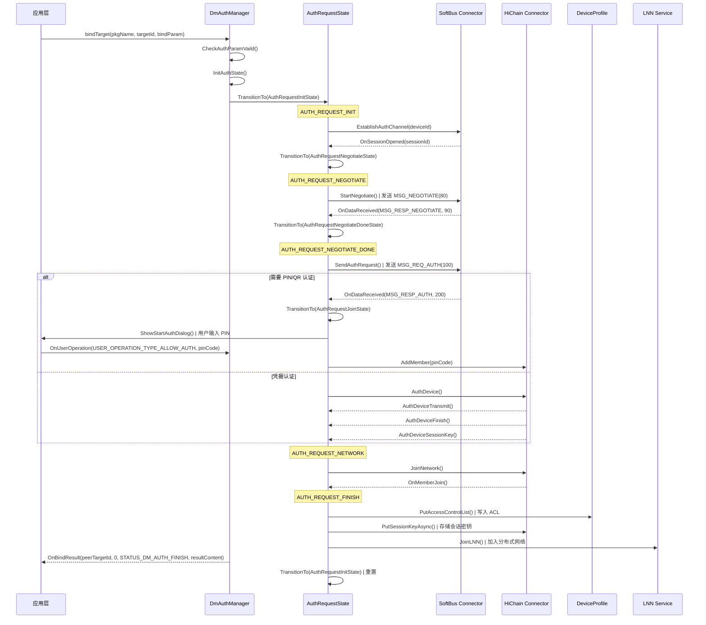
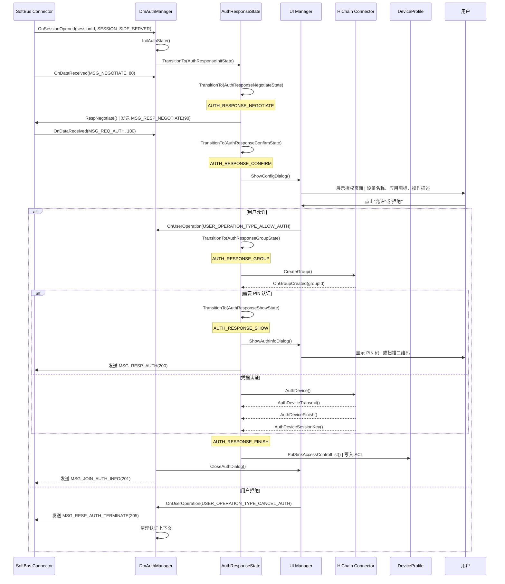
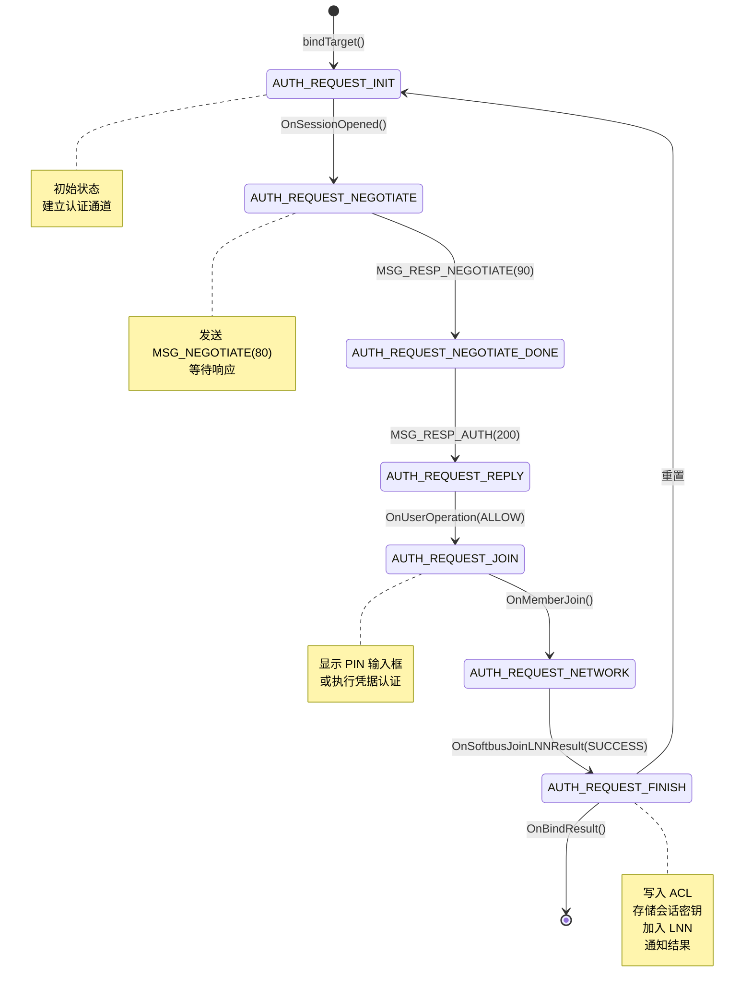
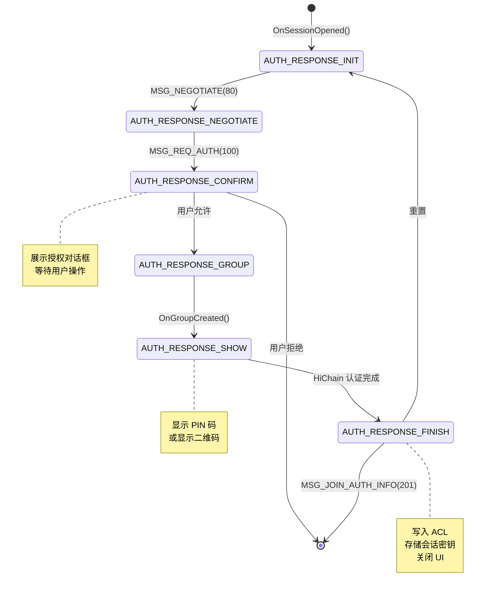
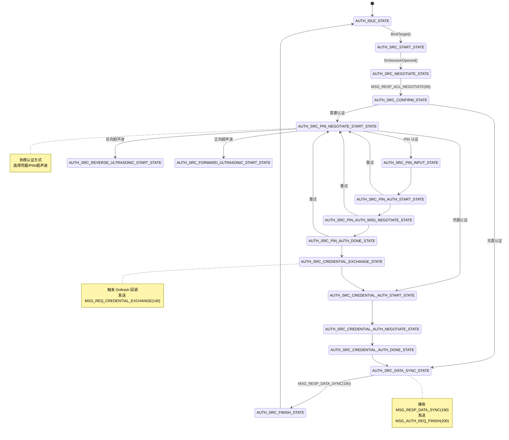
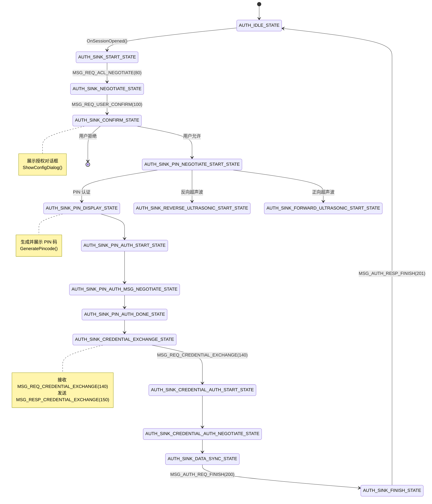
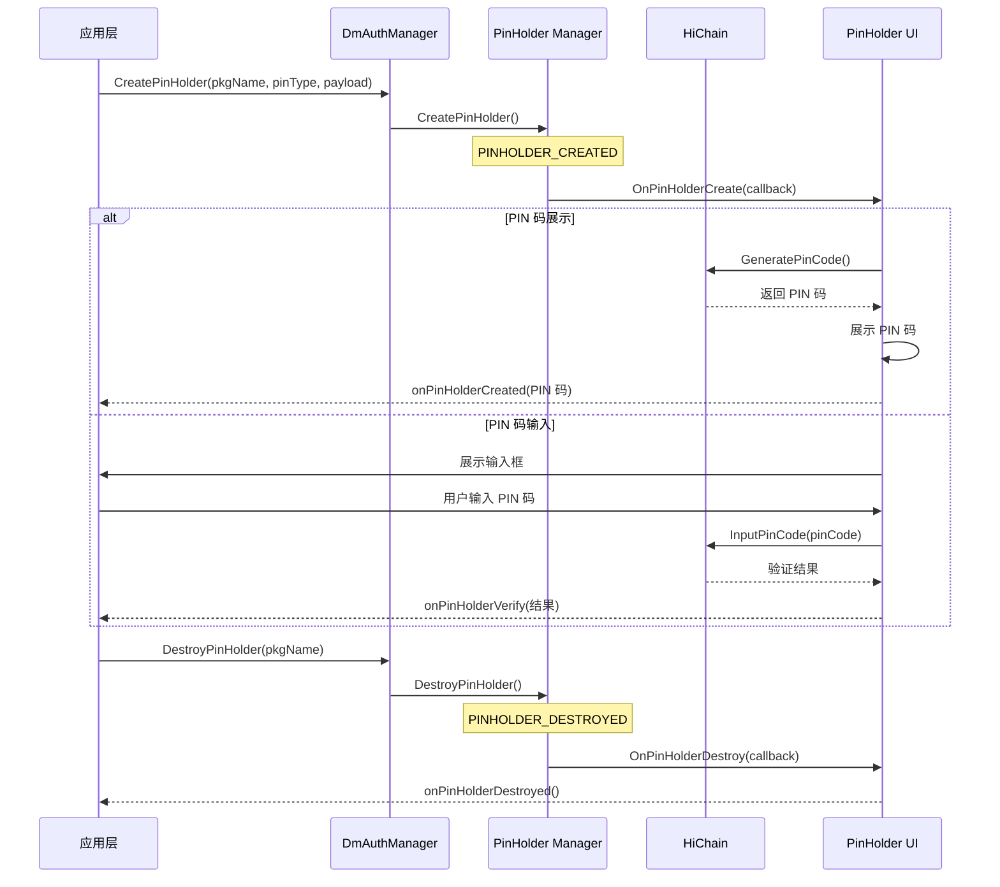
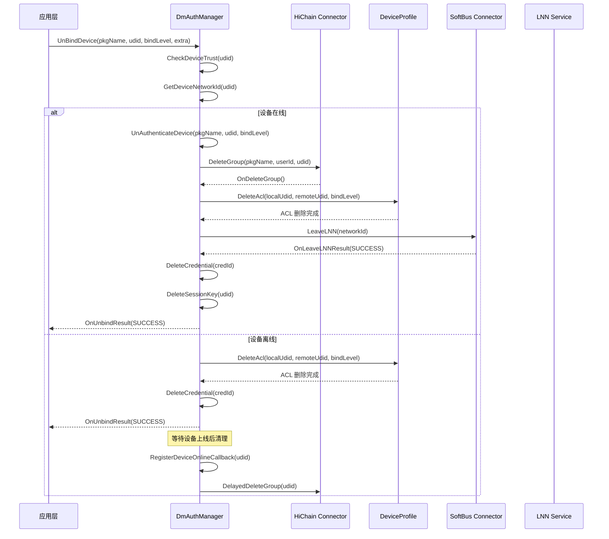

# 绑定与解绑流程


---

## 1. 概述

绑定/解绑是设备管理器（Device Manager, DM）最复杂的子系统，涉及：
- **认证状态机**：v1 基础状态机（`authentication/`）和 v2 增强状态机（`authentication_v2/`）
- **消息协议**：SoftBus 会话消息交互
- **UI 交互**：用户授权确认、PIN 码显示/输入、二维码展示
- **信任建立**：HiChain 组网、凭据交换、会话密钥导出
- **权限控制**：访问控制列表（ACL）写入与删除

绑定流程分两个角色：
- **发起端（Source/Src）**：主动发起绑定的设备
- **接收端（Sink）**：接收绑定请求的设备

---

## 2. 绑定 API 入口

### 2.1 主入口：bindTarget

```cpp
// services/implementation/include/authentication/dm_auth_manager.h
int32_t DmAuthManager::BindTarget(
    const std::string &pkgName,          // 调用方包名
    const PeerTargetId &targetId,        // 目标设备 ID
    const std::map<std::string, std::string> &bindParam,  // 绑定参数
    int sessionId,                       // SoftBus 会话 ID
    uint64_t logicalSessionId            // 逻辑会话 ID
)
```

**关键参数**（JSON 格式）：
```json
{
  "deviceId": "...",           // 目标设备 UDID
  "authType": 1,               // 认证类型
  "bindLevel": 1,              // 绑定级别
  "connSessionType": "WiFi",   // 连接会话类型
  "closeSessionDelaySeconds": 0,  // 会话延迟关闭时间
  "appOperation": "...",       // 应用操作描述
  "customDesc": "...",         // 自定义描述
  "targetPkgName": "...",      // 目标包名
  "peerBundleName": "...",     // 对端包名
  "isNeedJoinLnn": "0"         // 是否加入 LNN
}
```

### 2.2 遗留入口：authenticateDevice

```cpp
int32_t DmAuthManager::AuthenticateDevice(
    const std::string &pkgName,     // 调用方包名
    int32_t authType,               // 认证类型（DmAuthType）
    const std::string &deviceId,    // 目标设备 ID
    const std::string &extra        // 额外参数（JSON）
)
```

### 2.3 调用方要求

- **权限检查**：`ohos.permission.DISTRIBUTED_DEVICE_CONNECT`
- **参数校验**：
  - 包名非空
  - 设备 ID 有效
  - 认证类型支持（0-6 范围内）
  - 认证码类型需预先准备

---

## 3. 认证架构双版本

### 3.1 v1 架构（authentication/）

基于**经典状态模式**，分为**发起端状态**和**接收端状态**。

**发起端状态**（`AuthRequestState`）：
```cpp
// services/implementation/include/authentication/dm_auth_manager.h
typedef enum AuthState {
    AUTH_REQUEST_INIT = 1,           // 初始状态
    AUTH_REQUEST_NEGOTIATE,          // 协商中
    AUTH_REQUEST_NEGOTIATE_DONE,     // 协商完成
    AUTH_REQUEST_REPLY,              // 等待响应
    AUTH_REQUEST_JOIN,               // 加入网络
    AUTH_REQUEST_NETWORK,            // 网络已加入
    AUTH_REQUEST_FINISH,             // 完成
    AUTH_REQUEST_CREDENTIAL,         // 凭据交换（v2 新增）
    AUTH_REQUEST_CREDENTIAL_DONE,    // 凭据完成
    AUTH_REQUEST_AUTH_FINISH,        // 认证完成
    AUTH_REQUEST_RECHECK_MSG,        // 消息重检
    AUTH_REQUEST_RECHECK_MSG_DONE,   // 重检完成
    // ...
} AuthState;
```

**接收端状态**（`AuthResponseState`）：
```cpp
typedef enum AuthState {
    AUTH_RESPONSE_INIT = 20,         // 初始状态
    AUTH_RESPONSE_NEGOTIATE,         // 协商中
    AUTH_RESPONSE_CONFIRM,           // 用户确认
    AUTH_RESPONSE_GROUP,             // 组网中
    AUTH_RESPONSE_SHOW,              // 展示认证信息
    AUTH_RESPONSE_FINISH,            // 完成
    AUTH_RESPONSE_CREDENTIAL,        // 凭据交换
    AUTH_RESPONSE_AUTH_FINISH,       // 认证完成
    AUTH_RESPONSE_RECHECK_MSG,       // 消息重检
} AuthState;
```

**核心类**：
- `DmAuthManager`：认证管理器主入口
- `AuthRequestState` / `AuthResponseState`：状态基类
- `AuthMessageProcessor`：消息处理器
- `AuthUiStateManager`：UI 状态管理器

### 3.2 v2 架构（authentication_v2/）

基于**增强状态机模式**，支持：
- **事件驱动**：`DmEventType` + `WaitExpectEvent`
- **线程化状态机**：独立线程运行状态转换
- **凭据认证**：支持 PKI/PSK 凭据交换
- **超声波认证**：正向/反向超声波 PIN 码传输
- **代理绑定**：跨设备代理认证

**状态类型**（`DmAuthStateType`）：
```cpp
// services/implementation/include/authentication_v2/dm_auth_state.h
enum class DmAuthStateType {
    // 通用状态
    AUTH_IDLE_STATE = 0,

    // 发起端状态
    AUTH_SRC_START_STATE = 1,                  // 用户触发 BindTarget
    AUTH_SRC_NEGOTIATE_STATE = 2,              // OnSessionOpened，发送 80 消息
    AUTH_SRC_CONFIRM_STATE = 3,                // 收到 90 授权响应，发送 100 消息
    AUTH_SRC_PIN_NEGOTIATE_START_STATE = 4,    // PIN 协商开始
    AUTH_SRC_PIN_INPUT_STATE = 5,              // PIN 输入
    AUTH_SRC_REVERSE_ULTRASONIC_START_STATE = 6,  // 反向超声波开始
    AUTH_SRC_REVERSE_ULTRASONIC_DONE_STATE = 7,   // 反向超声波完成
    AUTH_SRC_FORWARD_ULTRASONIC_START_STATE = 8,  // 正向超声波开始
    AUTH_SRC_FORWARD_ULTRASONIC_DONE_STATE = 9,   // 正向超声波完成
    AUTH_SRC_PIN_AUTH_START_STATE = 10,           // PIN 认证开始，发送 120 消息
    AUTH_SRC_PIN_AUTH_MSG_NEGOTIATE_STATE = 11,   // 收到 130，发送 121
    AUTH_SRC_PIN_AUTH_DONE_STATE = 12,            // 收到 131，调用 processData
    AUTH_SRC_CREDENTIAL_EXCHANGE_STATE = 13,      // 触发 Onfinish，发送 140 消息
    AUTH_SRC_CREDENTIAL_AUTH_START_STATE = 14,    // 收到 150，发送 160
    AUTH_SRC_CREDENTIAL_AUTH_NEGOTIATE_STATE = 15,// 收到 170，发送 161
    AUTH_SRC_CREDENTIAL_AUTH_DONE_STATE = 16,     // 凭据认证完成
    AUTH_SRC_DATA_SYNC_STATE = 17,                // 收到 190，发送 200
    AUTH_SRC_FINISH_STATE = 18,                   // 收到 201
    AUTH_SRC_SK_DERIVE_STATE = 19,                // 收到 151，导出会话密钥

    // 接收端状态
    AUTH_SINK_START_STATE = 50,               // 总线触发 OnSessionOpened
    AUTH_SINK_NEGOTIATE_STATE = 51,           // 收到 80，发送 90
    AUTH_SINK_CONFIRM_STATE = 52,             // 收到 100，发送 110
    AUTH_SINK_PIN_NEGOTIATE_START_STATE = 53, // PIN 协商开始
    AUTH_SINK_PIN_DISPLAY_STATE = 54,         // 生成并展示 PIN
    AUTH_SINK_REVERSE_ULTRASONIC_START_STATE = 55,
    AUTH_SINK_REVERSE_ULTRASONIC_DONE_STATE = 56,
    AUTH_SINK_FORWARD_ULTRASONIC_START_STATE = 57,
    AUTH_SINK_FORWARD_ULTRASONIC_DONE_STATE = 58,
    AUTH_SINK_PIN_AUTH_START_STATE = 59,      // 收到 120，发送 130
    AUTH_SINK_PIN_AUTH_MSG_NEGOTIATE_STATE = 60, // 收到 121，发送 131
    AUTH_SINK_PIN_AUTH_DONE_STATE = 61,       // 触发 Onfinish
    AUTH_SINK_CREDENTIAL_EXCHANGE_STATE = 62, // 收到 140，发送 150
    AUTH_SINK_CREDENTIAL_AUTH_START_STATE = 63, // 收到 160，发送 170
    AUTH_SINK_CREDENTIAL_AUTH_NEGOTIATE_STATE = 64, // 收到 161
    AUTH_SINK_DATA_SYNC_STATE = 65,           // 收到 180，发送 190
    AUTH_SINK_FINISH_STATE = 66,              // 收到 200，发送 201
    AUTH_SINK_SK_DERIVE_STATE = 67,           // 收到 141，导出会话密钥
};
```

**事件类型**（`DmEventType`）：
```cpp
enum DmEventType {
    ON_TRANSMIT = 0,              // HiChain 传输回调
    ON_SESSION_KEY_RETURNED,      // 会话密钥返回
    ON_REQUEST,                   // HiChain 请求回调
    ON_FINISH,                    // HiChain 完成回调
    ON_ERROR,                     // 错误事件
    ON_ULTRASONIC_PIN_CHANGED,    // 超声波 PIN 改变
    ON_ULTRASONIC_PIN_TIMEOUT,    // 超声波 PIN 超时
    ON_TIMEOUT,                   // 状态超时
    ON_USER_OPERATION,            // 用户操作
    ON_FAIL,                      // 失败
    ON_SCREEN_LOCKED,             // 屏幕锁定
    ON_SESSION_OPENED,            // 会话打开
};
```

**核心类**：
- `DmAuthStateMachine`：状态机引擎（线程化）
- `AuthSrcManager` / `AuthSinkManager`：v2 认证管理器
- `DmAuthContext`：认证上下文（替代 v1 的 `DmAuthRequestContext`）
- `DmAuthState`：状态基类，所有状态实现 `Action()` 方法

---

## 4. 绑定流程 — 发起端（Source）

### 4.1 完整时序图



### 4.2 状态转换详解

#### 4.2.1 INIT → NEGOTIATE
```cpp
// services/implementation/src/authentication/auth_request_state.cpp
int32_t AuthRequestInitState::Enter() {
    stateAuthManager->EstablishAuthChannel(context_->deviceId);
    return DM_OK;
}
```
- 调用 `SoftbusConnector::OpenSession()` 打开会话
- 等待 `OnSessionOpened()` 回调
- 收到回调后转换到 `AUTH_REQUEST_NEGOTIATE`

#### 4.2.2 NEGOTIATE → NEGOTIATE_DONE
```cpp
int32_t AuthRequestNegotiateState::Enter() {
    stateAuthManager->StartNegotiate(context_->sessionId);
    return DM_OK;
}
```
- 发送 `MSG_NEGOTIATE(80)` 消息
- 等待接收端响应 `MSG_RESP_NEGOTIATE(90)`
- 收到响应后转换到 `AUTH_REQUEST_NEGOTIATE_DONE`

#### 4.2.3 NEGOTIATE_DONE → JOIN
```cpp
int32_t AuthRequestNegotiateDoneState::Enter() {
    stateAuthManager->SendAuthRequest(context_->sessionId);
    return DM_OK;
}
```
- 发送 `MSG_REQ_AUTH(100)` 认证请求
- 根据认证类型等待对应响应：
  - **PIN 认证**：等待 `MSG_RESP_AUTH(200)` → 显示输入框
  - **凭据认证**：等待 HiChain 回调

#### 4.2.4 JOIN → NETWORK
```cpp
int32_t AuthRequestJoinState::Enter() {
    stateAuthManager->ShowStartAuthDialog();
    return DM_OK;
}
```
- **PIN 认证**：显示 PIN 输入框
  - `displayOwner=1`：系统 UI（DmAbilityManager）
  - `displayOwner=0`：自定义 UI（应用层回调）
- **凭据认证**：直接调用 `HiChain::AddMember()`
- 等待 `OnMemberJoin()` 回调

#### 4.2.5 NETWORK → FINISH
```cpp
int32_t AuthRequestNetworkState::Enter() {
    stateAuthManager->JoinNetwork();
    return DM_OK;
}
```
- 调用 `SoftbusConnector::JoinLNN()` 加入分布式网络
- 等待 `OnSoftbusJoinLNNResult()` 回调
- 收到成功回调后转换到 `AUTH_REQUEST_FINISH`

#### 4.2.6 FINISH
```cpp
int32_t AuthRequestFinishState::Enter() {
    stateAuthManager->AuthenticateFinish();
    return DM_OK;
}
```
- **写入 ACL**：`PutSrcAccessControlList()`
  - 访问者（Accesser）：本地设备 UDID + TokenId
  - 被访问者（Accessee）：远程设备 UDID + 权限范围
- **存储会话密钥**：`PutSessionKeyAsync()`
  - 导出会话密钥哈希
  - 调用 `HiChain::PutSessionKey()`
- **加入 LNN**：`JoinLNN(networkId)`
  - 调用 `SoftbusConnector::JoinLNN()`
- **通知结果**：
  - `OnBindResult()` → 应用层
  - `OnAuthResult()` → 状态监听器
  - `OnDevicePinned()` → 设备置顶事件

---

## 5. 绑定流程 — 接收端（Sink）

### 5.1 完整时序图



### 5.2 状态转换详解

#### 5.2.1 INIT → NEGOTIATE
```cpp
int32_t AuthResponseInitState::Enter() {
    LOGI("start");
    return DM_OK;  // 等待接收消息
}
```
- 等待 SoftBus 会话打开事件
- 收到 `MSG_NEGOTIATE(80)` 后转换到 `AUTH_RESPONSE_NEGOTIATE`

#### 5.2.2 NEGOTIATE → CONFIRM
```cpp
int32_t AuthResponseNegotiateState::Enter() {
    stateAuthManager->RespNegotiate(context_->sessionId);
    return DM_OK;
}
```
- 发送 `MSG_RESP_NEGOTIATE(90)` 响应协商消息
- 等待 `MSG_REQ_AUTH(100)` 用户授权请求
- 收到后转换到 `AUTH_RESPONSE_CONFIRM`

#### 5.2.3 CONFIRM → GROUP
```cpp
int32_t AuthResponseConfirmState::Enter() {
    stateAuthManager->ShowConfigDialog();
    return DM_OK;
}
```
- **展示授权对话框**（`DmDialogManager::ShowConfirmDialog`）：
  - 设备名称（`deviceName`）
  - 应用图标（`appThumbnail`）
  - 操作描述（`appOperation` + `customDesc`）
  - 设备类型图标（根据 `deviceTypeId`）
  - "允许"和"拒绝"按钮
- 等待用户操作：
  - **允许**：`USER_OPERATION_TYPE_ALLOW_AUTH` → 转换到 `AUTH_RESPONSE_GROUP`
  - **拒绝**：`USER_OPERATION_TYPE_CANCEL_AUTH` → 终止认证

#### 5.2.4 GROUP → SHOW
```cpp
int32_t AuthResponseGroupState::Enter() {
    stateAuthManager->CreateGroup();
    return DM_OK;
}
```
- 调用 `HiChainConnector::CreateGroup()` 创建信任组
- 等待 `OnGroupCreated()` 回调
- 组创建成功后：
  - **PIN/QR 认证**：转换到 `AUTH_RESPONSE_SHOW`
  - **凭据认证**：直接进入 HiChain 认证流程

#### 5.2.5 SHOW → FINISH
```cpp
int32_t AuthResponseShowState::Enter() {
    stateAuthManager->ShowAuthInfoDialog();
    return DM_OK;
}
```
- **PIN 认证**：
  - 生成 6 位随机 PIN 码（`GeneratePincode()`）
  - 展示 PIN 码页面（`DmAbilityManager::StartAbility()`）
  - 发送 `MSG_RESP_AUTH(200)` 通知发起端
- **二维码认证**：
  - 生成认证 Token（`authToken`）
  - 展示二维码页面
  - 等待发起端扫描
- 等待发起端完成认证
- 转换到 `AUTH_RESPONSE_FINISH`

#### 5.2.6 FINISH
```cpp
int32_t AuthResponseFinishState::Enter() {
    stateAuthManager->SinkAuthenticateFinish();
    return DM_OK;
}
```
- **写入 ACL**：`PutSinkAccessControlList()`
  - 访问者（Accesser）：远程设备 UDID + TokenId
  - 被访问者（Accessee）：本地设备 UDID + 权限范围
- **存储会话密钥**：`PutSessionKeyAsync()`
- **关闭 UI**：`DmAbilityManager::TerminateAbility()`
- **发送完成消息**：`MSG_JOIN_AUTH_INFO(201)`
- **重置状态**：转换到 `AUTH_RESPONSE_INIT`

---

## 6. 认证状态机详解

### 6.1 发起端状态机（v1）



### 6.2 接收端状态机（v1）



### 6.3 发起端状态机（v2）



### 6.4 接收端状态机（v2）



### 6.5 状态转换条件表

| 当前状态 | 事件 | 下一状态 | 动作 |
|---------|------|---------|------|
| **发起端（v1）** ||||
| AUTH_REQUEST_INIT | EstablishAuthChannel() | AUTH_REQUEST_NEGOTIATE | 打开 SoftBus 会话 |
| AUTH_REQUEST_NEGOTIATE | OnSessionOpened() | AUTH_REQUEST_NEGOTIATE | 发送 MSG_NEGOTIATE(80) |
| AUTH_REQUEST_NEGOTIATE | MSG_RESP_NEGOTIATE(90) | AUTH_REQUEST_NEGOTIATE_DONE | 解析响应参数 |
| AUTH_REQUEST_NEGOTIATE_DONE | Enter() | AUTH_REQUEST_REPLY | 发送 MSG_REQ_AUTH(100) |
| AUTH_REQUEST_REPLY | MSG_RESP_AUTH(200) | AUTH_REQUEST_JOIN | 显示 PIN 输入框 |
| AUTH_REQUEST_JOIN | OnUserOperation(ALLOW) | AUTH_REQUEST_NETWORK | 调用 HiChain AddMember |
| AUTH_REQUEST_NETWORK | OnMemberJoin() | AUTH_REQUEST_FINISH | 加入 LNN |
| AUTH_REQUEST_FINISH | Enter() | AUTH_REQUEST_INIT | 写入 ACL，存储会话密钥 |
| **接收端（v1）** ||||
| AUTH_RESPONSE_INIT | MSG_NEGOTIATE(80) | AUTH_RESPONSE_NEGOTIATE | 解析协商请求 |
| AUTH_RESPONSE_NEGOTIATE | Enter() | AUTH_RESPONSE_CONFIRM | 发送 MSG_RESP_NEGOTIATE(90) |
| AUTH_RESPONSE_CONFIRM | MSG_REQ_AUTH(100) | AUTH_RESPONSE_CONFIRM | ShowConfigDialog() |
| AUTH_RESPONSE_CONFIRM | OnUserOperation(ALLOW) | AUTH_RESPONSE_GROUP | 用户允许 |
| AUTH_RESPONSE_CONFIRM | OnUserOperation(CANCEL) | AUTH_RESPONSE_INIT | 用户拒绝 |
| AUTH_RESPONSE_GROUP | OnGroupCreated() | AUTH_RESPONSE_SHOW | 创建信任组成功 |
| AUTH_RESPONSE_SHOW | Enter() | AUTH_RESPONSE_FINISH | ShowAuthInfoDialog() |
| AUTH_RESPONSE_FINISH | Enter() | AUTH_RESPONSE_INIT | 写入 ACL，关闭 UI |

---

## 7. 认证方式协议差异

### 7.1 认证类型枚举

```cpp
// services/implementation/include/authentication/dm_auth_manager.h
enum DmAuthType : int32_t {
    AUTH_TYPE_CRE = 0,                 // 凭据认证（Credential）
    AUTH_TYPE_PIN,                     // PIN 码认证
    AUTH_TYPE_QR_CODE,                 // 二维码认证
    AUTH_TYPE_NFC,                     // NFC 认证
    AUTH_TYPE_NO_INTER_ACTION,         // 无交互认证（仅同账号）
    AUTH_TYPE_IMPORT_AUTH_CODE,        // 导入认证码
    AUTH_TYPE_UNKNOW,                  // 未知类型
};
```

### 7.2 各认证方式对比

| 认证方式 | 消息序列 | UI 交互 | 安全级别 | 适用场景 |
|---------|---------|---------|---------|---------|
| **PIN 码** | 80 → 90 → 100 → 200, 用户输入 PIN → HiChain AddMember | 发起端：输入框, 接收端：显示 PIN | 中 | 点对点绑定、手动配对 |
| **二维码** | 80 → 90 → 100 → 200, 扫描二维码 → HiChain AddMember | 发起端：扫描框, 接收端：显示二维码 | 中 | 手机扫描平板/电视 |
| **凭据认证** | 80 → 90 → 100 → 140 → 150 → 160 → 170 → 180 → 190 → 200, （无用户交互） | 无 UI | 高 | 代理绑定、服务绑定、跨账号 |
| **NFC** | 80 → 90 → 100 → 200, NFC 碰触 → HiChain AddMember | 发起端：NFC 提示, 接收端：NFC 提示 | 中 | NFC 碰一碰配对 |
| **无交互** | 80 → 90 → 100 → 200, （自动验证） | 无 UI | 低 | 同账号设备自动绑定 |
| **导入认证码** | 80 → 90 → 100 → 200, 导入认证码 → HiChain AddMember | 发起端：输入框, 接收端：无 UI | 中 | 跨设备导入信任关系 |

### 7.3 PIN 码认证流程

**发起端**：
1. 发送 `MSG_REQ_AUTH(100)` 请求
2. 接收 `MSG_RESP_AUTH(200)` 响应
3. 显示 PIN 输入框（`ShowStartAuthDialog`）
4. 用户输入 PIN 码
5. 调用 `HiChain::AddMember(pinCode)`
6. 等待 `OnMemberJoin()` 回调

**接收端**：
1. 接收 `MSG_REQ_AUTH(100)` 请求
2. 显示授权对话框（`ShowConfigDialog`）
3. 用户允许后创建信任组（`CreateGroup`）
4. 生成 6 位随机 PIN 码（`GeneratePincode`）
5. 显示 PIN 码页面（`ShowAuthInfoDialog`）
6. 发送 `MSG_RESP_AUTH(200)` 响应
7. 等待发起端完成 HiChain 认证

### 7.4 凭据认证流程（v2）

**发起端**：
1. 协商认证方式 → 选择凭据认证
2. 转换到 `AUTH_SRC_CREDENTIAL_EXCHANGE_STATE`
3. 发送 `MSG_REQ_CREDENTIAL_EXCHANGE(140)`（包含公钥）
4. 接收 `MSG_RESP_CREDENTIAL_EXCHANGE(150)`（包含对端公钥）
5. 转换到 `AUTH_SRC_CREDENTIAL_AUTH_START_STATE`
6. 发送 `MSG_REQ_CREDENTIAL_AUTH_START(160)`（认证数据）
7. 接收 `MSG_RESP_CREDENTIAL_AUTH_START(170)`（认证响应）
8. 发送 `MSG_REQ_CREDENTIAL_AUTH_NEGOTIATE(161)`（协商数据）
9. 接收 `MSG_RESP_CREDENTIAL_AUTH_NEGOTIATE(171)`（协商响应）
10. 转换到 `AUTH_SRC_CREDENTIAL_AUTH_DONE_STATE`
11. 导出会话密钥（`DerivativeSessionKey`）
12. 转换到 `AUTH_SRC_DATA_SYNC_STATE`

**接收端**：
1. 协商认证方式 → 选择凭据认证
2. 转换到 `AUTH_SINK_CREDENTIAL_EXCHANGE_STATE`
3. 接收 `MSG_REQ_CREDENTIAL_EXCHANGE(140)`
4. 生成公私钥对（`GenerateCredential`）
5. 发送 `MSG_RESP_CREDENTIAL_EXCHANGE(150)`（包含公钥）
6. 转换到 `AUTH_SINK_CREDENTIAL_AUTH_START_STATE`
7. 接收 `MSG_REQ_CREDENTIAL_AUTH_START(160)`
8. 验证认证数据（HiChain）
9. 发送 `MSG_RESP_CREDENTIAL_AUTH_START(170)`
10. 接收 `MSG_REQ_CREDENTIAL_AUTH_NEGOTIATE(161)`
11. 发送 `MSG_RESP_CREDENTIAL_AUTH_NEGOTIATE(171)`
12. 转换到 `AUTH_SINK_DATA_SYNC_STATE`
13. 接收 `MSG_REQ_DATA_SYNC(180)`
14. 导出会话密钥（`DerivativeSessionKey`）
15. 发送 `MSG_RESP_DATA_SYNC(190)`
16. 转换到 `AUTH_SINK_FINISH_STATE`

### 7.5 超声波认证流程（v2）

**反向超声波**（Sink → Src）：
1. 发起端发送 `MSG_REVERSE_ULTRASONIC_START(102)`
2. 接收端接收后播放超声波（编码 PIN 码）
3. 发起端接收超声波并解码 PIN 码
4. 发送 `MSG_REVERSE_ULTRASONIC_DONE(112)` 确认

**正向超声波**（Src → Sink）：
1. 发起端播放超声波（编码 PIN 码）
2. 接收端接收超声波并解码 PIN 码
3. 发送 `MSG_FORWARD_ULTRASONIC_NEGOTIATE(111)` 确认

### 7.6 信任类型与认证方式映射

| 信任类型 | 认证方式 | 绑定级别 | 适用场景 |
|---------|---------|---------|---------|
| **同账号信任** | 无交互、凭据认证 | BIND_LEVEL_GLOBAL | 同账号多设备自动绑定 |
| **点对点信任** | PIN、二维码、NFC | BIND_LEVEL_PEER | 点对点设备绑定 |
| **跨账号信任** | 凭据认证、导入认证码 | BIND_LEVEL_ACROSS_ACCOUNT | 跨设备代理认证 |

---

## 8. 消息类型体系

### 8.1 v1 消息类型

```cpp
// services/implementation/include/authentication/dm_auth_manager.h
enum DmMsgType : int32_t {
    MSG_TYPE_UNKNOWN = 0,
    MSG_TYPE_NEGOTIATE = 80,                 // 协商请求
    MSG_TYPE_RESP_NEGOTIATE = 90,            // 协商响应
    MSG_TYPE_REQ_AUTH = 100,                 // 认证请求
    MSG_TYPE_INVITE_AUTH_INFO = 102,         // 邀请认证信息
    MSG_TYPE_REQ_AUTH_TERMINATE = 104,       // 认证终止请求
    MSG_TYPE_RESP_AUTH = 200,                // 认证响应
    MSG_TYPE_JOIN_AUTH_INFO = 201,           // 加入认证信息
    MSG_TYPE_RESP_AUTH_TERMINATE = 205,      // 认证终止响应
    MSG_TYPE_CHANNEL_CLOSED = 300,           // 通道关闭
    MSG_TYPE_SYNC_GROUP = 400,               // 同步组信息
    MSG_TYPE_AUTH_BY_PIN = 500,              // PIN 认证
    MSG_TYPE_RESP_AUTH_EXT,                  // 扩展认证响应
    MSG_TYPE_REQ_PUBLICKEY,                  // 公钥请求
    MSG_TYPE_RESP_PUBLICKEY,                 // 公钥响应
    MSG_TYPE_REQ_RECHECK_MSG,                // 消息重检请求
    MSG_TYPE_RESP_RECHECK_MSG,               // 消息重检响应
    MSG_TYPE_REQ_AUTH_DEVICE_NEGOTIATE = 600,// 设备认证协商请求
    MSG_TYPE_RESP_AUTH_DEVICE_NEGOTIATE = 700,// 设备认证协商响应
};
```

### 8.2 v2 消息类型

```cpp
// services/implementation/include/authentication_v2/dm_auth_message_processor.h
enum DmMsgType : int32_t {
    MSG_TYPE_UNKNOWN = 0,
    MSG_TYPE_AUTH_TERMINATE = 1,             // 认证终止
    MSG_TYPE_CANCEL_AUTH = 2,                // 取消认证

    // 协商阶段
    MSG_TYPE_REQ_ACL_NEGOTIATE = 80,         // ACL 协商请求
    MSG_TYPE_RESP_ACL_NEGOTIATE = 90,        // ACL 协商响应

    // 确认阶段
    MSG_TYPE_REQ_USER_CONFIRM = 100,         // 用户确认请求
    MSG_TYPE_FORWARD_ULTRASONIC_START = 101, // 正向超声波开始
    MSG_TYPE_REVERSE_ULTRASONIC_START = 102, // 反向超声波开始
    MSG_TYPE_RESP_USER_CONFIRM = 110,        // 用户确认响应
    MSG_TYPE_FORWARD_ULTRASONIC_NEGOTIATE = 111, // 正向超声波协商
    MSG_TYPE_REVERSE_ULTRASONIC_DONE = 112,  // 反向超声波完成

    // PIN 认证阶段
    MSG_TYPE_REQ_PIN_AUTH_START = 120,       // PIN 认证开始请求
    MSG_TYPE_RESP_PIN_AUTH_START = 130,      // PIN 认证开始响应
    MSG_TYPE_REQ_PIN_AUTH_MSG_NEGOTIATE = 121, // PIN 认证消息协商请求
    MSG_TYPE_RESP_PIN_AUTH_MSG_NEGOTIATE = 131, // PIN 认证消息协商响应

    // 凭据交换阶段
    MSG_TYPE_REQ_CREDENTIAL_EXCHANGE = 140,  // 凭据交换请求
    MSG_TYPE_RESP_CREDENTIAL_EXCHANGE = 150, // 凭据交换响应
    MSG_TYPE_REQ_SK_DERIVE = 141,            // 会话密钥导出请求
    MSG_TYPE_RESP_SK_DERIVE = 151,           // 会话密钥导出响应

    // 凭据认证阶段
    MSG_TYPE_REQ_CREDENTIAL_AUTH_START = 160, // 凭据认证开始请求
    MSG_TYPE_RESP_CREDENTIAL_AUTH_START = 170, // 凭据认证开始响应
    MSG_TYPE_REQ_CREDENTIAL_AUTH_NEGOTIATE = 161, // 凭据认证协商请求
    MSG_TYPE_RESP_CREDENTIAL_AUTH_NEGOTIATE = 171, // 凭据认证协商响应

    // 数据同步阶段
    MSG_TYPE_REQ_DATA_SYNC = 180,            // 数据同步请求
    MSG_TYPE_RESP_DATA_SYNC = 190,           // 数据同步响应

    // 完成阶段
    MSG_TYPE_AUTH_REQ_FINISH = 200,          // 认证请求完成
    MSG_TYPE_AUTH_RESP_FINISH = 201,         // 认证响应完成
};
```

### 8.3 消息流向表

| 消息类型 | 值 | 方向 | 用途 | v1/v2 |
|---------|-----|------|------|-------|
| MSG_NEGOTIATE / REQ_ACL_NEGOTIATE | 80 | Src → Sink | 协商认证参数 | v1/v2 |
| MSG_RESP_NEGOTIATE / RESP_ACL_NEGOTIATE | 90 | Sink → Src | 响应协商请求 | v1/v2 |
| MSG_REQ_AUTH / REQ_USER_CONFIRM | 100 | Src → Sink | 请求用户授权 | v1/v2 |
| MSG_RESP_AUTH | 200 | Sink → Src | 响应认证请求（包含 PIN/QR 信息） | v1 |
| MSG_RESP_USER_CONFIRM | 110 | Sink → Src | 响应用户确认 | v2 |
| MSG_AUTH_BY_PIN | 500 | 双向 | PIN 认证消息 | v1 |
| MSG_JOIN_AUTH_INFO | 201 | Sink → Src | 通知认证完成 | v1 |
| MSG_REQ_PIN_AUTH_START | 120 | Src → Sink | PIN 认证开始 | v2 |
| MSG_RESP_PIN_AUTH_START | 130 | Sink → Src | PIN 认证开始响应 | v2 |
| MSG_REQ_CREDENTIAL_EXCHANGE | 140 | Src → Sink | 凭据交换请求 | v2 |
| MSG_RESP_CREDENTIAL_EXCHANGE | 150 | Sink → Src | 凭据交换响应 | v2 |
| MSG_REQ_CREDENTIAL_AUTH_START | 160 | Src → Sink | 凭据认证开始 | v2 |
| MSG_RESP_CREDENTIAL_AUTH_START | 170 | Sink → Src | 凭据认证开始响应 | v2 |
| MSG_REQ_DATA_SYNC | 180 | Src → Sink | 数据同步请求 | v2 |
| MSG_RESP_DATA_SYNC | 190 | Sink → Src | 数据同步响应 | v2 |
| MSG_AUTH_REQ_FINISH | 200 | Src → Sink | 发起端完成 | v2 |
| MSG_AUTH_RESP_FINISH | 201 | Sink → Src | 接收端完成 | v2 |

---

## 9. PinHolder 机制

### 9.1 PinHolder 生命周期



### 9.2 PinType 类型

```cpp
// ext/pin_auth/include/standard/pin_auth_ui.h
enum DmPinType : int32_t {
    PINBOX = 1,              // PIN 盒：显示 PIN 码
    QR_FROMDP,              // 二维码：设备管理器生成
    FROMDP,                 // 设备管理器提供
    IMPORT_AUTH_CODE,       // 导入认证码
    ULTRASOUND,             // 超声波
};
```

### 9.3 PinHolder 回调

**创建回调**：
```cpp
// ext/pin_auth/include/standard/pin_auth_ui.h
void OnPinHolderCreate(const std::string &pkgName, DmPinType pinType,
                       const std::string &payload,
                       std::shared_ptr<PinHolderCallback> callback)
```

**销毁回调**：
```cpp
void OnPinHolderDestroy(const std::string &pkgName)
```

**回调方法**：
```cpp
class PinHolderCallback {
public:
    virtual void OnPinHolderCreated(const std::string &pinCode) = 0;
    virtual void OnPinHolderVerify(int32_t result) = 0;
    virtual void OnPinHolderDestroyed() = 0;
};
```

### 9.4 Payload 格式

**PIN 盒（PINBOX）**：
```json
{
  "pinCode": "123456",
  "deviceId": "...",
  "deviceName": "...",
  "expireTime": 300000
}
```

**二维码（QR_FROMDP）**：
```json
{
  "authToken": "...",
  "deviceId": "...",
  "expireTime": 300000
}
```

**导入认证码（IMPORT_AUTH_CODE）**：
```json
{
  "authCode": "...",
  "deviceId": "...",
  "createTime": 1716134400000
}
```

---

## 10. UI 交互流程

### 10.1 授权提示页

**触发时机**：
- 接收端进入 `AUTH_RESPONSE_CONFIRM` 状态
- 发起端发送 `MSG_REQ_AUTH(100)` 或 `MSG_REQ_USER_CONFIRM(100)`

**展示内容**：
```cpp
// services/implementation/include/authentication/dm_auth_manager.h
struct DmAuthRequestContext {
    std::string deviceName;        // 设备名称
    std::string appOperation;      // 应用操作描述
    std::string customDesc;        // 自定义描述
    std::string appThumbnail;      // 应用图标
    int32_t deviceTypeId;          // 设备类型 ID
    std::string appName;           // 应用名称
};
```

**UI 布局**：
```
┌─────────────────────────────────────┐
│        [设备图标]                    │
│     [设备名称]                        │
│                                     │
│   [应用图标]  请求连接设备           │
│                                     │
│   [操作描述]                         │
│   [自定义描述]                       │
│                                     │
│      [拒绝]        [允许]            │
└─────────────────────────────────────┘
```

**用户操作**：
- **允许**：`USER_OPERATION_TYPE_ALLOW_AUTH`
  - 接收端：转换到 `AUTH_RESPONSE_GROUP`
  - 发起端：继续认证流程
- **拒绝**：`USER_OPERATION_TYPE_CANCEL_AUTH`
  - 接收端：发送 `MSG_RESP_AUTH_TERMINATE(205)`
  - 发起端：清理认证上下文，通知失败

### 10.2 PIN 展示页

**触发时机**：
- 接收端进入 `AUTH_RESPONSE_SHOW` 状态
- PIN 认证或二维码认证

**展示内容**：
- **PIN 码**：6 位随机数字（100000-999999）
- **二维码**：编码 `authToken`（Base64）
- **设备信息**：发起端设备名称、类型
- **有效期**：默认 300 秒（5 分钟）

**UI 布局（PIN 码）**：
```
┌─────────────────────────────────────┐
│      请在以下设备输入此 PIN 码        │
│                                     │
│        [设备图标]                    │
│       [发起端设备名称]                │
│                                     │
│                                     │
│         [PIN 码: 123456]             │
│                                     │
│                                     │
│     有效期: 04:59                    │
└─────────────────────────────────────┘
```

**UI 布局（二维码）**：
```
┌─────────────────────────────────────┐
│      请使用以下设备扫描二维码         │
│                                     │
│        [设备图标]                    │
│       [发起端设备名称]                │
│                                     │
│                                     │
│        [二维码图案]                  │
│                                     │
│                                     │
│     有效期: 04:59                    │
└─────────────────────────────────────┘
```

### 10.3 PIN 输入页

**触发时机**：
- 发起端进入 `AUTH_REQUEST_JOIN` 状态
- PIN 认证模式

**显示所有者**：
- **系统 UI**（`displayOwner=1`）：`DmAbilityManager::StartAbility()`
  - 系统级对话框
  - 跨应用认证
- **自定义 UI**（`displayOwner=0`）：应用层实现
  - 应用内输入框
  - 通过 `OnUserOperation()` 回调返回 PIN 码

**UI 布局**：
```
┌─────────────────────────────────────┐
│      请输入以下设备显示的 PIN 码      │
│                                     │
│        [设备图标]                    │
│       [接收端设备名称]                │
│                                     │
│                                     │
│     [_____PIN 码输入框_____]          │
│                                     │
│                                     │
│      [取消]        [确认]            │
└─────────────────────────────────────┘
```

**输入验证**：
```cpp
// services/implementation/include/authentication/dm_auth_manager.h
static bool DmAuthManager::IsPinCodeValid(const std::string strpin);
static bool DmAuthManager::IsPinCodeValid(int32_t numpin);
```
- 长度：6 位数字
- 范围：100000-999999
- 格式：纯数字字符串

**重试机制**：
- 最大重试次数：3 次
- 超过次数：终止认证，返回失败
- 错误提示：更新输入框提示信息

### 10.4 超时处理

**超时类型**：
```cpp
// services/implementation/include/authentication/dm_auth_manager.h
const std::map<std::string, int32_t> TASK_TIME_OUT_MAP = {
    { std::string(AUTHENTICATE_TIMEOUT_TASK), CLONE_AUTHENTICATE_TIMEOUT },
    { std::string(NEGOTIATE_TIMEOUT_TASK), CLONE_NEGOTIATE_TIMEOUT },
    { std::string(CONFIRM_TIMEOUT_TASK), CLONE_CONFIRM_TIMEOUT },
    { std::string(ADD_TIMEOUT_TASK), CLONE_ADD_TIMEOUT },
    { std::string(WAIT_NEGOTIATE_TIMEOUT_TASK), CLONE_WAIT_NEGOTIATE_TIMEOUT },
    { std::string(WAIT_REQUEST_TIMEOUT_TASK), CLONE_WAIT_REQUEST_TIMEOUT },
    { std::string(SESSION_HEARTBEAT_TIMEOUT_TASK), CLONE_SESSION_HEARTBEAT_TIMEOUT }
};
```

**超时处理**：
- **认证超时**（`AUTHENTICATE_TIMEOUT`）：120 秒
  - 清理认证上下文
  - 关闭 SoftBus 会话
  - 通知应用认证失败
- **协商超时**（`NEGOTIATE_TIMEOUT`）：30 秒
  - 重试协商
  - 超过重试次数终止
- **确认超时**（`CONFIRM_TIMEOUT`）：60 秒
  - 关闭授权对话框
  - 发送拒绝响应
- **PIN 输入超时**（`ADD_TIMEOUT`）：300 秒
  - 关闭 PIN 输入框
  - 终止认证

---

## 11. 解绑流程

### 11.1 完整时序图



### 11.2 解绑 API 入口

```cpp
// services/implementation/include/authentication/dm_auth_manager.h
int32_t DmAuthManager::UnBindDevice(
    const std::string &pkgName,     // 调用方包名
    const std::string &udid,        // 设备 UDID
    int32_t bindLevel,              // 绑定级别
    const std::string &extra        // 额外参数（JSON）
)
```

**绑定级别**（`bindLevel`）：
- `BIND_LEVEL_GLOBAL` (1)：全局绑定，所有应用可见
- `BIND_LEVEL_PEER` (2)：点对点绑定，仅绑定应用可见
- `BIND_LEVEL_ACROSS_ACCOUNT` (3)：跨账号绑定

### 11.3 解绑清理链路

#### 11.3.1 在线设备清理

**步骤**：
1. **删除 HiChain 信任组**：
   ```cpp
   int32_t DmAuthManager::DeleteGroup(const std::string &pkgName, int32_t userId, const std::string &deviceId)
   ```
   - 调用 `HiChainConnector::DeleteGroup()`
   - 等待 `OnDeleteGroup()` 回调
   - 删除信任组后，会话密钥自动失效

2. **删除 ACL**：
   ```cpp
   int32_t DmAuthManager::DeleteAcl(const std::string &pkgName, const std::string &localUdid,
                                    const std::string &remoteUdid, int32_t bindLevel, const std::string &extra)
   ```
   - 调用 `DeviceProfileConnector::RemoveAccessControlList()`
   - 删除访问者（Accesser）记录
   - 删除被访问者（Accessee）记录

3. **离开 LNN**：
   ```cpp
   void DmAuthManager::OnLeaveLNNResult(const std::string &pkgName, const std::string &networkId, int32_t retCode)
   ```
   - 调用 `SoftbusConnector::LeaveLNN()`
   - 等待 `OnLeaveLNNResult()` 回调
   - 设备下线，不再接收分布式消息

4. **删除凭据**：
   ```cpp
   void DmAuthContext::DeleteCredential(std::shared_ptr<DmAuthContext> context, int32_t userId,
                                        const JsonItemObject &credInfo, const AccessControlProfile &profile)
   ```
   - 调用 `HiChainConnector::DeleteCredential()`
   - 删除公私钥对

5. **删除会话密钥**：
   ```cpp
   int32_t HiChainConnector::DeleteSessionKey(const std::string &deviceId)
   ```
   - 调用 `HiChain::DeleteSessionKey()`
   - 清空会话密钥缓存

6. **通知结果**：
   ```cpp
   listener_->OnUnbindResult(processInfo_, peerTargetId_, ERR_DM_OK, STATUS_DM_UNBIND_FINISH, "");
   ```

#### 11.3.2 离线设备清理

**步骤**：
1. **删除本地 ACL**：
   - 立即删除本地 ACL 记录
   - 阻止离线设备访问

2. **删除本地凭据**：
   - 删除本地公私钥对
   - 确保无法再发起认证

3. **延迟删除 HiChain 组**：
   - 注册设备上线回调
   - 设备上线后自动删除信任组

4. **通知结果**：
   - 立即返回成功（本地清理完成）
   - 后台等待设备上线清理

### 11.4 解绑失败处理

**失败场景**：
- **设备不存在**：返回 `ERR_DM_DEVICE_NOT_FOUND`
- **权限不足**：返回 `ERR_DM_NO_PERMISSION`
- **HiChain 删除失败**：返回 `ERR_DM_HICHAIN_DELETE_GROUP_FAILED`
- **ACL 删除失败**：返回 `ERR_DM_DELETE_ACL_FAILED`
- **LNN 离开失败**：记录日志，不阻塞解绑流程

**重试机制**：
- HiChain 删除失败：延迟重试（5 分钟）
- ACL 删除失败：立即重试（最多 3 次）
- LNN 离开失败：忽略，设备离线自动清理

---

## 12. 关键代码路径

### 12.1 认证初始化

```cpp
// services/implementation/src/authentication/dm_auth_manager.cpp
void DmAuthManager::InitAuthState(const std::string &pkgName, int32_t authType,
                                  const std::string &deviceId, const std::string &extra)
{
    // 创建定时器
    if (timer_ == nullptr) {
        timer_ = std::make_shared<DmTimer>();
    }
    timer_->StartTimer(std::string(AUTHENTICATE_TIMEOUT_TASK),
        GetTaskTimeout(AUTHENTICATE_TIMEOUT_TASK, AUTHENTICATE_TIMEOUT),
        [this] (std::string name) {
            DmAuthManager::HandleAuthenticateTimeout(name);
        });

    // 创建消息处理器
    authMessageProcessor_ = std::make_shared<AuthMessageProcessor>(shared_from_this());

    // 创建上下文
    authResponseContext_ = std::make_shared<DmAuthResponseContext>();
    authRequestContext_ = std::make_shared<DmAuthRequestContext>();

    // 解析 JSON 参数
    JsonObject jsonObject(extra);
    if (jsonObject.IsDiscarded()) {
        LOGE("extra string not a json type.");
        return;
    }

    GetAuthParam(pkgName, authType, deviceId, extra);
    authMessageProcessor_->SetRequestContext(authRequestContext_);

    // 设置初始状态
    authRequestState_ = std::make_shared<AuthRequestInitState>();
    authRequestState_->SetAuthManager(shared_from_this());
    authRequestState_->SetAuthContext(authRequestContext_);

    // 雷达埋点
    if (!DmRadarHelper::GetInstance().ReportAuthStart(peerTargetId_.deviceId, pkgName)) {
        LOGE("ReportAuthStart failed");
    }

    GetBindCallerInfo();
}
```

### 12.2 状态转换

```cpp
// services/implementation/src/authentication/auth_request_state.cpp
int32_t AuthRequestState::TransitionTo(std::shared_ptr<AuthRequestState> state)
{
    LOGI("start");
    std::shared_ptr<DmAuthManager> stateAuthManager = authManager_.lock();
    if (stateAuthManager == nullptr) {
        LOGE("stateAuthManager is null");
        return ERR_DM_FAILED;
    }
    std::shared_ptr<DmAuthRequestContext> contextTemp = GetAuthContext();
    CHECK_NULL_RETURN(state, ERR_DM_FAILED);
    state->SetAuthManager(stateAuthManager);
    stateAuthManager->SetAuthRequestState(state);
    state->SetAuthContext(contextTemp);
    this->Leave();
    state->Enter();
    return DM_OK;
}
```

### 12.3 ACL 写入

```cpp
// services/implementation/src/authentication/dm_auth_manager.cpp
void DmAuthManager::PutSrcAccessControlList(DmAccesser &accesser, DmAccessee &accessee,
                                             const std::string &localUdid)
{
    // 设置访问者信息
    accesser.deviceId = localUdid;
    accesser.bundleName = authRequestContext_->hostPkgName;
    accesser.serviceId = authRequestContext_->hostPkgName;
    accesser.accessToken = std::to_string(authRequestContext_->tokenId);

    // 设置被访问者信息
    accessee.deviceId = authRequestContext_->deviceId;
    accessee.bundleName = authRequestContext_->targetPkgName;
    accessee.serviceId = authRequestContext_->targetPkgName;

    // 获取权限范围
    DmAuthScope authorizedScope = GetAuthorizedScope(authRequestContext_->bindLevel);
    accessee.access = authorizedScope;

    // 写入 ACL
    std::shared_ptr<DeviceProfileConnector> profileConnector = GetProfileConnector();
    profileConnector->AddAccessControlList(accesser, accessee);
}
```

### 12.4 会话密钥存储

```cpp
// services/implementation/src/authentication/dm_auth_manager.cpp
void DmAuthManager::PutSessionKeyAsync(int64_t requestId, std::vector<unsigned char> hash)
{
    auto task = [this, requestId, hash]() {
        std::string deviceId = peerTargetId_.deviceId;
        std::shared_ptr<HiChainConnector> hiChainConnector = hiChainConnector_;
        if (hiChainConnector == nullptr) {
            LOGE("hiChainConnector_ is null");
            return;
        }
        hiChainConnector->PutSessionKey(deviceId, hash);
    };

    // 异步执行
    ffrt::submit(task, {}, {});
}
```

### 12.5 用户操作处理

```cpp
// services/implementation/src/authentication/dm_auth_manager.cpp
int32_t DmAuthManager::OnUserOperation(int32_t action, const std::string &params)
{
    LOGI("OnUserOperation, action: %{public}d", action);
    switch (action) {
        case USER_OPERATION_TYPE_ALLOW_AUTH:
            return ConfirmProcess(action);
        case USER_OPERATION_TYPE_CANCEL_AUTH:
            return SetReasonAndFinish(ERR_DM_AUTH_CANCEL, STATUS_DM_AUTH_DEFAULT);
        case USER_OPERATION_TYPE_INPUT_PIN_CODE:
            return ProcessPincode(params);
        case USER_OPERATION_TYPE_RETRY_AUTH:
            return StartAuthProcess(USER_OPERATION_TYPE_RETRY_AUTH);
        default:
            LOGE("Invalid action");
            return ERR_DM_INPUT_PARA_INVALID;
    }
}
```

### 12.6 错误处理

```cpp
// services/implementation/src/authentication/dm_auth_manager.cpp
int32_t DmAuthManager::SetReasonAndFinish(int32_t reason, int32_t state)
{
    LOGI("SetReasonAndFinish, reason: %{public}d, state: %{public}d", reason, state);
    if (authRequestContext_ != nullptr) {
        authRequestContext_->reason = reason;
    }
    if (authResponseContext_ != nullptr) {
        authResponseContext_->reason = reason;
    }

    // 通知结果
    if (listener_ != nullptr) {
        listener_->OnAuthResult(processInfo_, peerTargetId_.deviceId, "", state, reason);
        listener_->OnBindResult(processInfo_, peerTargetId_, reason, state, "");
    }

    // 清理资源
    if (timer_ != nullptr) {
        timer_->StopTimer(std::string(AUTHENTICATE_TIMEOUT_TASK));
    }

    // 关闭会话
    if (authRequestContext_ != nullptr && authRequestContext_->sessionId > 0) {
        CloseAuthSession(authRequestContext_->sessionId);
    }

    // 重置状态
    authRequestState_ = nullptr;
    authResponseState_ = nullptr;
    authRequestContext_ = nullptr;
    authResponseContext_ = nullptr;

    return DM_OK;
}
```

---

## 13. 附录

### 13.1 错误码

```cpp
// common/include/dm_error_type.h
constexpr int32_t ERR_DM_AUTH_FAILED = 11500050;
constexpr int32_t ERR_DM_AUTH_BUSY = 11500051;
constexpr int32_t ERR_DM_AUTH_UNSUPPORTED = 11500052;
constexpr int32_t ERR_DM_AUTH_CANCEL = 11500053;
constexpr int32_t ERR_DM_AUTH_TIMEOUT = 11500054;
constexpr int32_t ERR_DM_AUTH_PIN_INVALID = 11500055;
constexpr int32_t ERR_DM_AUTH_PIN_MISMATCH = 11500056;
constexpr int32_t ERR_DM_UNSUPPORTED_AUTH_TYPE = 11500057;
constexpr int32_t ERR_DM_AUTH_BUSINESS_BUSY = 11500058;
constexpr int32_t ERR_DM_INPUT_PARA_INVALID = 11500001;
constexpr int32_t ERR_DM_NO_PERMISSION = 11500003;
constexpr int32_t ERR_DM_DEVICE_NOT_FOUND = 11500004;
constexpr int32_t ERR_DM_HICHAIN_DELETE_GROUP_FAILED = 11500059;
constexpr int32_t ERR_DM_DELETE_ACL_FAILED = 11500060;
```

### 13.2 认证状态

```cpp
// common/include/dm_constants.h
enum DmAuthStatus {
    STATUS_DM_AUTH_DEFAULT = 0,
    STATUS_DM_AUTH_START = 1,
    STATUS_DM_AUTH_NEGOTIATE = 2,
    STATUS_DM_AUTH_CONFIRM = 3,
    STATUS_DM_AUTH_INPUT_PIN = 4,
    STATUS_DM_AUTH_FINISH = 5,
    STATUS_DM_AUTH_FAIL = 6,
    STATUS_DM_SINK_AUTH_FINISH = 7,
    STATUS_DM_UNBIND_FINISH = 8,
};
```

### 13.3 用户操作类型

```cpp
// common/include/dm_constants.h
enum DmUserOperationType {
    USER_OPERATION_TYPE_START_AUTH = 0,
    USER_OPERATION_TYPE_ALLOW_AUTH = 1,
    USER_OPERATION_TYPE_CANCEL_AUTH = 2,
    USER_OPERATION_TYPE_INPUT_PIN_CODE = 3,
    USER_OPERATION_TYPE_RETRY_AUTH = 4,
    USER_OPERATION_TYPE_IMPORT_AUTH_CODE = 5,
    USER_OPERATION_TYPE_EXPORT_AUTH_CODE = 6,
    USER_OPERATION_TYPE_SCAN_QR_CODE = 7,
};
```

### 13.4 参考文件

**v1 认证架构**：
- `services/implementation/include/authentication/dm_auth_manager.h`
- `services/implementation/include/authentication/auth_request_state.h`
- `services/implementation/include/authentication/auth_response_state.h`
- `services/implementation/include/authentication/auth_ui_state_manager.h`
- `services/implementation/src/authentication/dm_auth_manager.cpp`

**v2 认证架构**：
- `services/implementation/include/authentication_v2/auth_manager.h`
- `services/implementation/include/authentication_v2/dm_auth_state_machine.h`
- `services/implementation/include/authentication_v2/dm_auth_state.h`
- `services/implementation/include/authentication_v2/dm_auth_context.h`
- `services/implementation/src/authentication_v2/dm_auth_state_machine.cpp`

**消息处理**：
- `services/implementation/include/authentication/auth_message_processor.h`
- `services/implementation/include/authentication_v2/dm_auth_message_processor.h`
- `services/implementation/src/authentication/auth_message_processor.cpp`
- `services/implementation/src/authentication_v2/dm_auth_message_processor.cpp`

**UI 交互**：
- `services/implementation/include/authentication/auth_ui_state_manager.h`
- `services/implementation/src/authentication/auth_ui_state_manager.cpp`
- `ext/pin_auth/include/pin_auth.h`
- `ext/pin_auth/include/standard/pin_auth_ui.h`

**凭据管理**：
- `services/implementation/include/dependency/hichain/hichain_auth_connector.h`
- `services/implementation/src/dependency/hichain/hichain_auth_connector.cpp`

---

**文档结束**
