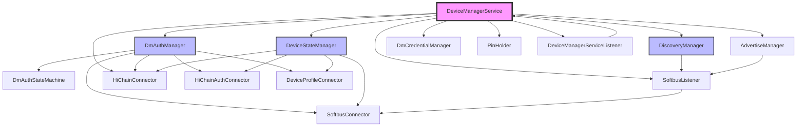

# 内部模块接口

版本：v2.0
更新日期：2026-05-19

## 1. 概述

DM 内部各 Manager 之间的调用关系与接口契约。DeviceManagerService 作为核心协调者，与各个功能模块进行交互，实现设备发现、认证、状态管理、凭证管理等核心功能。

## 2. 内部模块关系图



## 3. DeviceManagerService ↔ DmAuthManager

### 3.1 认证启动接口

**接口名称**: `AuthenticateDevice`

**调用方向**: DeviceManagerService → DmAuthManager

**方法签名**:
```cpp
int32_t AuthenticateDevice(const std::string &pkgName, int32_t authType, 
                           const std::string &deviceId, const std::string &extra);
```

**参数说明**:
- `pkgName`: 调用者包名
- `authType`: 认证类型（PIN码、二维码、NFC等）
- `deviceId`: 目标设备ID
- `extra`: 扩展参数（JSON格式）

**返回值**: 成功返回0，失败返回错误码

**使用场景**: 应用发起设备认证请求时

**同步/异步**: 异步（通过回调返回结果）

### 3.2 取消认证接口

**接口名称**: `StopAuthenticateDevice`

**调用方向**: DeviceManagerService → DmAuthManager

**方法签名**:
```cpp
int32_t StopAuthenticateDevice(const std::string &pkgName);
```

**参数说明**:
- `pkgName`: 调用者包名

**返回值**: 成功返回0，失败返回错误码

**使用场景**: 用户取消认证操作

**同步/异步**: 同步

### 3.3 绑定目标接口

**接口名称**: `BindTarget`

**调用方向**: DeviceManagerService → DmAuthManager

**方法签名**:
```cpp
int32_t BindTarget(const std::string &pkgName, const PeerTargetId &targetId,
                   const std::map<std::string, std::string> &bindParam, 
                   int sessionId, uint64_t logicalSessionId);
```

**参数说明**:
- `pkgName`: 调用者包名
- `targetId`: 对端目标ID
- `bindParam`: 绑定参数
- `sessionId`: 会话ID
- `logicalSessionId`: 逻辑会话ID

**返回值**: 成功返回0，失败返回错误码

**使用场景**: 服务绑定场景

**同步/异步**: 异步

### 3.4 用户操作接口

**接口名称**: `OnUserOperation`

**调用方向**: DeviceManagerService → DmAuthManager

**方法签名**:
```cpp
int32_t OnUserOperation(int32_t action, const std::string &params);
```

**参数说明**:
- `action`: 操作类型（确认/取消等）
- `params`: 操作参数（JSON格式）

**返回值**: 成功返回0，失败返回错误码

**使用场景**: 用户在UI上确认或取消认证

**同步/异步**: 同步

## 4. DeviceManagerService ↔ DeviceStateManager

### 4.1 设备状态变更通知

**接口名称**: `HandleDeviceStatusChange`

**调用方向**: DeviceManagerService → DeviceStateManager

**方法签名**:
```cpp
void HandleDeviceStatusChange(DmDeviceState devState, DmDeviceInfo &devInfo, 
                              const bool isOnline);
```

**参数说明**:
- `devState`: 设备状态（DEVICE_ONLINE/DEVICE_OFFLINE/DEVICE_INFO_CHANGED）
- `devInfo`: 设备信息
- `isOnline`: 是否在线

**返回值**: 无

**使用场景**: 设备上线/下线/信息变更时通知

**同步/异步**: 同步

### 4.2 设备屏幕状态变更

**接口名称**: `HandleDeviceScreenStatusChange`

**调用方向**: DeviceManagerService → DeviceStateManager

**方法签名**:
```cpp
void HandleDeviceScreenStatusChange(DmDeviceInfo &devInfo);
```

**参数说明**:
- `devInfo`: 设备信息（包含屏幕状态）

**返回值**: 无

**使用场景**: 设备屏幕状态变更通知

**同步/异步**: 同步

## 5. DeviceManagerService ↔ DiscoveryManager

### 5.1 启动发现接口

**接口名称**: `StartDiscovering`

**调用方向**: DeviceManagerService → DiscoveryManager

**方法签名**:
```cpp
int32_t StartDiscovering(const std::string &pkgName, 
                         const std::map<std::string, std::string> &discoverParam,
                         const std::map<std::string, std::string> &filterOptions);
```

**参数说明**:
- `pkgName`: 调用者包名
- `discoverParam`: 发现参数
- `filterOptions`: 过滤选项

**返回值**: 成功返回0，失败返回错误码

**使用场景**: 应用启动设备发现

**同步/异步**: 异步（通过回调返回结果）

### 5.2 停止发现接口

**接口名称**: `StopDiscovering`

**调用方向**: DeviceManagerService → DiscoveryManager

**方法签名**:
```cpp
int32_t StopDiscovering(const std::string &pkgName, 
                        const std::map<std::string, std::string> &discoverParam);
```

**参数说明**:
- `pkgName`: 调用者包名
- `discoverParam`: 发现参数（用于定位订阅ID）

**返回值**: 成功返回0，失败返回错误码

**使用场景**: 应用停止设备发现

**同步/异步**: 同步

### 5.3 启用发现监听器

**接口名称**: `EnableDiscoveryListener`

**调用方向**: DeviceManagerService → DiscoveryManager

**方法签名**:
```cpp
int32_t EnableDiscoveryListener(const std::string &pkgName, 
                                const std::map<std::string, std::string> &discoverParam,
                                const std::map<std::string, std::string> &filterOptions);
```

**参数说明**:
- `pkgName`: 调用者包名
- `discoverParam`: 发现参数
- `filterOptions`: 过滤选项

**返回值**: 成功返回0，失败返回错误码

**使用场景**: 启用持续发现监听

**同步/异步**: 异步

### 5.4 设备发现回调

**接口名称**: `OnDeviceFound`

**调用方向**: DiscoveryManager → DeviceManagerService（通过Listener）

**方法签名**:
```cpp
void OnDeviceFound(const std::string &pkgName, const DmDeviceInfo &info, bool isOnline);
```

**参数说明**:
- `pkgName`: 调用者包名
- `info`: 发现的设备信息
- `isOnline`: 设备是否在线

**返回值**: 无

**使用场景**: 发现设备后通知上层

**同步/异步**: 异步

## 6. DeviceManagerService ↔ SoftbusListener

### 6.1 LNN加入接口

**接口名称**: `RefreshSoftbusLNN`

**调用方向**: DeviceManagerService → SoftbusListener

**方法签名**:
```cpp
int32_t RefreshSoftbusLNN(const char *pkgName, const DmSubscribeInfo &dmSubInfo, 
                          const std::string &customData);
```

**参数说明**:
- `pkgName`: 调用者包名
- `dmSubInfo`: 订阅信息
- `customData`: 自定义数据

**返回值**: 成功返回0，失败返回错误码

**使用场景**: 刷新LNN网络

**同步/异步**: 异步

### 6.2 LNN离开接口

**接口名称**: `LeaveLNN`

**调用方向**: DeviceManagerService → SoftbusListener

**方法签名**:
```cpp
int32_t LeaveLNN(const std::string &pkgName, const std::string &networkId);
```

**参数说明**:
- `pkgName`: 调用者包名
- `networkId`: 网络ID

**返回值**: 成功返回0，失败返回错误码

**使用场景**: 离开LNN网络

**同步/异步**: 异步

### 6.3 设备上线事件

**接口名称**: `OnSoftbusDeviceOnline`

**调用方向**: SoftbusListener → DeviceManagerService

**方法签名**:
```cpp
static void OnSoftbusDeviceOnline(NodeBasicInfo *info);
```

**参数说明**:
- `info`: 节点基本信息

**返回值**: 无

**使用场景**: SoftBus通知设备上线

**同步/异步**: 异步

### 6.4 设备下线事件

**接口名称**: `OnSoftbusDeviceOffline`

**调用方向**: SoftbusListener → DeviceManagerService

**方法签名**:
```cpp
static void OnSoftbusDeviceOffline(NodeBasicInfo *info);
```

**参数说明**:
- `info`: 节点基本信息

**返回值**: 无

**使用场景**: SoftBus通知设备下线

**同步/异步**: 异步

## 7. DeviceManagerService ↔ HiChainConnector

### 7.1 创建组接口

**接口名称**: `CreateGroup`

**调用方向**: DeviceManagerService → HiChainConnector

**方法签名**:
```cpp
int32_t CreateGroup(int64_t requestId, int32_t authType, const std::string &userId,
                    JsonObject &jsonOutObj);
```

**参数说明**:
- `requestId`: 请求ID
- `authType`: 认证类型
- `userId`: 用户ID
- `jsonOutObj`: 输出JSON对象

**返回值**: 成功返回0，失败返回错误码

**使用场景**: 创建信任组

**同步/异步**: 异步（通过回调返回结果）

### 7.2 删除组接口

**接口名称**: `DeleteGroup`

**调用方向**: DeviceManagerService → HiChainConnector

**方法签名**:
```cpp
int32_t DeleteGroup(int64_t requestId, const std::string &userId, const int32_t authType);
```

**参数说明**:
- `requestId`: 请求ID
- `userId`: 用户ID
- `authType`: 认证类型

**返回值**: 成功返回0，失败返回错误码

**使用场景**: 删除信任组

**同步/异步**: 异步

### 7.3 获取组信息

**接口名称**: `GetGroupInfo`

**调用方向**: DeviceManagerService → HiChainConnector

**方法签名**:
```cpp
bool GetGroupInfo(const int32_t userId, const std::string &queryParams, 
                  std::vector<DmGroupInfo> &groupList);
```

**参数说明**:
- `userId`: 用户ID
- `queryParams`: 查询参数
- `groupList`: 输出组列表

**返回值**: 成功返回true，失败返回false

**使用场景**: 查询信任组信息

**同步/异步**: 同步

### 7.4 组创建回调

**接口名称**: `onFinish`

**调用方向**: HiChainConnector → DeviceManagerService

**方法签名**:
```cpp
static void onFinish(int64_t requestId, int operationCode, const char *returnData);
```

**参数说明**:
- `requestId`: 请求ID
- `operationCode`: 操作码
- `returnData`: 返回数据

**返回值**: 无

**使用场景**: HiChain操作完成回调

**同步/异步**: 异步

## 8. DeviceManagerService ↔ PinHolder

### 8.1 注册回调接口

**接口名称**: `RegisterPinHolderCallback`

**调用方向**: DeviceManagerService → PinHolder

**方法签名**:
```cpp
int32_t RegisterPinHolderCallback(const std::string &pkgName);
```

**参数说明**:
- `pkgName`: 调用者包名

**返回值**: 成功返回0，失败返回错误码

**使用场景**: 注册PIN码保持回调

**同步/异步**: 同步

### 8.2 创建PIN码保持

**接口名称**: `CreatePinHolder`

**调用方向**: DeviceManagerService → PinHolder

**方法签名**:
```cpp
int32_t CreatePinHolder(const std::string &pkgName, const PeerTargetId &targetId,
                        DmPinType pinType, const std::string &payload);
```

**参数说明**:
- `pkgName`: 调用者包名
- `targetId`: 对端目标ID
- `pinType`: PIN码类型
- `payload`: 负载数据

**返回值**: 成功返回0，失败返回错误码

**使用场景**: 创建PIN码保持会话

**同步/异步**: 异步

### 8.3 销毁PIN码保持

**接口名称**: `DestroyPinHolder`

**调用方向**: DeviceManagerService → PinHolder

**方法签名**:
```cpp
int32_t DestroyPinHolder(const std::string &pkgName, const PeerTargetId &targetId,
                         DmPinType pinType, const std::string &payload);
```

**参数说明**:
- `pkgName`: 调用者包名
- `targetId`: 对端目标ID
- `pinType`: PIN码类型
- `payload`: 负载数据

**返回值**: 成功返回0，失败返回错误码

**使用场景**: 销毁PIN码保持会话

**同步/异步**: 异步

### 8.4 PIN码事件通知

**接口名称**: `OnPinHolderEvent`

**调用方向**: PinHolder → DeviceManagerService

**方法签名**:
```cpp
void OnPinHolderEvent(const std::string &pkgName, const std::string &event);
```

**参数说明**:
- `pkgName`: 调用者包名
- `event`: 事件信息

**返回值**: 无

**使用场景**: PIN码事件通知

**同步/异步**: 异步

## 9. DmAuthManager ↔ DmAuthStateMachine

### 9.1 状态转换接口

**接口名称**: `TransitionTo`

**调用方向**: DmAuthManager → DmAuthStateMachine

**方法签名**:
```cpp
int32_t TransitionTo(std::shared_ptr<DmAuthState> state);
```

**参数说明**:
- `state`: 目标状态

**返回值**: 成功返回0，失败返回错误码

**使用场景**: 认证状态转换

**同步/异步**: 异步

### 9.2 事件完成通知

**接口名称**: `NotifyEventFinish`

**调用方向**: DmAuthManager → DmAuthStateMachine

**方法签名**:
```cpp
void NotifyEventFinish(DmEventType eventType);
```

**参数说明**:
- `eventType`: 事件类型

**返回值**: 无

**使用场景**: 通知事件完成

**同步/异步**: 异步

### 9.3 获取当前状态

**接口名称**: `GetCurState`

**调用方向**: DmAuthManager → DmAuthStateMachine

**方法签名**:
```cpp
DmAuthStateType GetCurState();
```

**参数说明**: 无

**返回值**: 当前认证状态类型

**使用场景**: 查询当前认证状态

**同步/异步**: 同步

## 10. DeviceStateManager ↔ DeviceProfileConnector

### 10.1 获取设备ACL参数

**接口名称**: `GetDeviceAclParam`

**调用方向**: DeviceStateManager → DeviceProfileConnector

**方法签名**:
```cpp
int32_t GetDeviceAclParam(DmDiscoveryInfo discoveryInfo, bool &isOnline, int32_t &authForm);
```

**参数说明**:
- `discoveryInfo`: 发现信息
- `isOnline`: 输出是否在线
- `authForm`: 输出认证形式

**返回值**: 成功返回0，失败返回错误码

**使用场景**: 查询设备访问控制列表参数

**同步/异步**: 同步

### 10.2 删除访问控制列表

**接口名称**: `DeleteAccessControlList`

**调用方向**: DeviceStateManager → DeviceProfileConnector

**方法签名**:
```cpp
DmOfflineParam DeleteAccessControlList(const std::string &pkgName,
                                       const std::string &localDeviceId, 
                                       const std::string &remoteDeviceId, 
                                       int32_t bindLevel, const std::string &extra);
```

**参数说明**:
- `pkgName`: 调用者包名
- `localDeviceId`: 本地设备ID
- `remoteDeviceId`: 远程设备ID
- `bindLevel`: 绑定级别
- `extra`: 扩展参数

**返回值**: 离线参数

**使用场景**: 删除设备访问控制列表

**同步/异步**: 同步

### 10.3 获取访问控制配置

**接口名称**: `GetAccessControlProfile`

**调用方向**: DeviceStateManager → DeviceProfileConnector

**方法签名**:
```cpp
std::vector<DistributedDeviceProfile::AccessControlProfile> GetAccessControlProfile();
```

**参数说明**: 无

**返回值**: 访问控制配置列表

**使用场景**: 获取所有访问控制配置

**同步/异步**: 同步

### 10.4 检查访问控制权限

**接口名称**: `CheckAccessControl`

**调用方向**: DeviceStateManager → DeviceProfileConnector

**方法签名**:
```cpp
bool CheckAccessControl(const DmAccessCaller &caller, const std::string &srcUdid,
                        const DmAccessCallee &callee, const std::string &sinkUdid);
```

**参数说明**:
- `caller`: 调用者信息
- `srcUdid`: 源设备UDID
- `callee`: 被调用者信息
- `sinkUdid`: 目标设备UDID

**返回值**: 有权限返回true，否则返回false

**使用场景**: 检查设备访问权限

**同步/异步**: 同步

## 11. 设备状态通知流程

### 11.1 设备上线通知

1. **SoftbusListener** 监听到设备上线事件
2. 调用 **DeviceManagerService::OnSoftbusDeviceOnline**
3. **DeviceManagerService** 通知 **DeviceStateManager::HandleDeviceStatusChange**
4. **DeviceStateManager** 更新设备状态并通知 **DeviceProfileConnector**
5. **DeviceProfileConnector** 更新ACL状态
6. **DeviceManagerServiceListener** 将事件通知给应用层

### 11.2 设备下线通知

1. **SoftbusListener** 监听到设备下线事件
2. 调用 **DeviceManagerService::OnSoftbusDeviceOffline**
3. **DeviceManagerService** 通知 **DeviceStateManager::HandleDeviceStatusChange**
4. **DeviceStateManager** 处理离线逻辑，可能触发：
   - 删除ACL（通过 **DeviceProfileConnector**）
   - 删除凭证（通过 **HiChainConnector**）
   - 离开LNN（通过 **SoftbusConnector**）
5. **DeviceManagerServiceListener** 将事件通知给应用层

## 12. 认证流程交互

### 12.1 发起认证

1. 应用调用 **DeviceManagerService::AuthenticateDevice**
2. **DeviceManagerService** 调用 **DmAuthManager::AuthenticateDevice**
3. **DmAuthManager** 创建认证状态机 **DmAuthStateMachine**
4. **DmAuthManager** 通过 **SoftbusConnector** 建立认证通道
5. **DmAuthManager** 调用 **HiChainConnector** 创建信任组
6. **DmAuthStateMachine** 进行状态转换，处理认证流程
7. 认证完成后，**DmAuthManager** 通知 **DeviceManagerService**
8. **DeviceManagerService** 通过 **DeviceProfileConnector** 保存ACL
9. **DeviceManagerServiceListener** 通知应用认证结果

### 12.2 取消认证

1. 应用调用 **DeviceManagerService::StopAuthenticateDevice**
2. **DeviceManagerService** 调用 **DmAuthManager** 取消逻辑
3. **DmAuthManager** 停止 **DmAuthStateMachine**
4. 清理会话资源和临时数据
5. **DeviceManagerServiceListener** 通知应用取消结果

## 13. 发现流程交互

### 13.1 启动发现

1. 应用调用 **DeviceManagerService::StartDiscovering**
2. **DeviceManagerService** 调用 **DiscoveryManager::StartDiscovering**
3. **DiscoveryManager** 通过 **SoftbusListener** 注册发现回调
4. **SoftbusListener** 调用底层SoftBus接口启动发现
5. 发现设备后，**SoftbusListener** 回调 **DiscoveryManager::OnDeviceFound**
6. **DiscoveryManager** 处理设备信息并通过 **DeviceProfileConnector** 查询ACL
7. **DiscoveryManager** 通知 **DeviceManagerServiceListener**
8. **DeviceManagerServiceListener** 将发现的设备信息返回给应用

### 13.2 停止发现

1. 应用调用 **DeviceManagerService::StopDiscovering**
2. **DeviceManagerService** 调用 **DiscoveryManager::StopDiscovering**
3. **DiscoveryManager** 通过 **SoftbusListener** 停止发现
4. 清理发现相关资源

## 14. 数据流向总结

### 14.1 下行流（Service → Manager）

- **认证控制**: DeviceManagerService → DmAuthManager
- **状态管理**: DeviceManagerService → DeviceStateManager
- **发现控制**: DeviceManagerService → DiscoveryManager
- **发布控制**: DeviceManagerService → AdvertiseManager
- **PIN管理**: DeviceManagerService → PinHolder

### 14.2 上行流（Manager → Service）

- **设备发现**: DiscoveryManager → DeviceManagerService（通过Listener）
- **设备状态**: DeviceStateManager → DeviceManagerService（通过Listener）
- **认证结果**: DmAuthManager → DeviceManagerService（通过Listener）
- **PIN事件**: PinHolder → DeviceManagerService（通过Listener）
- **SoftBus事件**: SoftbusListener → DeviceManagerService

### 14.3 横向交互（Manager ↔ Manager）

- **认证 ↔ HiChain**: DmAuthManager ↔ HiChainConnector
- **认证 ↔ SoftBus**: DmAuthManager ↔ SoftbusConnector
- **状态 ↔ DP**: DeviceStateManager ↔ DeviceProfileConnector
- **状态 ↔ HiChain**: DeviceStateManager ↔ HiChainConnector
- **发现 ↔ SoftBus**: DiscoveryManager ↔ SoftbusListener

## 15. 错误处理机制

### 15.1 错误码传递

所有内部接口均遵循统一的错误码规范：
- **0**: 成功
- **负数**: 失败错误码

### 15.2 异常处理

- **状态机异常**: DmAuthStateMachine 捕获异常后转换到 FINISH 状态
- **网络异常**: SoftbusConnector 重试机制，超时后返回错误
- **HiChain异常**: HiChainConnector 通过 onError 回调通知错误
- **DP异常**: DeviceProfileConnector 直接返回错误码，由调用方处理

### 15.3 超时处理

- **认证超时**: DmAuthManager 使用定时器，超时后取消认证
- **发现超时**: DiscoveryManager 支持超时配置，超时后自动停止
- **LNN操作超时**: SoftbusConnector 设置超时时间，超时后返回错误

## 16. 性能考虑

### 16.1 异步处理

- 所有耗时操作（网络、HiChain、DP）均采用异步方式
- 使用回调机制返回结果
- 避免阻塞主线程

### 16.2 并发控制

- 使用互斥锁保护共享数据
- 使用队列处理并发事件
- 状态转换采用线程安全设计

### 16.3 资源管理

- 及时释放不再使用的资源
- 使用智能指针管理对象生命周期
- 定期清理过期缓存数据

## 17. 安全性考虑

### 17.1 参数校验

- 所有公共接口均进行参数合法性检查
- 验证调用者权限
- 过滤敏感信息

### 17.2 数据保护

- 设备UDID等敏感信息进行匿名化处理
- 凭证信息加密存储
- 通信数据使用加密通道

### 17.3 权限控制

- 通过DeviceProfileConnector检查访问权限
- 验证应用签名和包名
- 支持多用户隔离

## 18. 扩展性设计

### 18.1 插件化架构

- 各Manager独立实现，易于替换
- 通过接口定义交互契约
- 支持运行时加载

### 18.2 版本兼容

- 接口设计考虑向后兼容
- 使用版本号协商机制
- 支持特性探测

### 18.3 可配置性

- 支持动态配置参数
- 提供配置热更新能力
- 支持A/B测试
