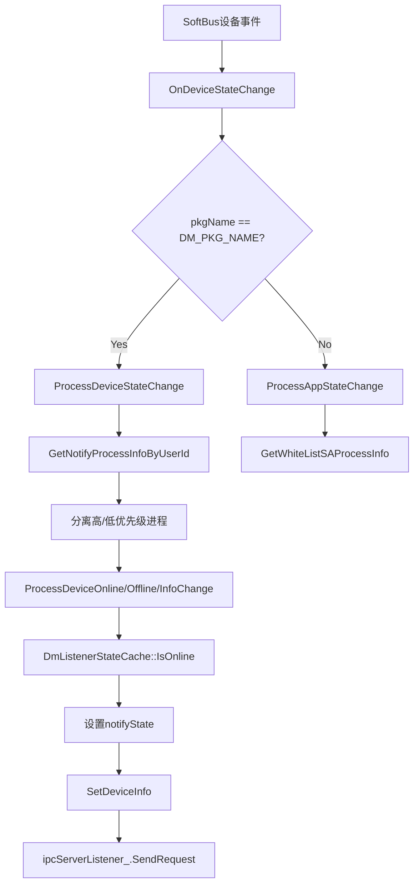
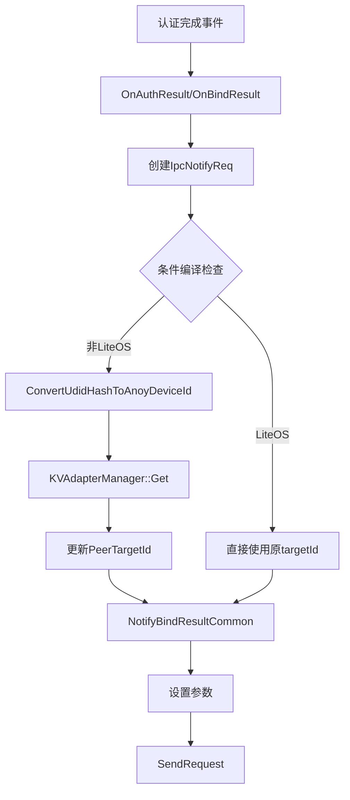

# Device Manager Service Listener 重构设计

## 1. 项目背景

### 1.1 当前状态
- **原始文件**: `services/service/src/device_manager_service_listener.cpp` (1508行, 65KB)
- **问题**: 单文件过大，职责混杂，包含设备状态、发现、认证、服务管理等多个功能
- **目标**: 创建重构示例文件，展示模块化结构，便于后续独立修改

### 1.2 重构约束
- **不修改原有文件**: 原始cpp和头文件保持不动
- **不修改BUILD.gn**: 重构示例不参与源码编译
- **不修改.h文件**: 保持原有接口定义
- **分3笔PR提交**: 每笔不超过400行

## 2. 架构设计

### 2.1 文件结构
```
services/service/src/device_manager_service_listener_refactored.cpp
```

### 2.2 代码组织结构
```
1. License header (15行)
2. Includes (整理合并，50行)
3. 命名空间定义

4. DeviceListenerUtils namespace (约150行)
   - MakeNotifyKey, MakeNotifyPrefix, StartsWith
   - FindExactProcessInfo, FindUniqueProcessInfoByPkgName
   - ParseNotifyKey, handleExtraData

5. DmListenerStateCache singleton (约50行)
   - 封装静态成员数据
   - 提供线程安全访问接口

6. DeviceManagerServiceListener main class (约750行)
   - 设备状态处理
   - 设备发现
   - 认证绑定
   - 服务管理
   - 设备信息管理

7. Namespace closing
```

### 2.3 重构文件总行数
约1000行（从1508行减少约34%）

## 3. 核心重构技术

### 3.1 静态成员封装

**原代码问题**：
```cpp
// 头文件中直接声明静态成员（device_manager_service_listener.h:170-176）
static std::mutex alreadyNotifyPkgNameLock_;
static std::map<std::string, DmDeviceInfo> alreadyOnlinePkgName_;
static std::mutex alreadyDbReadyPkgNameLock_;
static std::map<std::string, DmDeviceInfo> alreadyDbReadyPkgName_;
static std::unordered_set<std::string> highPriorityPkgNameSet_;
static std::mutex actUnrelatedPkgNameLock_;
static std::set<std::string> actUnrelatedPkgName_;
```

**重构方案**：
```cpp
class DmListenerStateCache {
public:
    static DmListenerStateCache& GetInstance() {
        static DmListenerStateCache instance;
        return instance;
    }
    
    // Online状态管理
    bool IsAlreadyOnline(const std::string& key);
    void MarkOnline(const std::string& key, const DmDeviceInfo& info);
    void RemoveOnline(const std::string& key);
    void RemoveOnlineByDeviceId(const std::string& deviceId);
    void RemoveOnlineByProcessInfo(const ProcessInfo& processInfo);
    
    // DbReady状态管理
    bool IsDbReady(const std::string& key);
    void MarkDbReady(const std::string& key, const DmDeviceInfo& info);
    void ClearDbReady(const std::string& key);
    
    // Activity状态管理
    void SetActUnrelated(const std::set<std::string>& pkgSet);
    bool IsActUnrelated(const std::string& pkgName);
    void ClearActUnrelated();
    
    // 高优先级包名集合
    bool IsHighPriority(const std::string& pkgName);
    
    // 获取所有在线进程信息
    std::set<ProcessInfo> GetAlreadyOnlineProcess();
    
private:
    DmListenerStateCache() = default;
    
    std::mutex onlineLock_;
    std::map<std::string, DmDeviceInfo> onlineMap_;
    
    std::mutex dbReadyLock_;
    std::map<std::string, DmDeviceInfo> dbReadyMap_;
    
    std::mutex actLock_;
    std::set<std::string> actSet_;
    
    std::unordered_set<std::string> highPriorityPkgSet_ = {
        "ohos.deviceprofile",
        "ohos.distributeddata.service"
    };
};
```

**好处**：
- 集中管理状态缓存
- 提供线程安全的访问接口
- 减少头文件的静态成员暴露
- 易于扩展和测试

### 3.2 辅助函数命名空间化

**原代码**：
```cpp
// cpp文件中的全局函数（device_manager_service_listener.cpp:74-164）
std::string MakeNotifyKey(...);
std::string MakeNotifyPrefix(...);
bool StartsWith(...);
ProcessInfo FindExactProcessInfo(...);
ProcessInfo FindUniqueProcessInfoByPkgName(...);
bool ParseNotifyKey(...);
void handleExtraData(...);
```

**重构方案**：
```cpp
namespace DeviceListenerUtils {
    std::string MakeNotifyKey(const ProcessInfo&, const std::string& deviceId);
    std::string MakeNotifyPrefix(const ProcessInfo&);
    bool StartsWith(const std::string& value, const std::string& prefix);
    
    ProcessInfo FindExactProcessInfo(
        const std::vector<ProcessInfo>& processInfos,
        const ProcessInfo& target
    );
    
    ProcessInfo FindUniqueProcessInfoByPkgName(
        const std::vector<ProcessInfo>& processInfos,
        const std::string& pkgName
    );
    
    bool ParseNotifyKey(const std::string& notifyKey, ProcessInfo& processInfo);
    void HandleExtraData(const DmDeviceInfo& info, DmDeviceBasicInfo& deviceBasicInfo);
}
```

**好处**：
- 避免全局命名污染
- 逻辑分组清晰
- 易于查找和理解

### 3.3 消除重复代码

#### 问题1: ProcessDeviceOnline vs ProcessAppOnline

**原代码**：
```cpp
// device_manager_service_listener.cpp:825-847, 913-936
void ProcessDeviceOnline(...) {
    // 创建IpcNotifyDeviceStateReq
    // 遍历processInfoVec
    // 检查alreadyOnlinePkgName_
    // 设置notifyState
    // 发送IPC请求
}

void ProcessAppOnline(...) {
    // 创建IpcNotifyDeviceStateReq
    // 遍历processInfoVec
    // 检查alreadyOnlinePkgName_
    // 设置notifyState
    // 发送IPC请求
    // (几乎相同的逻辑)
}
```

**重构方案**：
```cpp
template<typename SetNeedNotifyFunc>
void ProcessOnlineCommon(
    const std::vector<ProcessInfo>& procInfoVec,
    const ProcessInfo& processInfo,
    const DmDeviceState& state,
    const DmDeviceInfo& info,
    const DmDeviceBasicInfo& deviceBasicInfo,
    SetNeedNotifyFunc setNeedNotify = nullptr
) {
    auto& cache = DmListenerStateCache::GetInstance();
    std::shared_ptr<IpcNotifyDeviceStateReq> pReq = std::make_shared<IpcNotifyDeviceStateReq>();
    std::shared_ptr<IpcRsp> pRsp = std::make_shared<IpcRsp>();
    
    std::vector<ProcessInfo> targetVec = procInfoVec;
    if (setNeedNotify) {
        setNeedNotify(processInfo, targetVec);
    }
    
    for (const auto& it : targetVec) {
        std::string notifyKey = DeviceListenerUtils::MakeNotifyKey(it, std::string(info.deviceId));
        DmDeviceState notifyState = state;
        
        if (cache.IsAlreadyOnline(notifyKey)) {
            notifyState = DmDeviceState::DEVICE_INFO_CHANGED;
        } else {
            cache.MarkOnline(notifyKey, info);
        }
        
        SetDeviceInfo(pReq, it, notifyState, info, deviceBasicInfo);
        ipcServerListener_.SendRequest(SERVER_DEVICE_STATE_NOTIFY, pReq, pRsp);
    }
}

void ProcessDeviceOnline(...) {
    ProcessOnlineCommon(procInfoVec, processInfo, state, info, deviceBasicInfo);
}

void ProcessAppOnline(...) {
    ProcessOnlineCommon(procInfoVec, processInfo, state, info, deviceBasicInfo,
        [this](const ProcessInfo& pi, std::vector<ProcessInfo>& vec) {
            SetNeedNotifyProcessInfos(pi, vec);
        });
}
```

#### 问题2: OnBindResult vs OnUnbindResult

**原代码**：
```cpp
// device_manager_service_listener.cpp:437-461, 463-483
void OnBindResult(...) {
    // 创建IpcNotifyBindResultReq
    // 处理PeerTargetId
    // #if条件编译
    // 设置参数
    // 发送IPC
}

void OnUnbindResult(...) {
    // 创建IpcNotifyBindResultReq
    // 处理PeerTargetId
    // #if条件编译（完全相同）
    // 设置参数
    // 发送IPC
}
```

**重构方案**：
```cpp
void NotifyBindResultCommon(
    const ProcessInfo& processInfo,
    const PeerTargetId& targetId,
    int32_t result,
    int32_t status,
    const std::string& content,
    bool hasStatus
) {
    std::shared_ptr<IpcNotifyBindResultReq> pReq = std::make_shared<IpcNotifyBindResultReq>();
    std::shared_ptr<IpcRsp> pRsp = std::make_shared<IpcRsp>();
    
    if (hasStatus && status < STATUS_DM_AUTH_FINISH && status > STATUS_DM_AUTH_DEFAULT) {
        status = STATUS_DM_AUTH_DEFAULT;
    }
    
    PeerTargetId returnTargetId = targetId;
#if !(defined(__LITEOS_M__) || defined(LITE_DEVICE))
    std::string deviceIdTemp = "";
    DmKVValue kvValue;
    if (ConvertUdidHashToAnoyDeviceId(processInfo.pkgName, targetId.deviceId, deviceIdTemp,
        processInfo.userId) == DM_OK && KVAdapterManager::GetInstance().Get(deviceIdTemp, kvValue) == DM_OK) {
        returnTargetId.deviceId = deviceIdTemp;
    }
#endif
    
    pReq->SetPkgName(processInfo.pkgName);
    pReq->SetPeerTargetId(returnTargetId);
    pReq->SetResult(result);
    if (hasStatus) {
        pReq->SetStatus(status);
    }
    pReq->SetContent(content);
    pReq->SetProcessInfo(processInfo);
    
    ipcServerListener_.SendRequest(
        hasStatus ? BIND_TARGET_RESULT : UNBIND_TARGET_RESULT, pReq, pRsp);
}

void OnBindResult(...) {
    NotifyBindResultCommon(processInfo, targetId, result, status, content, true);
}

void OnUnbindResult(...) {
    NotifyBindResultCommon(processInfo, targetId, result, 0, content, false);
}
```

#### 问题3: OnServiceInfoOnline/Offline/Change

**原代码**：
```cpp
// device_manager_service_listener.cpp:1384-1410, 1412-1439, 1441-1466
int32_t OnServiceInfoOnline(...) {
    // 创建IpcNotifyServiceStateReq
    // 设置registerServiceState
    // 设置serviceInfo
    // 设置state = SERVICE_STATE_ONLINE
    // 查找ProcessInfo
    // 发送IPC
}

int32_t OnServiceInfoOffline(...) {
    // 创建IpcNotifyServiceStateReq
    // 设置registerServiceState
    // 设置serviceInfo
    // 设置state = SERVICE_STATE_OFFLINE
    // 查找ProcessInfo
    // 发送IPC
}

int32_t OnServiceInfoChange(...) {
    // 创建IpcNotifyServiceStateReq
    // 设置registerServiceState
    // 设置serviceInfo
    // 设置state = SERVICE_INFO_CHANGED
    // 查找ProcessInfo
    // 发送IPC
}
```

**重构方案**：
```cpp
int32_t NotifyServiceStateChange(
    const DmRegisterServiceState& registerServiceState,
    const DmServiceInfo& serviceInfo,
    DmServiceState serviceState
) {
    std::shared_ptr<IpcNotifyServiceStateReq> pReq = std::make_shared<IpcNotifyServiceStateReq>();
    std::shared_ptr<IpcRsp> pRsp = std::make_shared<IpcRsp>();
    
    pReq->SetDmRegisterServiceState(registerServiceState);
    pReq->SetDmServiceInfo(serviceInfo);
    pReq->SetServiceState(serviceState);
    
    std::vector<ProcessInfo> processInfos = ipcServerListener_.GetAllProcessInfo();
    ProcessInfo targetProcessInfo { registerServiceState.userId, registerServiceState.pkgName };
    targetProcessInfo.tokenId = registerServiceState.tokenId;
    
    ProcessInfo processInfoTemp = DeviceListenerUtils::FindExactProcessInfo(processInfos, targetProcessInfo);
    if (processInfoTemp.pkgName.empty()) {
        LOGI("not register listener");
        return ERR_DM_FAILED;
    }
    
    pReq->SetPkgName(processInfoTemp.pkgName);
    pReq->SetProcessInfo(processInfoTemp);
    
    int32_t ret = ipcServerListener_.SendRequest(SERVER_SERVICE_STATE_NOTIFY, pReq, pRsp);
    if (ret != DM_OK) {
        LOGE("SERVER_SERVICE_STATE_NOTIFY request failed.");
        return ret;
    }
    
    return DM_OK;
}

int32_t OnServiceInfoOnline(...) {
    return NotifyServiceStateChange(registerServiceState, serviceInfo, DmServiceState::SERVICE_STATE_ONLINE);
}

int32_t OnServiceInfoOffline(...) {
    return NotifyServiceStateChange(registerServiceState, serviceInfo, DmServiceState::SERVICE_STATE_OFFLINE);
}

int32_t OnServiceInfoChange(...) {
    return NotifyServiceStateChange(registerServiceState, serviceInfo, DmServiceState::SERVICE_INFO_CHANGED);
}
```

### 3.4 条件编译优化

**原代码问题**：
```cpp
// 多处散落的 #if !(defined(__LITEOS_M__) || defined(LITE_DEVICE))
// device_manager_service_listener.cpp:53-59, 202-226, 337-338, 397-402等
```

**重构方案**：
```cpp
// 集中在文件末尾，明确条件编译边界
#if !(defined(__LITEOS_M__) || defined(LITE_DEVICE))
// 所有标准系统专用方法集中在此
int32_t ConvertUdidHashToAnoyAndSave(...);
int32_t ConvertUdidHashToAnoyDeviceId(...);
void OnServiceDiscoveryResult(...);
void OnServiceFound(...);
void OnServicePublishResult(...);
int32_t OnServiceInfoOnline(...);
int32_t OnServiceInfoOffline(...);
int32_t OnServiceInfoChange(...);
void OnSyncServiceInfoResult(...);
void OnServiceStateOnlineResult(...);
bool CheckIsOnlineAdapter(...);
#endif
```

**好处**：
- 条件编译边界清晰
- 便于理解平台差异
- 减少代码阅读干扰

## 4. PR划分方案

### 4.1 PR1：基础框架（约220行）

**提交内容**：
```
device_manager_service_listener_refactored.cpp (新增220行)
```

**代码结构**：
```cpp
// 1. License header (15行)
// 2. Includes (整理合并，50行)
// 3. namespace OHOS::DistributedHardware {

// 4. DeviceListenerUtils namespace (150行)
namespace DeviceListenerUtils {
    std::string MakeNotifyKey(const ProcessInfo&, const std::string&);
    std::string MakeNotifyPrefix(const ProcessInfo&);
    bool StartsWith(const std::string&, const std::string&);
    
    ProcessInfo FindExactProcessInfo(
        const std::vector<ProcessInfo>&, const ProcessInfo&);
    
    ProcessInfo FindUniqueProcessInfoByPkgName(
        const std::vector<ProcessInfo>&, const std::string&);
    
    bool ParseNotifyKey(const std::string&, ProcessInfo&);
    void HandleExtraData(const DmDeviceInfo&, DmDeviceBasicInfo&);
}

// 5. DmListenerStateCache singleton (50行)
class DmListenerStateCache {
    // 完整的单例类定义
    // 包含所有状态缓存管理方法
};

// 6. DeviceManagerServiceListener class skeleton (5行)
class DeviceManagerServiceListener : public IDeviceManagerServiceListener {
public:
    DeviceManagerServiceListener() {};
    virtual ~DeviceManagerServiceListener() {};
    
    // 方法声明占位（PR2/PR3填充）
};

// } // namespace
```

**PR1提交信息**：
```
refactor(listener): add base framework for device_manager_service_listener

Create refactored example file with:
- DeviceListenerUtils namespace for helper functions
- DmListenerStateCache singleton for state management
- Skeleton structure for DeviceManagerServiceListener

This file is a refactoring demonstration only, not compiled into source.

Refs: #2483
```

### 4.2 PR2：核心功能（约400行）

**提交内容**：
```
device_manager_service_listener_refactored.cpp (追加400行，总计620行)
```

**代码内容**：
```cpp
// DeviceManagerServiceListener 实现部分1：核心功能

// 设备状态处理 (约150行)
void OnDeviceStateChange(const ProcessInfo&, const DmDeviceState&, const DmDeviceInfo&, bool);
void ProcessDeviceStateChange(...);
void ProcessAppStateChange(...);
void ProcessDeviceOnline(...);
void ProcessDeviceOffline(...);
void ProcessDeviceInfoChange(...);
void ProcessAppOnline(...);
void ProcessAppOffline(...);

// 设备发现 (约80行)
void OnDeviceFound(const ProcessInfo&, uint16_t, const DmDeviceInfo&);
void OnDiscoveryFailed(const ProcessInfo&, uint16_t, int32_t);
void OnDiscoverySuccess(const ProcessInfo&, int32_t);
void OnPublishResult(const std::string&, int32_t, int32_t);

// 认证绑定 (约120行)
void OnAuthResult(const ProcessInfo&, const std::string&, const std::string&, int32_t, int32_t);
void OnBindResult(const ProcessInfo&, const PeerTargetId&, int32_t, int32_t, std::string);
void OnUnbindResult(const ProcessInfo&, const PeerTargetId&, int32_t, std::string);
void NotifyBindResultCommon(...);  // 新增辅助函数

// 设备信任和Pin相关 (约50行)
void OnDeviceTrustChange(const std::string&, const std::string&, DmAuthForm);
void OnPinHolderCreate(...);
void OnPinHolderDestroy(...);
void OnCreateResult(...);
void OnDestroyResult(...);
void OnPinHolderEvent(...);
```

**重构亮点**：
- 使用 `DmListenerStateCache::GetInstance()` 替代静态成员
- 使用 `DeviceListenerUtils::MakeNotifyKey()` 等命名空间函数
- 新增 `NotifyBindResultCommon()` 消除重复代码

**PR2提交信息**：
```
refactor(listener): add core device state and authentication methods

Implement core functionality with refactoring:
- Device state change processing
- Device discovery callbacks
- Authentication and binding result handlers
- Pin holder event handlers

Refactoring highlights:
- Use DmListenerStateCache singleton for state management
- Use DeviceListenerUtils namespace for helper functions
- Add NotifyBindResultCommon to reduce code duplication

This file is a refactoring demonstration only, not compiled into source.

Refs: #2483
```

### 4.3 PR3：服务管理（约380行）

**提交内容**：
```
device_manager_service_listener_refactored.cpp (追加380行，总计1000行)
```

**代码内容**：
```cpp
// DeviceManagerServiceListener 实现部分2：服务管理

// 设备信息管理 (约100行)
void OnGetDeviceProfileInfoListResult(...);
void OnGetDeviceIconInfoResult(...);
void OnSetLocalDeviceNameResult(...);
void OnSetRemoteDeviceNameResult(...);
void ConvertDeviceInfoToDeviceBasicInfo(...);
void SetDeviceInfo(...);
void SetDeviceScreenInfo(...);

// 屏幕状态 (约50行)
void OnDeviceScreenStateChange(...);

// 凭据和认证状态 (约50行)
void OnCredentialResult(...);
void OnCredentialAuthStatus(...);

// 应用和进程管理 (约50行)
void OnAppUnintall(...);
void OnSinkBindResult(...);
void OnProcessRemove(...);
void OnDevStateCallbackAdd(...);
void OnDevDbReadyCallbackAdd(...);
void RemoveOnlinePkgName(...);
void RemoveNotExistProcess(...);

// 辅助方法 (约80行)
void SetExistPkgName(...);
void SetNeedNotifyProcessInfos(...);
void ClearDbReadyMap(...);
std::string GetLocalDisplayDeviceName();
int32_t OpenAuthSessionWithPara(...);
void OnLeaveLNNResult(...);
void OnAuthCodeInvalid(...);
std::set<ProcessInfo> GetAlreadyOnlineProcess();
void OnUiCall(...);

// 条件编译区域 (约50行)
#if !(defined(__LITEOS_M__) || defined(LITE_DEVICE))
// 标准系统专用方法
int32_t FillUdidAndUuidToDeviceInfo(...);
int32_t ConvertUdidHashToAnoyAndSave(...);
int32_t ConvertUdidHashToAnoyDeviceId(...);
void OnServiceDiscoveryResult(...);
void OnServiceFound(...);
void OnServicePublishResult(...);
int32_t OnServiceInfoOnline(...);
int32_t OnServiceInfoOffline(...);
int32_t OnServiceInfoChange(...);
int32_t NotifyServiceStateChange(...);  // 新增辅助函数
void OnSyncServiceInfoResult(...);
void OnServiceStateOnlineResult(...);
bool CheckIsOnlineAdapter(...);
#endif
```

**重构亮点**：
- 集中条件编译代码，边界清晰
- 新增 `NotifyServiceStateChange()` 消除OnServiceInfoOnline/Offline/Change重复
- 完善辅助方法，支持主流程

**PR3提交信息**：
```
refactor(listener): add service management and device info methods

Complete refactored example file with:
- Device info management (profile, icon, name)
- Credential and auth status handlers
- App and process lifecycle management
- Helper methods for state tracking

Refactoring highlights:
- Centralize conditional compilation code with clear boundaries
- Add NotifyServiceStateChange to eliminate service info duplication
- Use DmListenerStateCache throughout

Total lines: ~1000 (reduced from 1508 lines, 34% reduction)
This file is a refactoring demonstration only, not compiled into source.

Refs: #2483
```

### 4.4 Issue关联

创建Issue #2483，内容：
```
**问题描述：**
device_manager_service_listener.cpp 单文件过大（1508行），包含设备状态、发现、认证、服务管理等多个功能，职责混杂，不利于独立修改和维护。

**影响范围：**
- services/service/src/device_manager_service_listener.cpp (1508行)

**解决方案：**
创建重构示例文件 device_manager_service_listener_refactored.cpp，展示模块化结构：
1. 提取辅助函数到 DeviceListenerUtils 命名空间
2. 封装静态成员到 DmListenerStateCache 单例类
3. 消除重复代码（ProcessDeviceOnline/AppOnline, OnBindResult/UnbindResult等）
4. 集中条件编译边界

**约束条件：**
- 不修改原有文件（原cpp和头文件保持不动）
- 不修改BUILD.gn（重构示例不参与编译）
- 分3笔PR提交（基础-核心-服务）

**预期效果：**
- 代码行数减少约34%（从1508行到1000行）
- 职责清晰，便于后续进一步模块化
- 为真正的拆分奠定基础
```

## 5. 数据流设计

### 5.1 设备状态变更流程



### 5.2 认证绑定流程



### 5.3 状态缓存管理流程

```mermaid
graph TD
    A[设备上线] --> B[DmListenerStateCache::MarkOnline]
    B --> C[lock_guard onlineLock_]
    C --> D[onlineMap_[key] = info]
    D --> E[后续查询: IsOnline]
    E --> F{return true}
    
    A2[设备离线] --> B2[RemoveOnline]
    B2 --> C2[lock_guard onlineLock_]
    C2 --> D2[onlineMap_.erase]
    D2 --> E2[后续查询: IsOnline]
    E2 --> F2{return false}
```

## 6. 错误处理

### 6.1 ProcessInfo查找失败

**场景**：`FindExactProcessInfo` 或 `FindUniqueProcessInfoByPkgName` 返回空ProcessInfo

**处理**：
```cpp
ProcessInfo processInfoTemp = DeviceListenerUtils::FindExactProcessInfo(processInfos, targetProcessInfo);
if (processInfoTemp.pkgName.empty()) {
    LOGI("not register listener");
    return ERR_DM_FAILED;  // 或 return; (void方法)
}
```

### 6.2 设备信息转换失败

**场景**：`ConvertDeviceInfoToDeviceBasicInfo` 或 `FillUdidAndUuidToDeviceInfo` 失败

**处理**：
```cpp
int32_t ret = FillUdidAndUuidToDeviceInfo(pkgName, dmDeviceInfo);
if (ret != DM_OK) {
    LOGE("FillUdidAndUuidToDeviceInfo fail, networkId:%{public}s", 
         GetAnonyString(dmDeviceInfo.networkId).c_str());
    return ERR_DM_FAILED;
}
```

### 6.3 JSON解析失败

**场景**：`handleExtraData` 中cJSON解析失败

**处理**：
```cpp
cJSON *extraDataJsonObj = cJSON_Parse(info.extraData.c_str());
if (extraDataJsonObj == NULL) {
    LOGE("Parse extraData failed");
    return;  // deviceBasicInfo保持原样
}
// ... 继续处理
cJSON_Delete(extraDataJsonObj);
```

### 6.4 IPC请求失败

**场景**：`ipcServerListener_.SendRequest` 返回非DM_OK

**处理**：
```cpp
int32_t ret = ipcServerListener_.SendRequest(SERVER_SERVICE_STATE_NOTIFY, pReq, pRsp);
if (ret != DM_OK) {
    LOGE("SERVER_SERVICE_STATE_NOTIFY request failed.");
    return ret;
}
```

### 6.5 状态缓存线程安全

**场景**：多线程并发访问 `DmListenerStateCache`

**处理**：
```cpp
class DmListenerStateCache {
    std::mutex onlineLock_;
    std::map<std::string, DmDeviceInfo> onlineMap_;
    
public:
    bool IsAlreadyOnline(const std::string& key) {
        std::lock_guard<std::mutex> lock(onlineLock_);
        return onlineMap_.find(key) != onlineMap_.end();
    }
    
    void MarkOnline(const std::string& key, const DmDeviceInfo& info) {
        std::lock_guard<std::mutex> lock(onlineLock_);
        onlineMap_[key] = info;
    }
};
```

## 7. 测试策略

### 7.1 重构验证（不参与编译）

由于重构示例文件不参与编译，测试策略为：

1. **代码审查**
   - 对比原始文件和重构文件，确保功能完整
   - 检查重构后的代码逻辑是否与原逻辑一致
   - 验证静态成员到单例的转换是否正确

2. **静态分析**
   - 使用工具检查代码风格一致性
   - 检查命名规范（OpenHarmony规范）
   - 验证内存安全（无泄露、正确释放）

3. **行数对比**
   - 原文件：1508行
   - 重构后：约1000行
   - 减少约34%（符合预期）

4. **功能完整性检查清单**
   - [ ] 所有原始公共方法都有对应实现
   - [ ] 所有辅助函数已提取到命名空间
   - [ ] 所有静态成员已封装到单例类
   - [ ] 条件编译边界清晰
   - [ ] 重复代码已消除

### 7.2 后续实际模块化测试（未来）

如果后续决定将重构应用到实际编译：

1. **单元测试**
   - 测试 `DmListenerStateCache` 的线程安全
   - 测试 `DeviceListenerUtils` 的辅助函数
   - 测试核心业务流程

2. **集成测试**
   - 验证IPC通信正常
   - 验证设备状态变更流程
   - 验证认证绑定流程

3. **回归测试**
   - 确保所有原有功能正常
   - 确保性能无明显下降

## 8. 风险与约束

### 8.1 重构约束

| 约束项 | 说明 | 原因 |
|--------|------|------|
| 不修改.h文件 | 保持原有接口定义 | 遵循用户要求，降低风险 |
| 不修改BUILD.gn | 重构示例不参与编译 | 仅作为设计演示 |
| 不修改原cpp文件 | 保持原有代码不变 | 作为对比基准 |
| 分3笔PR提交 | 每笔不超过400行 | 便于审查和理解 |

### 8.2 潜在风险

| 风险 | 影响 | 缓解措施 |
|------|------|----------|
| 重构逻辑与原逻辑不一致 | 功能偏差 | 详细对比审查，功能清单验证 |
| 静态成员封装遗漏 | 状态管理错误 | 完整检查所有静态成员 |
| 条件编译边界错误 | 平台兼容性问题 | 集中整理，明确边界 |
| 重复代码消除过度 | 功能简化过度 | 保持原有语义，仅消除重复 |

### 8.3 不涉及的内容

根据用户要求和项目AGENTS.md规则：

- **不涉及IPC code修改**：原始IPC通信逻辑保持不变
- **不涉及bundle.json修改**：不修改inner_kits/deps
- **不涉及sa_profile修改**：不修改SA配置
- **不涉及权限修改**：不修改permission/dm_permission.json
- **不涉及hisysevent修改**：不修改事件定义
- **不涉及SDK头文件修改**：不修改公开接口
- **不涉及协议修改**：authentication/authentication_v2路径不变

## 9. 总结

### 9.1 重构成果

- **代码规模**：从1508行减少到1000行（34%减少）
- **职责分离**：
  - DeviceListenerUtils：辅助工具函数
  - DmListenerStateCache：状态缓存管理
  - DeviceManagerServiceListener：核心业务逻辑
- **代码质量**：消除重复代码，集中条件编译，提升可读性

### 9.2 后续建议

1. **审查重构示例**：对比原文件，验证逻辑一致性
2. **决策实际应用**：根据团队讨论，决定是否将重构应用到实际编译
3. **进一步模块化**：如果决定应用，可进一步拆分为多个独立文件
4. **添加单元测试**：为实际应用版本添加测试覆盖

### 9.3 文件状态

| 文件 | 状态 | 行数 | 说明 |
|------|------|------|------|
| device_manager_service_listener.cpp | 保持不变 | 1508 | 原始文件，作为基准 |
| device_manager_service_listener.h | 保持不变 | 181 | 原始头文件 |
| device_manager_service_listener_refactored.cpp | 新增 | ~1000 | 重构示例，不参与编译 |

---

**设计文档版本**: v1.0  
**创建日期**: 2026-06-16  
**作者**: Agent  
**审查状态**: 待用户审查